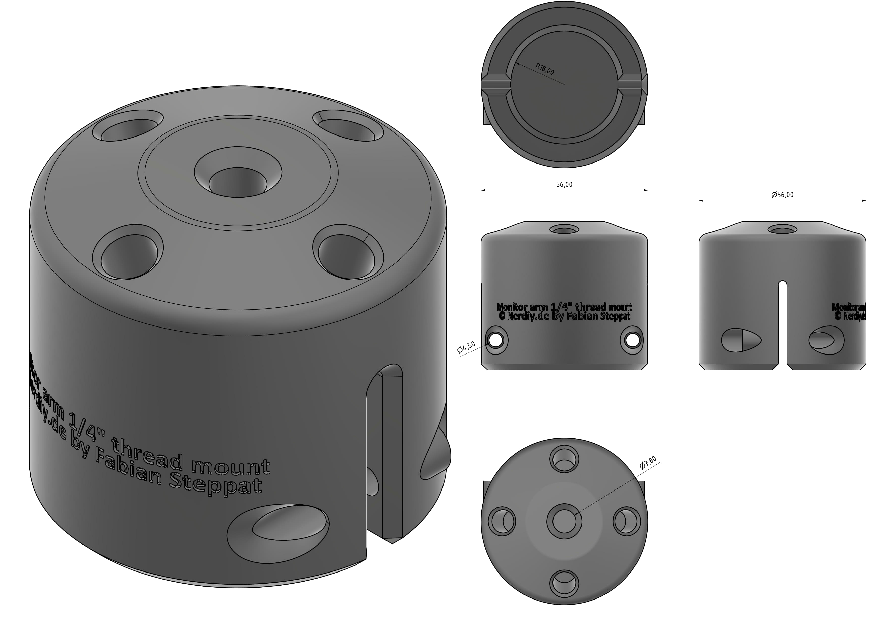
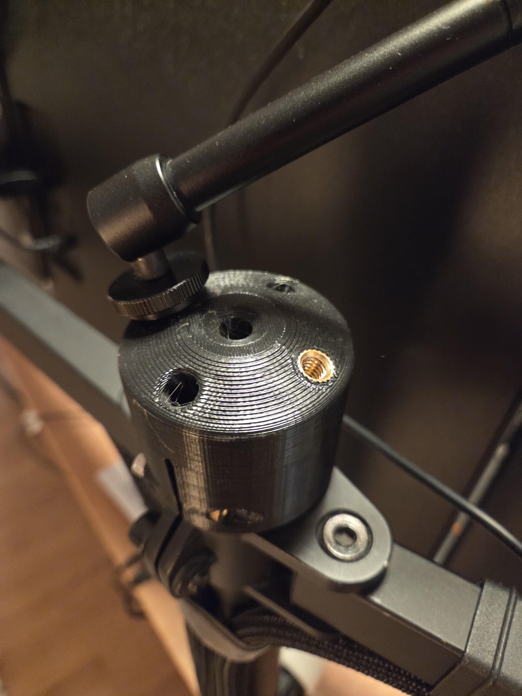

# 1/4" Thread to Monitor Arm Adapter by Nerdiy.de

---

## 🎯 Project Overview

This product page provides a complete overview of the STL package, bill of materials, and recommended print settings.

---

## 📋 About This Product

- **Product Name**: 1/4" Thread to Monitor Arm Adapter by Nerdiy.de
- **Nerdiy.de Shop**: [View Product](https://www.nerdiy.de/)
- **Created**: March 2026

---

## 🛒 Purchase Options

### Primary Source (Recommended)
- **[Nerdiy.de Shop](https://www.nerdiy.de/)** - Download the STL files here

### Alternative Sources
- **[Printables](https://www.printables.com/model/1500254-14-thread-to-monitor-arm-adapter-by-nerdiyde)**

---

## 📦 Bill of Materials

### 📦 Required Components

| Qty | Component | ASIN (DE) | Amazon (DE) |
|-----|-----------|-----------|-------------|
| 1x | 3D Printed Adapter Set (STL Files) | - | N/A |
| 1x | Compatible 1/4" Threaded Device | - | N/A |

---

## 🖼️ Product Images

| Image 1 | Image 2 |
|---------|---------|
|  |  |

---

## 🖨️ 3D Print Settings

### ⚙️ Recommended Print Settings
| Setting | Value |
|---------|-------|
| **Filament Type** | Weather and UV-resistant (for example PETG, ABS, or ASA) |
| **Layer Height** | 0.2 mm |
| **Infill** | 15-25% |
| **Wall Lines** | 3-5 |
| **Supports** | As needed by part geometry |

> 🖨️ **Print Orientation**: Use the orientation included in the STL package to maximize part strength and fit.

---

## 🔧 How to Use

1. Download the STL files from Nerdiy.de or the linked Printables page.
2. Print all required parts with the recommended settings.
3. Prepare all parts from the bill of materials.
4. Assemble and test before final installation.

---

## 📄 License

See the license information on the product page.

---

**Last Updated**: March 17, 2026
**Status**: Active - Ready to build

