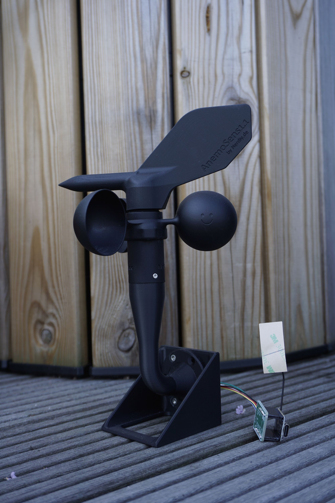
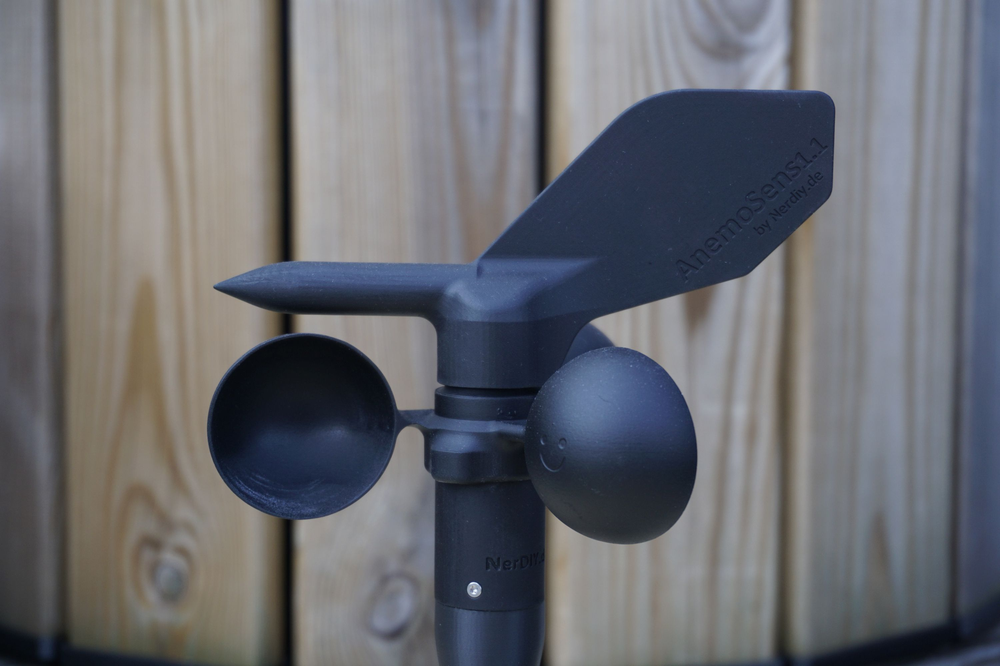
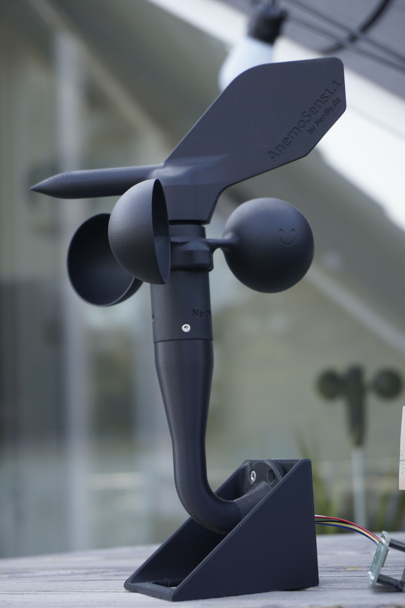
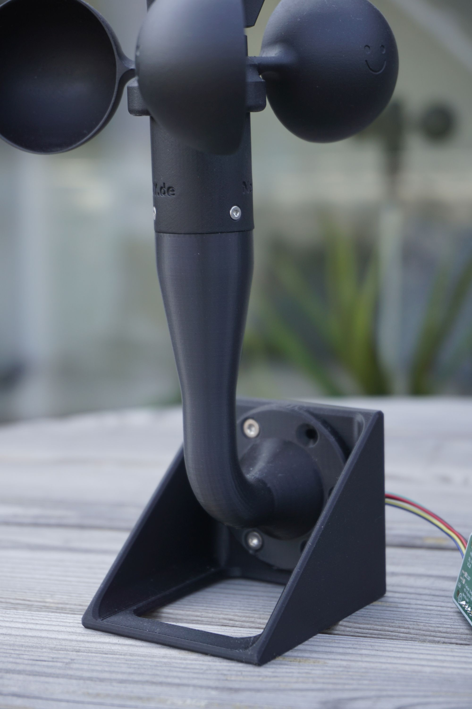
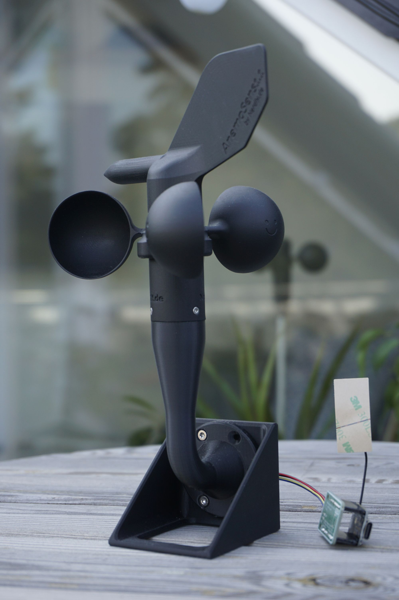
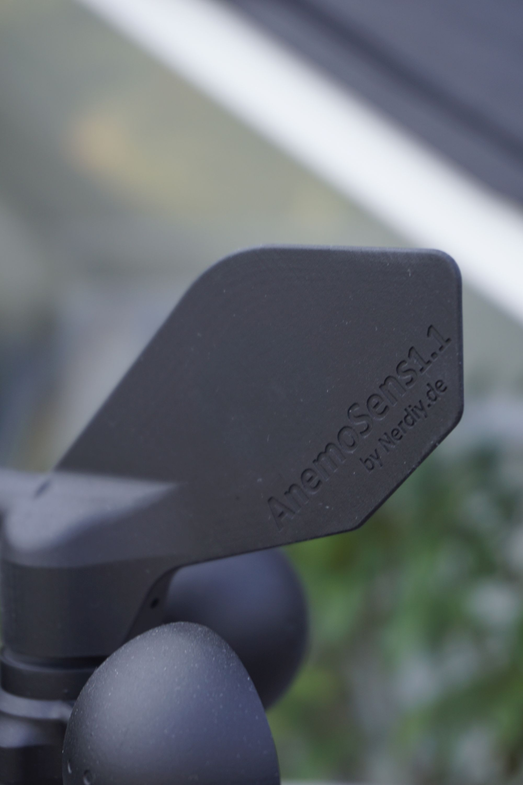

# Anemosens Mini V1.0 - Parts for a 3D Printable Anemometer by Nerdiy.de

---

## 🎯 Project Overview

This STL package provides the printable housing and mechanical parts for the compact Anemosens Mini anemometer build.

---

## 📋 About This Product

The project is intended for maker builds that need a small 3D printable anemometer enclosure and matching mechanical components. It is a good fit for weather monitoring, ESPHome-based projects, and other sensor-driven installations.

---

## 🛒 Purchase Options

### Primary Source (Recommended)
- **[Nerdiy.de Shop](https://www.nerdiy.de/)** - Download the STL files here

### Alternative Sources
- **[Printables](https://www.printables.com/model/1281882-anemosens-mini-v10-teile-fur-3d-druckbares-anemome)**

> Support Nerdiy.de if you want to help fund future product updates, documentation improvements, and new maker projects.

---

## 📦 Bill of Materials

### 📦 Required Components

| Qty | Component | ASIN (DE) | Amazon (DE) |
|-----|-----------|-----------|-------------|
| 1x | 3D Printed Part Set (STL Files) | - | N/A |
| 1x | Matching Anemosens Mini Electronics and Sensor Hardware | - | N/A |

---

## 🖼️ Product Images
<table>
  <tr>
    <td></td>
    <td></td>
  </tr>
  <tr>
    <td></td>
    <td></td>
  </tr>
  <tr>
    <td></td>
    <td></td>
  </tr>
</table>

---

## 🖨️ 3D Print Settings

## 3D Print Settings

### ⚙️ Recommended Print Settings
| Parameter | Value |
| --- | --- |
| Filament Type | Weather and UV-resistant (for example PETG, ABS, or ASA) |
| Layer Height | 0.2 mm |
| Infill | 15-25% |
| Wall Lines | 3-5 |
| Supports | As needed by part geometry |

Use the orientation included in the STL package to minimize supports and achieve better surface quality on visible faces.
## 🎯 How to Use

### Step-by-Step Guide

1. Download the STL files from Nerdiy.de or the linked Printables page.
2. Print all enclosure and mechanical parts with the recommended settings.
3. Prepare the matching Anemosens Mini electronics and sensor hardware from the bill of materials.
4. Assemble the printed parts, install the electronics, and test the anemometer before final outdoor installation.

---

## 📄 License

Refer to the original product page for the license terms that apply to this STL package.

---

**Last Updated**: March 17, 2026
**Status**: Active - Ready to build

