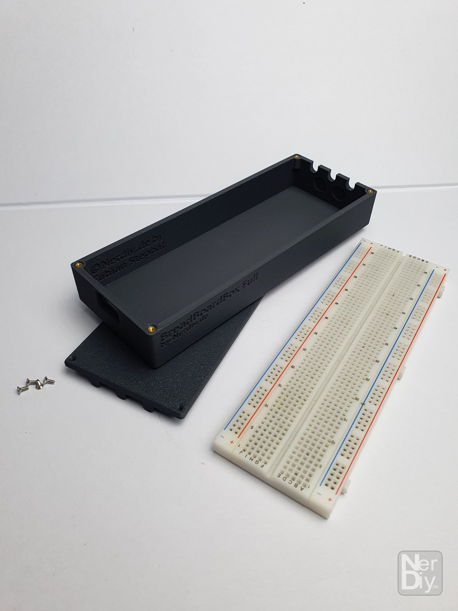
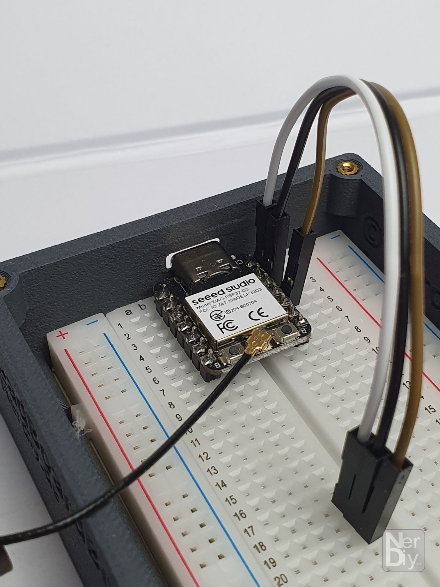
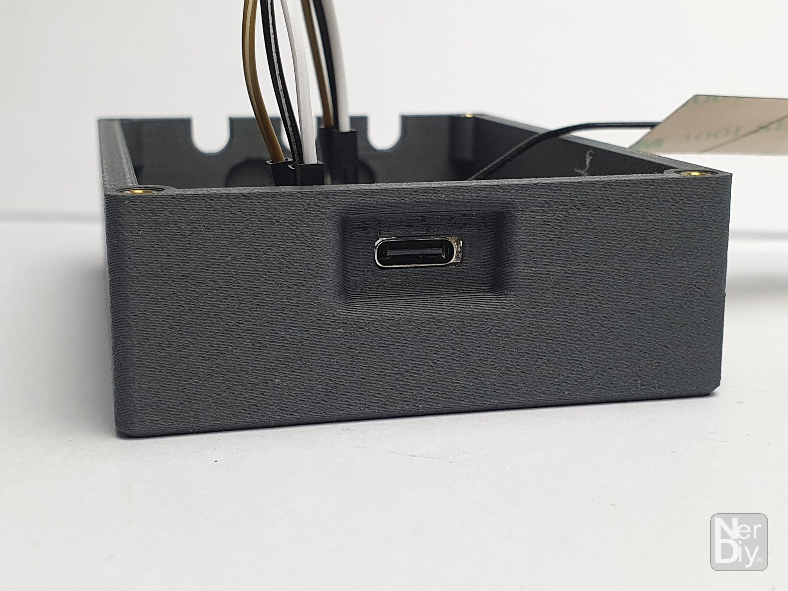
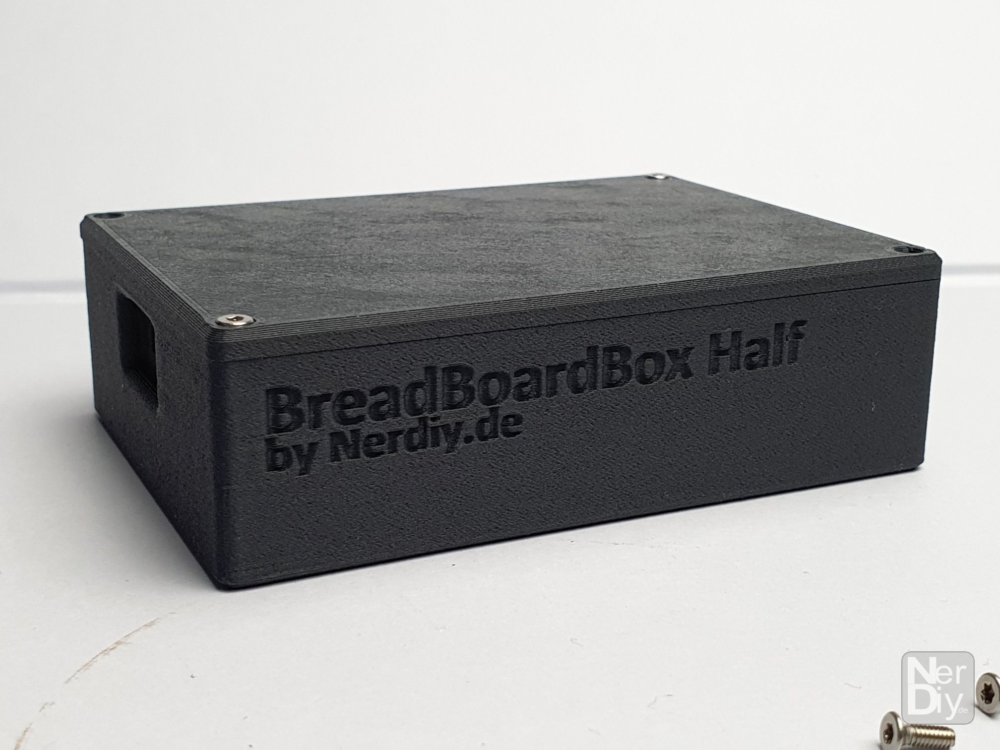
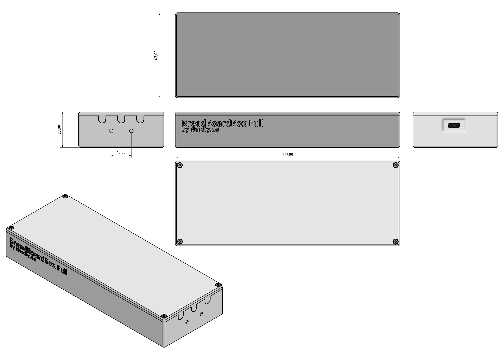
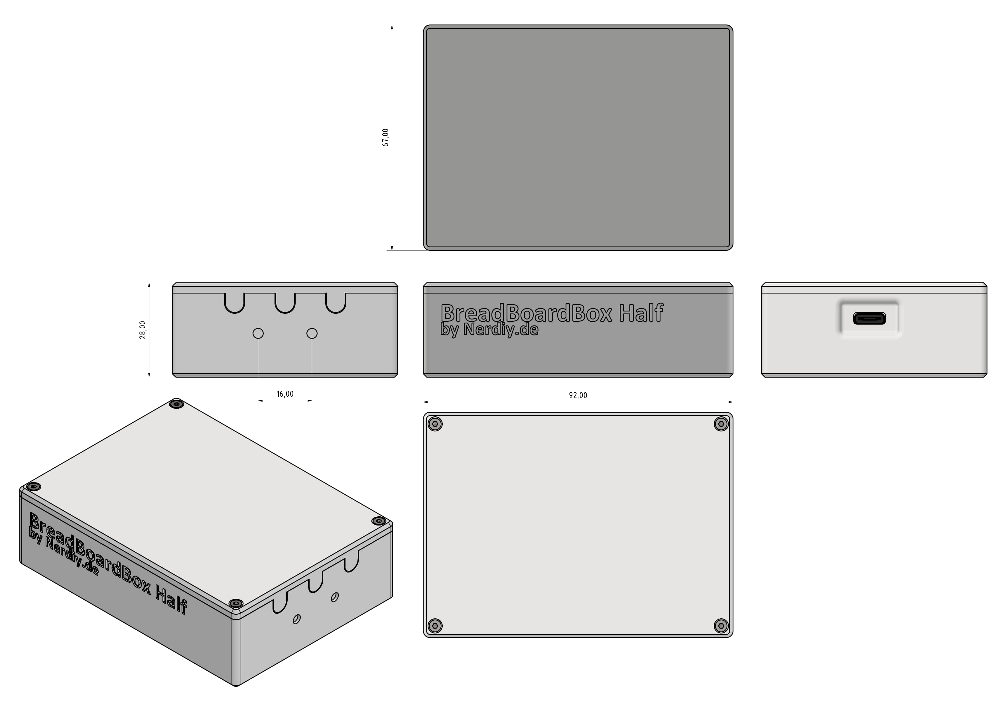
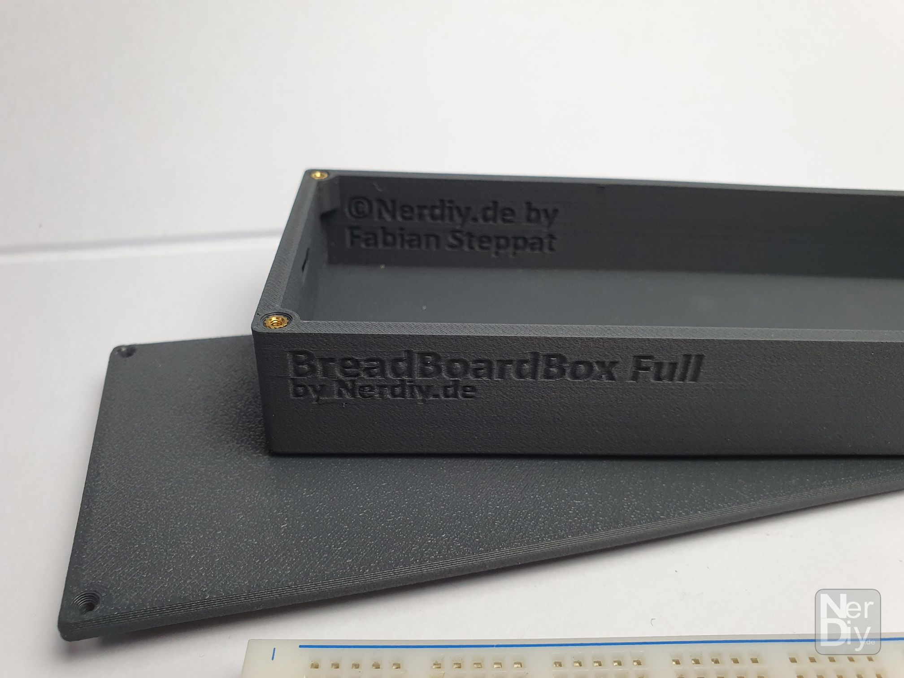
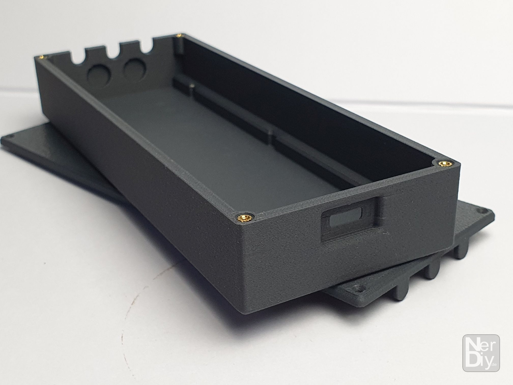
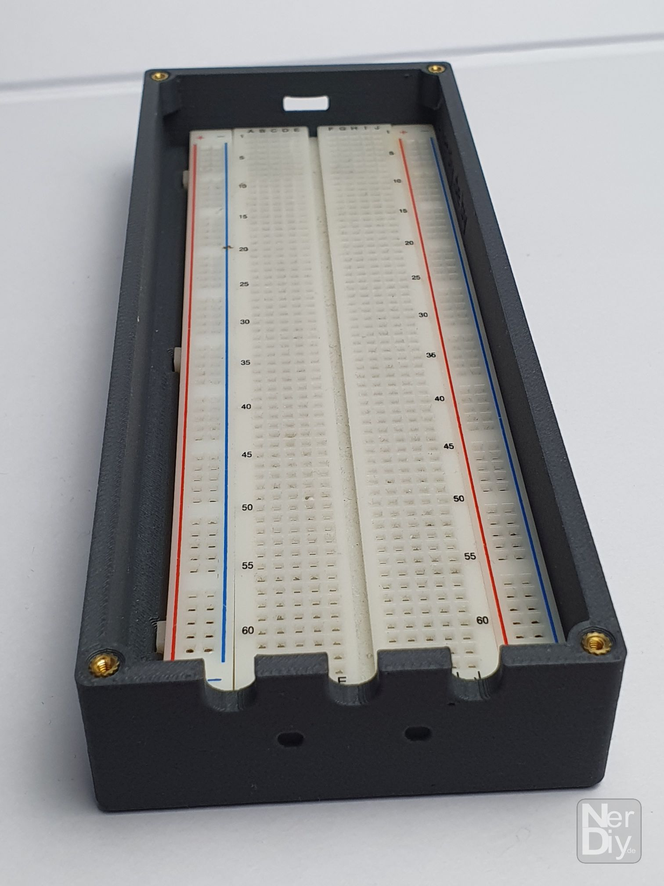
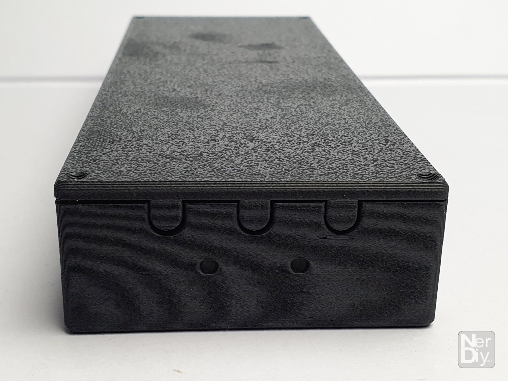

# BreadBordBox Housing Set by Nerdiy.de - Housing for BreadBoard stripes

---

## 🎯 Project Overview

This product page provides a complete overview of the STL package, bill of materials, and recommended print settings.

---

## 📋 About This Product

- **Product Name**: BreadBordBox Housing Set by Nerdiy.de - Housing for BreadBoard stripes
- **Nerdiy.de Shop**: [ View Product](https://www.nerdiy.de/)
- **Created**: March 2026

---

## 🛒 Purchase Options

### Primary Source (Recommended)
- **[ Nerdiy.de Shop](https://www.nerdiy.de/)** - Download the STL files here

### Alternative Sources
- **[ Printables](https://www.printables.com/model/1414535-breadbordbox-housing-set-by-nerdiyde-housing-for-b)**

---

## 📦 Bill of Materials

### 🛠️ Required Tools

| Qty | Component | ASIN (DE) | Amazon (DE) |
|-----|-----------|-----------|-------------|
| 1x | Screwdriver Set | B092LVWNX8 | [Amazon](https://www.amazon.de/dp/B086SQZGLJ?tag=nerdiyde018-21&linkCode=ogi&th=1&psc=1) |
| 1x | Soldering Iron | B0CCV6T329 | [Amazon](https://www.amazon.de/dp/B0CCV6T329?tag=nerdiyde018-21&linkCode=ogi&th=1&psc=1) |
| 1x | 3D Printer | - | N/A |

### 📦 Required Components

| Qty | Component | ASIN (DE) | Amazon (DE) |
|-----|-----------|-----------|-------------|
| 4x | M2x6 Countersunk | B0957W34XS | [Amazon](https://www.amazon.de/dp/B0957W34XS?tag=nerdiyde018-21&linkCode=ogi&th=1&psc=1) |
| 11x | Thread Insert | B088QJG676 | [Amazon](https://www.amazon.de/dp/B088QJG676?tag=nerdiyde018-21&linkCode=ogi&th=1&psc=1) |
| 1x | PETG Filament | B0C6MMM51Y | [Amazon](https://www.amazon.de/dp/B0C6MMM51Y?tag=nerdiyde018-21&linkCode=ogi&th=1&psc=1) |

---

## 🖼️ Product Images

| Image 1 | Image 2 |
|---------|---------|
|  |  |
|  |  |
|  |  |

Show additional images (including subfolders)

.jpg)

---

## 🖨️ 3D Print Settings

### ⚙️ Recommended Print Settings
| Setting | Value |
|---------|-------|
| **Filament Type** | Weather and UV-resistant (for example PETG, ABS, or ASA) |
| **Layer Height** | 0.2 mm |
| **Infill** | 15-25% |
| **Wall Lines** | 3-5 |
| **Supports** | As needed by part geometry |

> 🖨️ **Print Orientation**: Use the orientation included in the STL package to maximize part strength and fit.

---

## 🔧 How to Use

1. Download the STL files from the Nerdiy.de product page.
2. Print all required parts with the recommended settings.
3. Prepare all parts from the bill of materials.
4. Assemble and test before final installation.

---

## 📄 License

See the license information on the product page.

---

**Last Updated**: 22. February 2026
**Status**: Active - Ready to build
