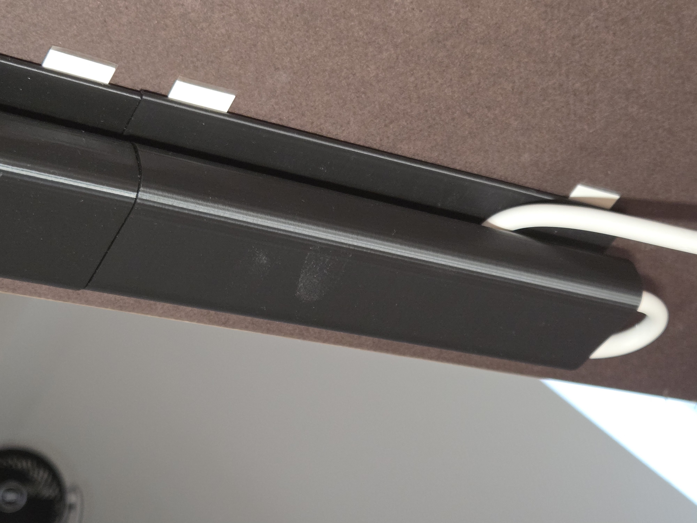
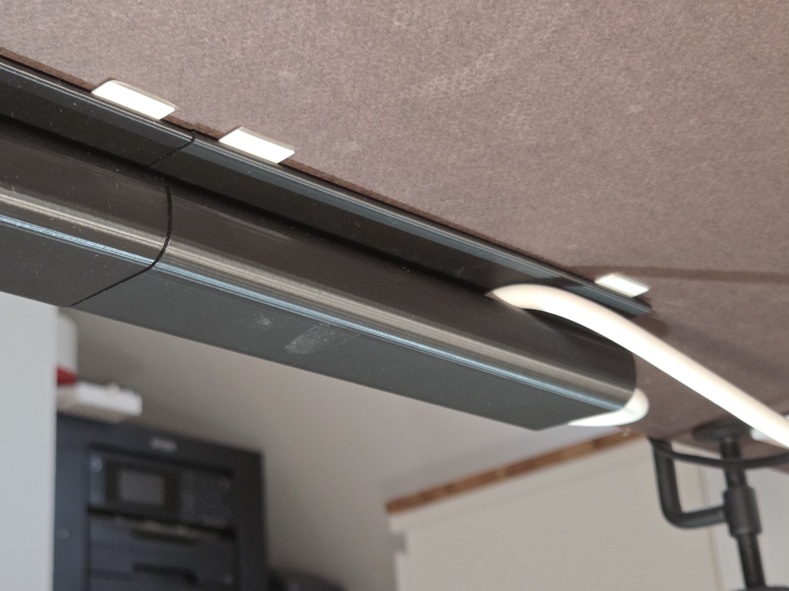
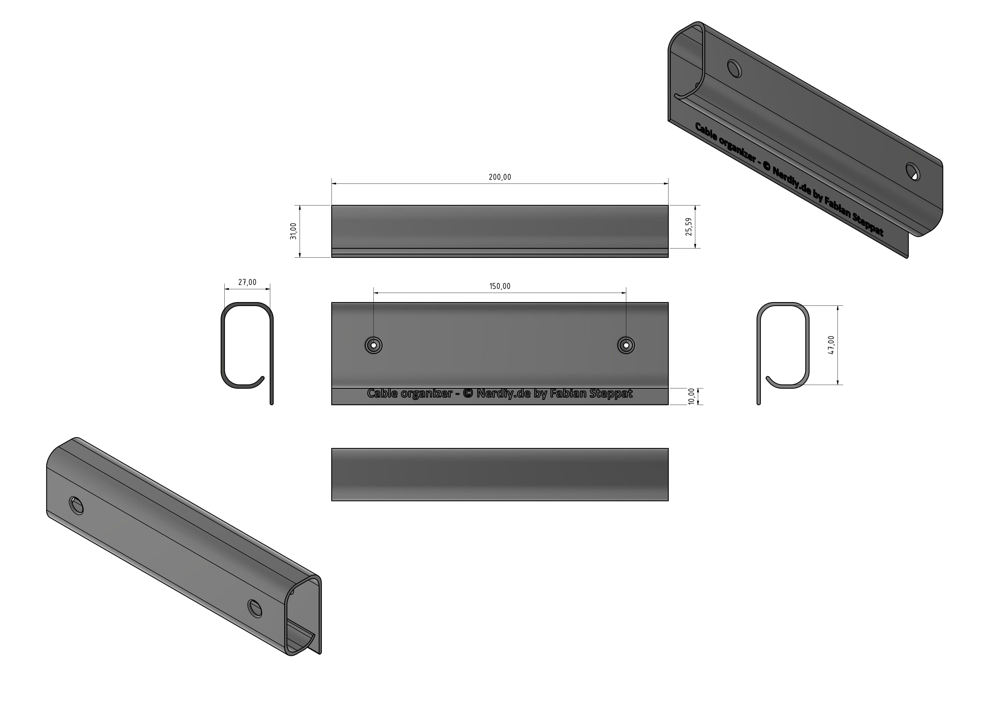

# Cable Organizer Conduit for Desk/Table by Nerdiy.de

---

## 🎯 Project Overview

This cable conduit helps route and tidy up cables below or behind a desk or table using a clean printable mounting solution.

---

## 📋 About This Product

The design is meant for workspace organization and gives loose cables a more controlled path along the edge or underside of a desk. It is useful for office desks, workshop tables, and other setups where visible cable clutter should be reduced.

---

## 🛒 Purchase Options

### Primary Source (Recommended)
- **[Nerdiy.de Shop](https://www.nerdiy.de/)** - Download the STL files here

### Alternative Sources
- **[Printables](https://www.printables.com/model/1492019-cable-organizer-conduit-for-desktable-by-nerdiyde)**

> Support Nerdiy.de if you want to help fund future product updates, documentation improvements, and new maker projects.

---

## 📦 Bill of Materials

### 🛠️ Required Tools

| Qty | Tool | ASIN (DE) | Amazon (DE) |
|-----|------|-----------|-------------|
| 1x | 3D Printer | - | [Prusa3D](https://www.prusa3d.com/de/#a_aid=Nerdiy) |

### 📦 Required Components

| Qty | Component | ASIN (DE) | Amazon (DE) |
|-----|-----------|-----------|-------------|
| As needed | Power Strips / Mounting Adhesive Tape | B00EDLCS9S | [Amazon](https://www.amazon.de/dp/B00EDLCS9S?tag=nerdiyde018-21&linkCode=ogi&th=1&psc=1) |
| 1x | PETG Filament (1kg) | B07T2QZYS1 | [Amazon](https://www.amazon.de/dp/B07T2QZYS1?tag=nerdiyde018-21&linkCode=ogi&th=1&psc=1) |

---

## 🖼️ Product Images
<table>
  <tr>
    <td></td>
    <td></td>
  </tr>
  <tr>
    <td></td>
    <td></td>
  </tr>
</table>

---

## 🖨️ 3D Print Settings

## 3D Print Settings

### ⚙️ Recommended Print Settings
| Parameter | Value |
| --- | --- |
| Filament Type | Weather and UV-resistant (for example PETG, ABS, or ASA) |
| Layer Height | 0.2 mm |
| Infill | 15-25% |
| Wall Lines | 3-5 |
| Supports | As needed by part geometry |

Use the orientation included in the STL package to minimize supports and achieve better surface quality on visible faces.
## 🎯 How to Use

### Step-by-Step Guide

1. Download the STL files from Nerdiy.de or the linked Printables page.
2. Print the conduit parts with the recommended settings.
3. Position the conduit where your cables need guidance and check fitment against the desk or table.
4. Route the cables through the printed guide and adjust the final cable path for a clean installation.

---

## 📄 License

Refer to the original product page for the license terms that apply to this STL package.

---

**Last Updated**: March 17, 2026
**Status**: Active - Ready to build

