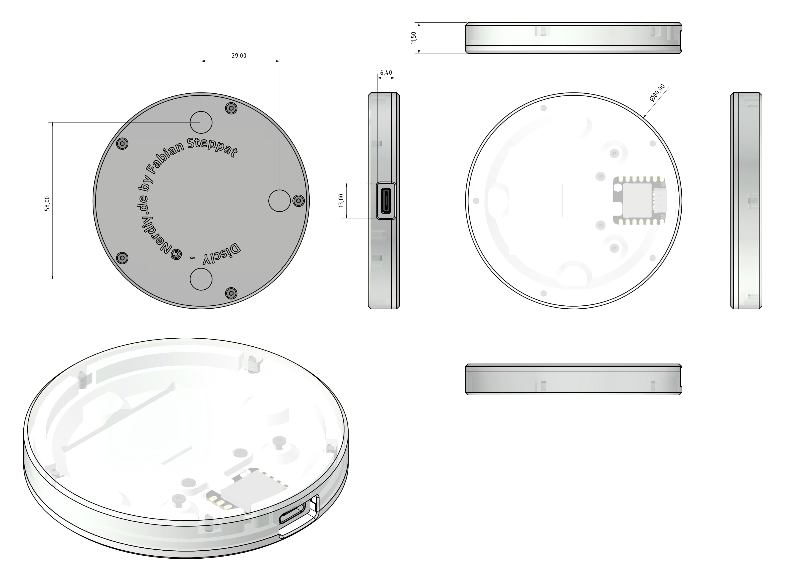
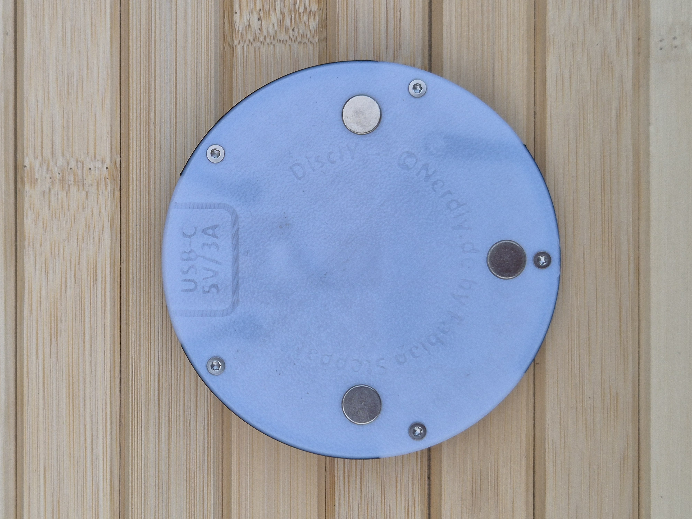
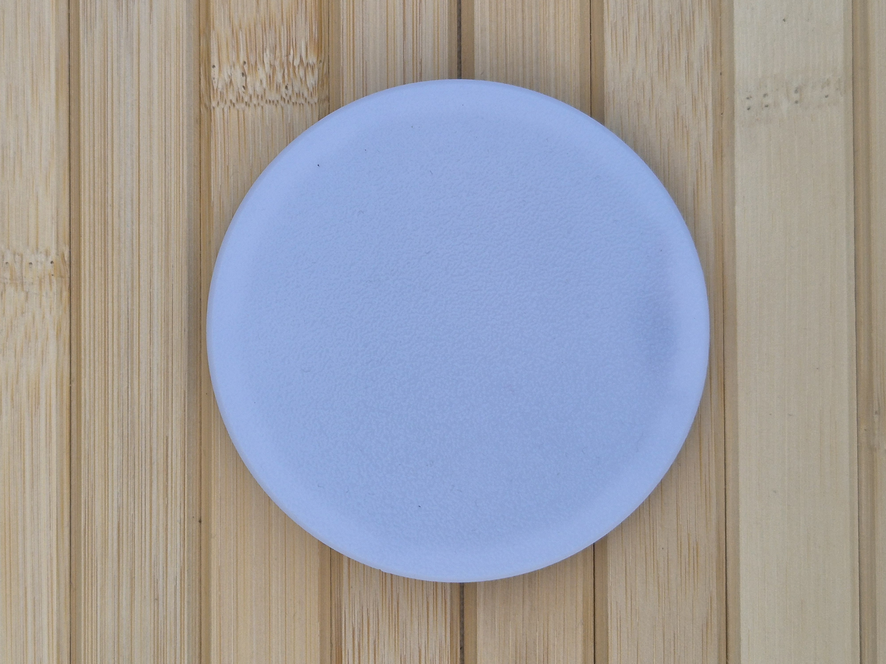
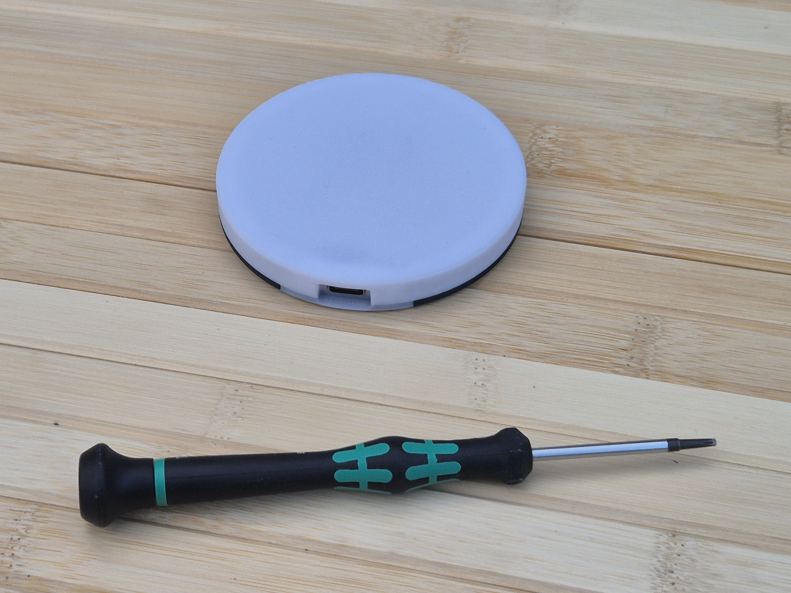
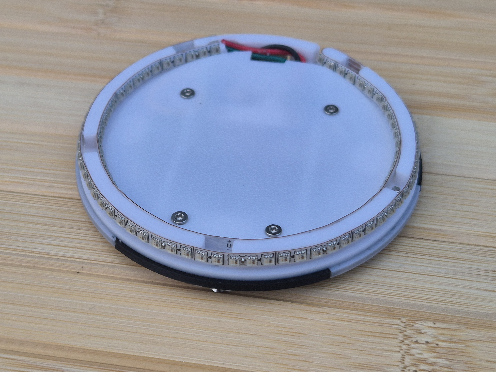
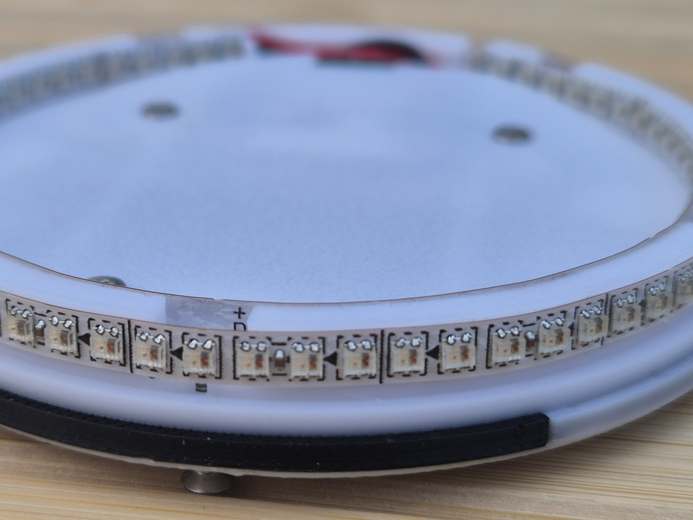
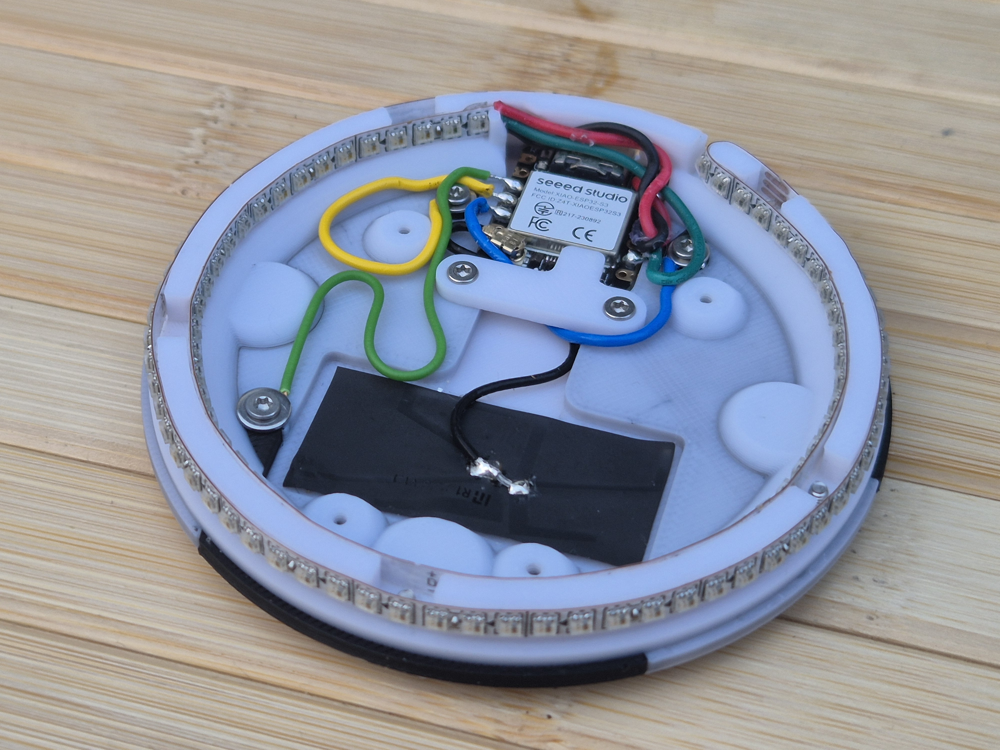
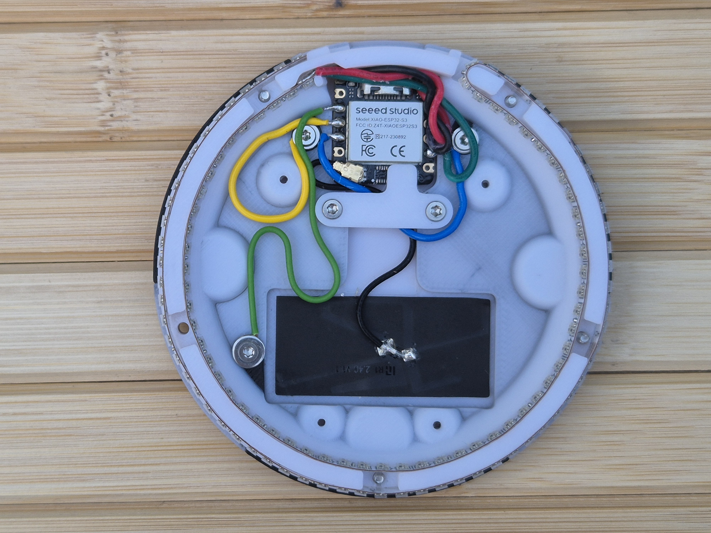
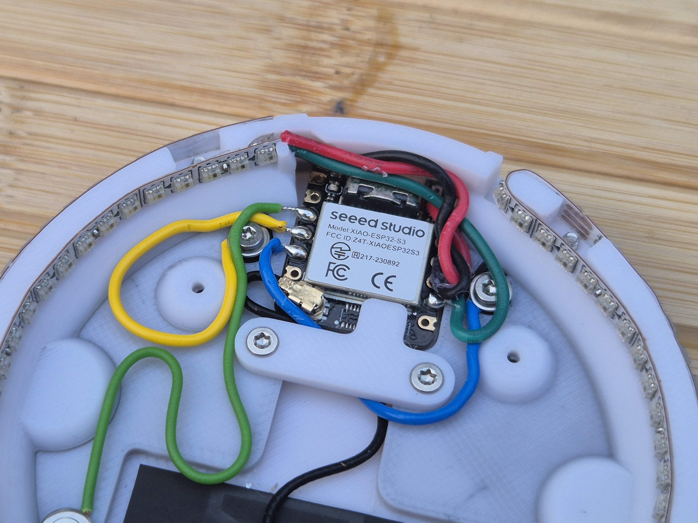
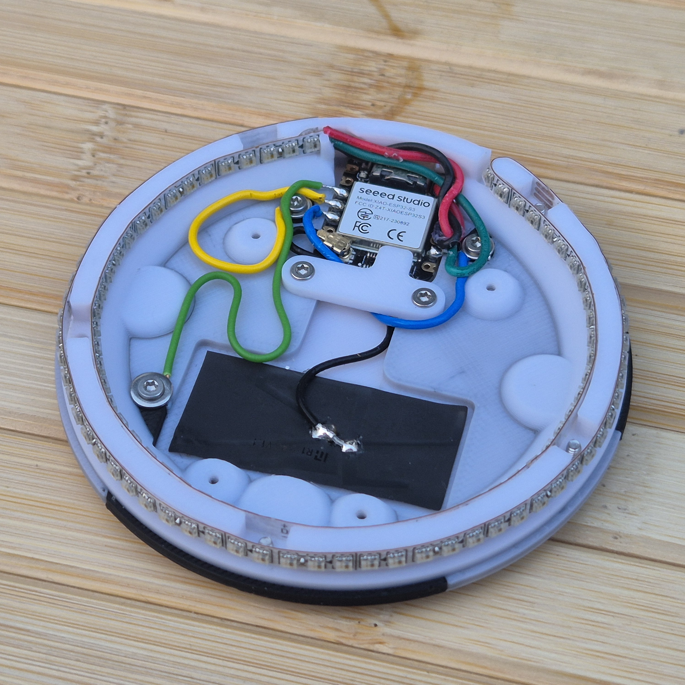

# DiscIY - ESP32 driven & USB-C powered disc sized LED lamp by Nerdiy.de

---

## 🎯 Project Overview

Build a super-slim, disc-shaped smart LED lamp with a height of only 11.5mm.

DiscIY is designed as a 3D-printable round light body that is illuminated from the inside by 2mm wide SK6812 LEDs. The lamp is powered via USB-C and controlled by a Seeed Studio XIAO ESP32-S3 running ESPHome.

In addition to local control logic, the XIAO ESP32-S3 enables wireless control via Wi-Fi or Bluetooth.

Optionally, three touch electrodes can be integrated into the housing using electrically conductive filament to enable direct control on the lamp itself.

---

## 📋 About This Product

This product provides the concept and hardware structure for a compact ESPHome-based smart LED lamp in an 11.5mm disc form factor.

- **Product Name**: DiscIY - ESP32 driven & USB-C powered disc sized LED lamp by Nerdiy.de
- **Nerdiy.de Shop**: [🛍️ Purchase STL Files](https://nerdiy.de/)
- **Created**: June 2026

---

## 🛒 Purchase Options

### Primary Source (Recommended)
- **[🛍️ Nerdiy.de Shop](https://nerdiy.de/)** - Purchase the STL files here to support independent design and development

### Alternative Sources
- **[🎨 Printables Store](https://www.printables.com/model/1287050-disciy-esp32-driven-usb-c-powered-disc-sized-led-l)**
- **[🖨️ Cults3D](https://cults3d.com/de/modell-3d/gadget/disciy-esp32-driven-usb-c-powered-disc-sized-led-lamp-by-nerdiy-de)**

> 💖 **Support independent makers**: By purchasing the STL files through [Nerdiy.de Shop](https://nerdiy.de/), you directly support further development and new projects!

---

## 📦 Bill of Materials

### 🛠️ Required Tools

| Qty | Tool | ASIN (DE) | Amazon (DE) |
|-----|------|-----------|-------------|
| 1x | Screwdriver Set | B086SQZGLJ | [Amazon](https://www.amazon.de/dp/B086SQZGLJ?tag=nerdiyde018-21&linkCode=ogi&th=1&psc=1) |
| 1x | Soldering Iron | B0D5M727WM | [Amazon](https://www.amazon.de/dp/B0D5M727WM?tag=nerdiyde018-21&linkCode=ogi&th=1&psc=1) |
| 1x | Side Cutters | B005EXOF6S | [Amazon](https://www.amazon.de/Electronic-Elektronik-Seitenschneider-Lichtwellenleiter-Rostschutz-125/dp/B005EXOF6S?tag=nerdiyde018-21&linkCode=ogi&th=1&psc=1) |
| 1x | Wire Stripper | B001NUMVHQ | [Amazon](https://www.amazon.de/WEICON-automatische-Abisolierzange-Abisolierer-selbsteinstellend/dp/B001NUMVHQ?tag=nerdiyde018-21&linkCode=ogi&th=1&psc=1) |
| 1x | Tweezers | B06XXXQHS8 | [Amazon](https://www.amazon.de/Pinzette-Pr%C3%A4zision-Antistatische-nicht-magnetische-Elektronik/dp/B06XXXQHS8?tag=nerdiyde018-21&linkCode=ogi&th=1&psc=1) |
| 1x | Hot Glue Gun (optional) | B0001D1Q72 | [Amazon](https://www.amazon.de/Bosch-Klebepistole-extralange-D%C3%BCse-Volt/dp/B0001D1Q72?tag=nerdiyde018-21&linkCode=ogi&th=1&psc=1) |

### 📦 Electronics

| Qty | Component | ASIN (DE) | Amazon (DE) |
|-----|-----------|-----------|-------------|
| 1x | Seeed Studio XIAO ESP32-S3 | B0BYSB66S5 | [Amazon](https://www.amazon.de/dp/B0BYSB66S5?tag=nerdiyde018-21&linkCode=ogi&th=1&psc=1) |
| 1x | SK6812 LED Strip, 2mm (5V) |  | - |
| 1x | USB-C Cable (5V power) | B098WVHH5L | [Amazon](https://www.amazon.de/dp/B098WVHH5L?tag=nerdiyde018-21&linkCode=ogi&th=1&psc=1) |
| 1x | USB Power Supply 5V (optional) | B00WLI5E3M | [Amazon](https://www.amazon.de/dp/B00WLI5E3M?tag=nerdiyde018-21&linkCode=ogi&th=1&psc=1) |
| 1x | Hookup Wire | B0C7TJG9YB | [Amazon](https://www.amazon.de/dp/B0C7TJG9YB?tag=nerdiyde018-21&linkCode=ogi&th=1&psc=1) |

### ⚙️ Mechanical Parts - Optional Touch Control

| Qty | Component | ASIN (DE) | Amazon (DE) |
|-----|-----------|-----------|-------------|
| 1x | Electrically Conductive Filament |  | - |

---

## 🖼️ Product Images

<table>
  <tr>
      <td></td>
      <td></td>
   </tr>
   <tr>
      <td></td>
      <td></td>
   </tr>
   <tr>
      <td></td>
      <td></td>
   </tr>
   <tr>
      <td></td>
      <td></td>
   </tr>
   <tr>
      <td></td>
      <td></td>
  </tr>
</table>

---

## 🖨️ 3D Print Settings

### ⚙️ Recommended Print Settings
| Setting | Value |
|---------|-------|
| **Filament Type** | PETG, ABS, or ASA recommended |
| **Layer Thickness** | 0.2mm |
| **Infill** | 15-25% |
| **Wall Lines** | 3-5 |

> **💡 Print Orientation**: Print in the predefined orientation to keep the 11.5mm disc body rigid and dimensionally stable.

---

## 🎯 How to Use

### Step-by-Step Guide

1. **Gather Your Materials**
   - Collect all components from the Bill of Materials section above
   - Use the Seeed XIAO ESP32-S3, 2mm SK6812 strip, and 5V USB-C power source

2. **Download 3D Files**
   - [🛍️ Download from Nerdiy.de Shop](https://nerdiy.de/) (recommended - supports independent makers)
   - Alternative: [Download from Printables](https://www.printables.com/model/1287050-disciy-esp32-driven-usb-c-powered-disc-sized-led-l)
   - Alternative: [Download from Cults3D](https://cults3d.com/de/modell-3d/gadget/disciy-esp32-driven-usb-c-powered-disc-sized-led-lamp-by-nerdiy-de)

3. **ESPHome Firmware Configuration**
   - Configure ESPHome for the XIAO ESP32-S3
   - Set up SK6812 LED control and desired light effects
   - Configure optional touch control with three conductive-filament electrodes
   - Enable wireless control via Wi-Fi or Bluetooth as needed

4. **Prepare for 3D Printing**
   - Material: PLA, PETG, or similar
   - Layer height: 0.2mm
   - Infill: 20-30%
   - Supports: As needed depending on your part geometry

5. **Assembly**
   - Install LED strip inside the disc body
   - Integrate controller and USB-C power connection
   - Add optional conductive-filament touch electrodes
   - Test LED output and touch behavior before final closure

6. **Final Installation**
   - Close and secure the 11.5mm disc assembly
   - Place the lamp in your desired setup location
   - Adjust effects and behavior via ESPHome/Home Assistant

---

## 📄 License

See the license information on the product page.

---

**Last Updated**: June 8, 2026
**Status**: Active - Initial product setup
