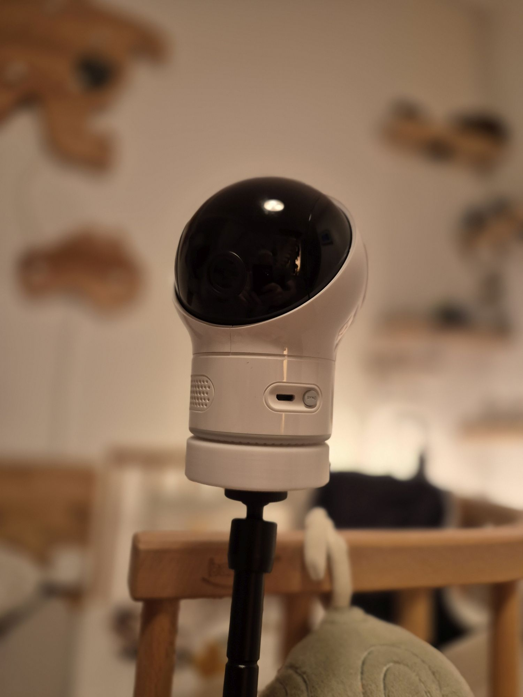
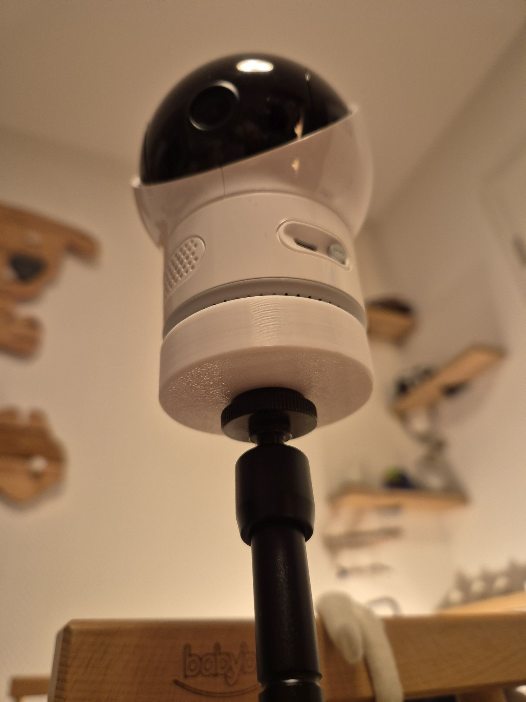
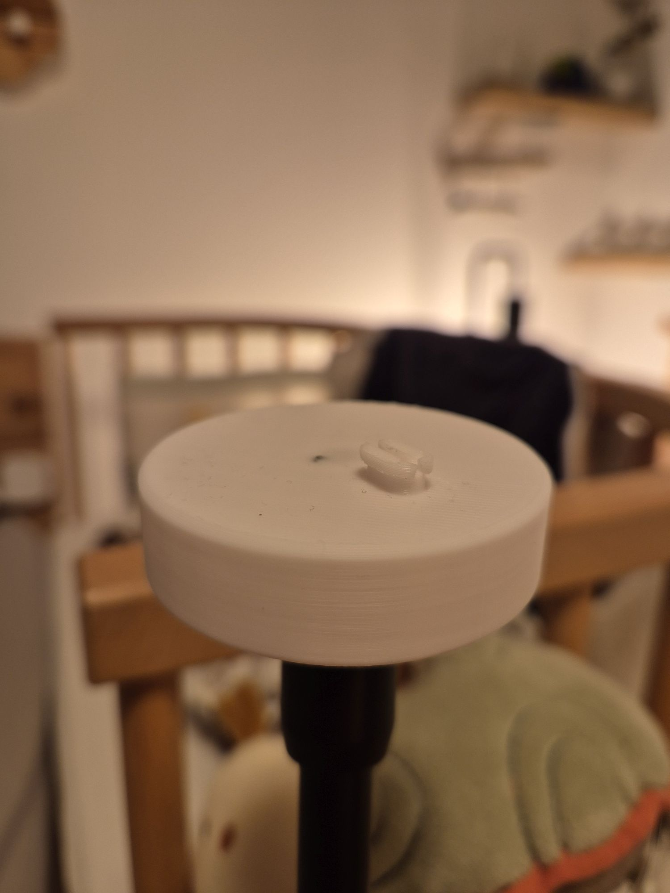
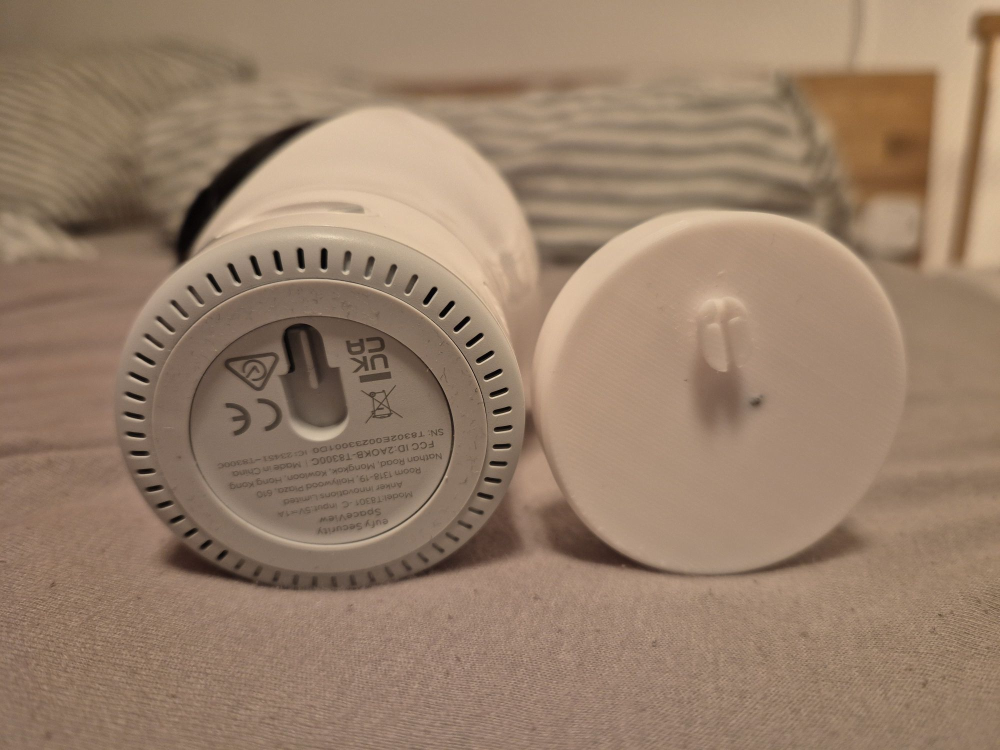
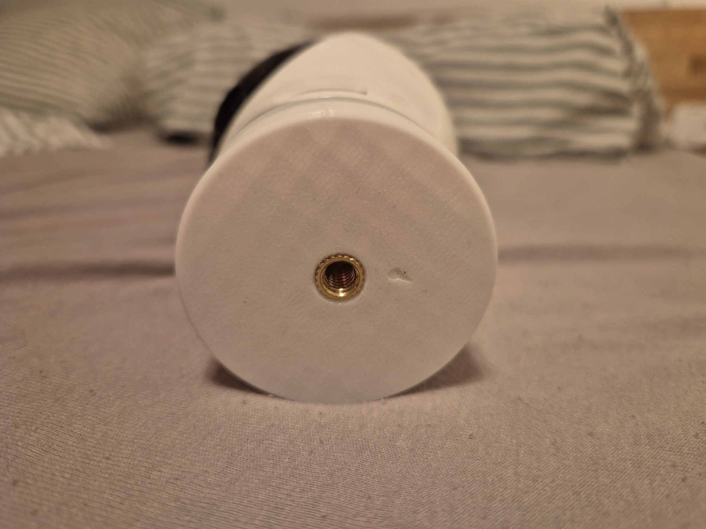
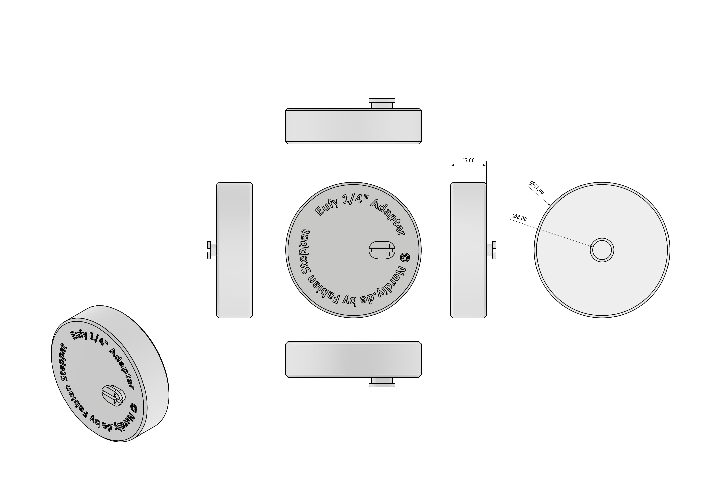

# Eufy SpaceView Baby Monitor - Camera Thread Adapter by Nerdiy.de

---

## 🎯 Project Overview

This product page provides a complete overview of the STL package, bill of materials, and recommended print settings.

---

## 📋 About This Product

- **Product Name**: Eufy SpaceView Baby Monitor - Camera Thread Adapter by Nerdiy.de
- **Nerdiy.de Shop**: [ View Product](https://www.nerdiy.de/)
- **Created**: March 2026

---

## 🛒 Purchase Options

### Primary Source (Recommended)
- **[ Nerdiy.de Shop](https://www.nerdiy.de/)** - Download the STL files here

### Alternative Sources
- **[🎨 Printables](https://www.printables.com/model/1285832-eufy-spaceview-baby-monitor-camera-thread-adapter)**

> 💖 **Support independent makers**: By purchasing the STL files through [Nerdiy.de Shop](https://www.nerdiy.de/), you directly support further development and new projects!

---

## 📦 Bill of Materials

### 🛠️ Required Tools

| Qty | Component | ASIN (DE) | Amazon (DE) |
|-----|-----------|-----------|-------------|
| 1x | Screwdriver Set | B092LVWNX8 | [Amazon](https://www.amazon.de/dp/B092LVWNX8?tag=nerdiyde018-21&linkCode=ogi&th=1&psc=1) |
| 1x | Soldering Iron | B0CCV6T329 | [Amazon](https://www.amazon.de/dp/B0CCV6T329?tag=nerdiyde018-21&linkCode=ogi&th=1&psc=1) |
| 1x | Prusa 3D Printer | - | [Prusa3D](https://www.prusa3d.com/de/#a_aid=Nerdiy) |

### 📦 Required Components

| Qty | Component | ASIN (DE) | Amazon (DE) |
|-----|-----------|-----------|-------------|
| 1x | PETG Filament | B0C6MMM51Y | [Amazon](https://www.amazon.de/dp/B0C6MMM51Y?tag=nerdiyde018-21&linkCode=ogi&th=1&psc=1) |
| 1x | 1/4" Thread Insert | B09MTS6ZZQ | [Amazon](https://www.amazon.de/dp/B09MTS6ZZQ?tag=nerdiyde018-21&linkCode=ogi&th=1&psc=1) |

---

## 🖼️ Product Images

<table>
  <tr>
    <td></td>
    <td></td>
  </tr>
  <tr>
    <td></td>
    <td></td>
  </tr>
  <tr>
    <td></td>
    <td></td>
  </tr>
</table>

---

## 🖨️ 3D Print Settings

### ⚙️ Recommended Print Settings
| Setting | Value |
|---------|-------|
| **Filament Type** | Weather and UV-resistant (for example PETG, ABS, or ASA) |
| **Layer Height** | 0.2 mm |
| **Infill** | 15-25% |
| **Wall Lines** | 3-5 |
| **Supports** | As needed by part geometry |

> 🖨️ **Print Orientation**: Use the orientation included in the STL package to maximize part strength and fit.

---

## 🎯 How to Use

### Step-by-Step Guide

1. **Gather Your Materials** — Review the bill of materials and acquire all required hardware (thread inserts, screws, filament).
2. **Download 3D Files** — [🛍️ Download from Nerdiy.de Shop](https://www.nerdiy.de/) (recommended) or from [Printables](https://www.printables.com/model/1285832-eufy-spaceview-baby-monitor-camera-thread-adapter).
3. **Slice & Print** — Use the recommended settings (PETG, 0.2 mm layers, 15–25% infill, 3–5 wall lines). No supports required in most orientations.
4. **Install Thread Inserts** — Press M3 thread inserts into the designated holes using a soldering iron.
5. **Mount the Adapter** — Attach the printed adapter to the Eufy SpaceView camera using the M3 countersunk screws.
6. **Test** — Verify that the camera sits securely on the adapter and check that the thread engagement is correct before final installation.

---

## 📄 License

See the license information on the product page.

---

**Last Updated**: 22. February 2026
**Status**: Active - Ready to build
