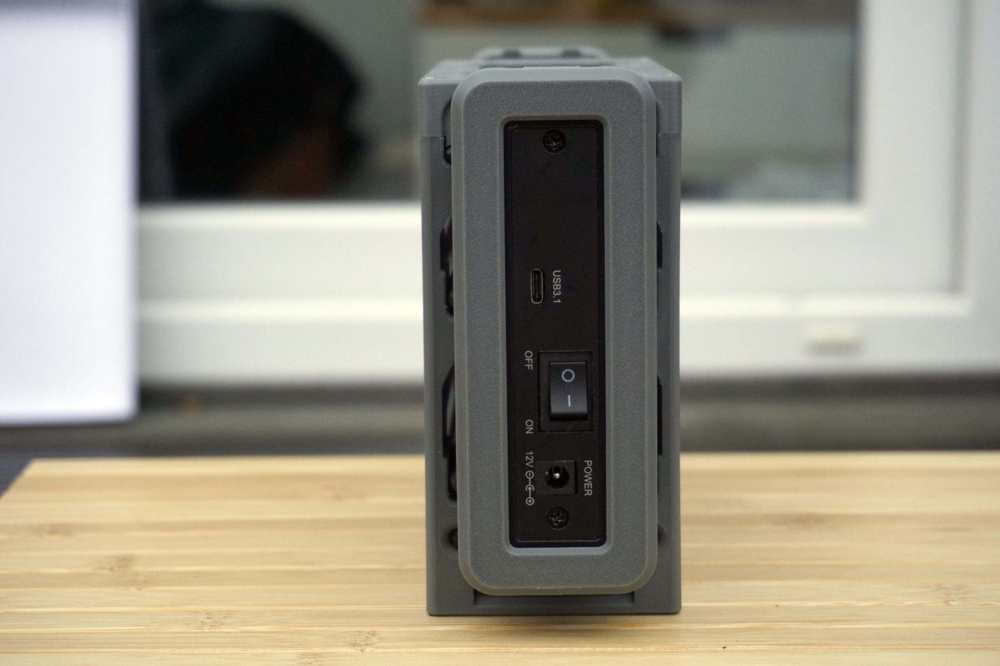
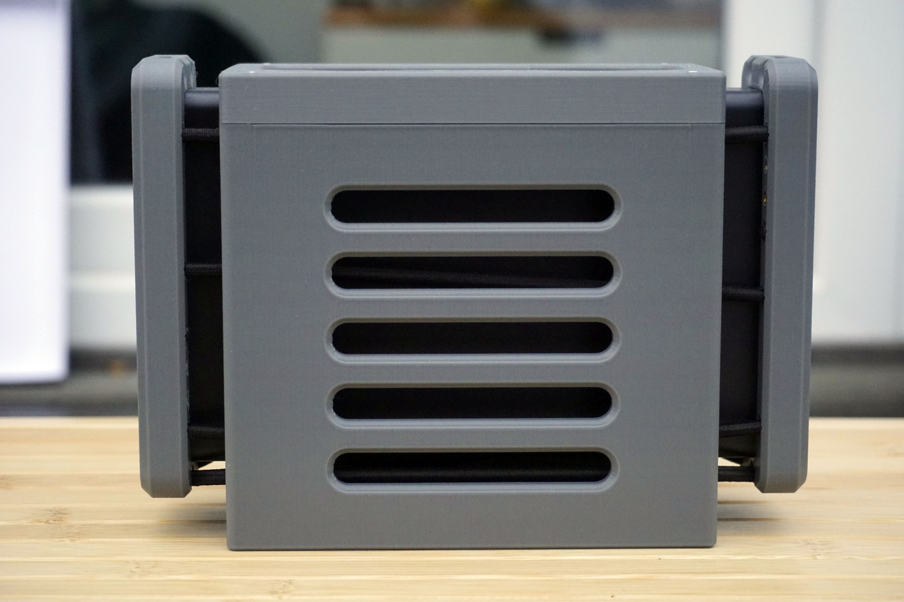
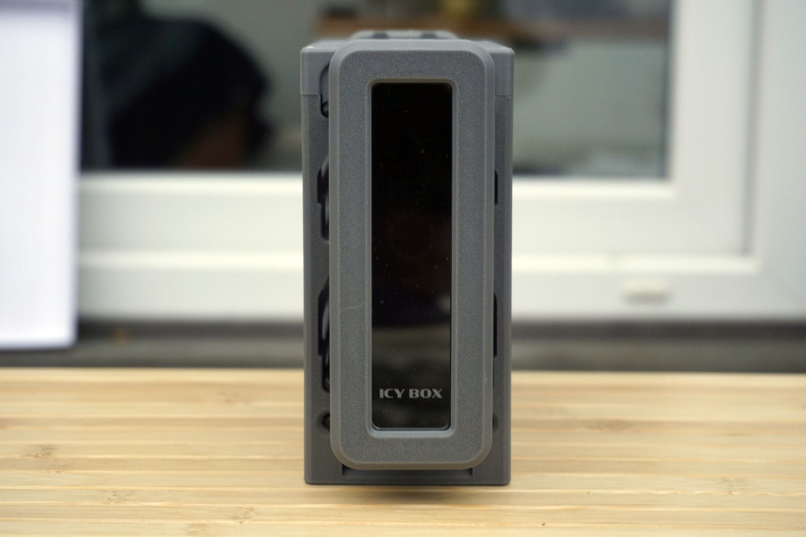
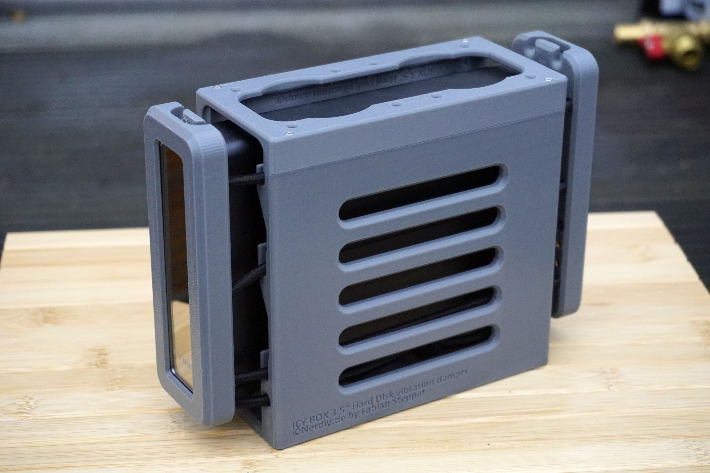
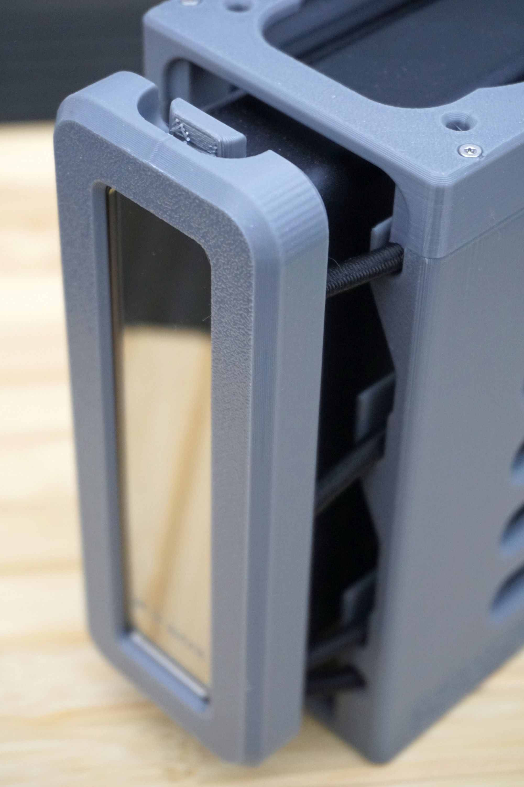
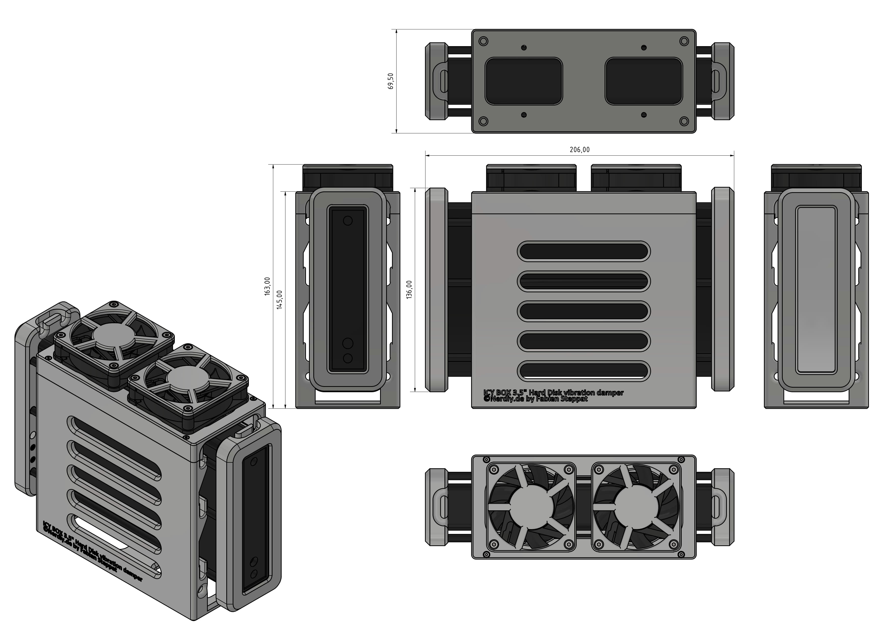

# ICY BOX 3.5" Hard Drive Decoupler by Nerdiy.de

---

## 🎯 Project Overview

The ICY BOX 3.5" Hard Drive Decoupler is an innovative 3D-printable vibration isolation solution for mounting 3.5" hard drives in external ICY BOX enclosures without vibration transmission.

This project provides STL files for 3D-printed parts specifically designed to hold your ICY BOX hard drive enclosure with vibration damping and stability.

---

## 📋 About This Product

This product provides 3D-printable suspension and isolation parts for ICY BOX 3.5" hard drive enclosures.

- **Product Name**: ICY BOX 3.5" Hard Drive Decoupler by Nerdiy.de
- **Nerdiy.de Shop**: [🛍️ Purchase STL Files](https://nerdiy.de/de_de/produkt/icy-box-35-festplatten-entkoppler-3d-druckbar-stl-dateien/)
- **Created**: February 2026
- **Note**: The decoupler system enables vibration-free mounting of external ICY BOX hard drive enclosures.

---

## 🛒 Purchase Options

### Primary Source (Recommended)
- **[🛍️ Nerdiy.de Shop](https://nerdiy.de/de_de/produkt/icy-box-35-festplatten-entkoppler-3d-druckbar-stl-dateien/)** - Purchase the STL files here to support independent design and development

### Alternative Sources
- **[🎨 Printables Store](https://www.printables.com/model/1279739-icy-box-35-hard-drive-decoupler-by-nerdiyde)**
- **[🖨️ Cults3D](https://cults3d.com/en/3d-model/gadget/icy-box-3-5-hard-drive-decoupler-3d-printable-stl-files)**

> 💖 **Support independent makers**: By purchasing the STL files through [Nerdiy.de Shop](https://nerdiy.de/de_de/produkt/icy-box-35-festplatten-entkoppler-3d-druckbar-stl-dateien/), you directly support further development and new projects!

---

## 📦 Bill of Materials

### 🎨 3D Print Materials

| Qty | Component | ASIN (DE) | Amazon (DE) |
|-----|-----------|-----------|-------------|
| 1x | PETG Filament 1.75mm (1kg) | B07T2QZYS1 | [Amazon](https://www.amazon.de/dp/B07T2QZYS1?tag=nerdiyde018-21&linkCode=ogi&th=1&psc=1) |

### 🪢 Suspension Hardware

| Qty | Component | ASIN (DE) | Amazon (DE) |
|-----|-----------|-----------|-------------|
| 1x (needed length: 1x 55cm + 2x 70cm) | Silicone Rubber Cord 5mm (5m) | B00YEFQUSI | [Amazon](https://www.amazon.de/dp/B00YEFQUSI?tag=nerdiyde018-21&linkCode=ogi&th=1&psc=1) |

### ⚙️ Fasteners & Hardware

| Qty | Component | ASIN (DE) | Amazon (DE) |
|-----|-----------|-----------|-------------|
| 4x | M3x25 Countersunk Screw | B09MZQ8C84 | [Amazon](https://www.amazon.de/dp/B09MZQ8C84?tag=nerdiyde018-21&linkCode=ogi&th=1&psc=1) |
| 8x | M2x20 Countersunk Screw | B09N4WV1WP | [Amazon](https://www.amazon.de/dp/B09N4WV1WP?tag=nerdiyde018-21&linkCode=ogi&th=1&psc=1) |
| 8x | M3x10 Set Screw (Madenschraube) | B0DNFW44L9 | [Amazon](https://www.amazon.de/dp/B0DNFW44L9?tag=nerdiyde018-21&linkCode=ogi&th=1&psc=1) |
| 16x | M3 Thread Insert | B08BCRZZS3 | [Amazon](https://www.amazon.de/dp/B08BCRZZS3?tag=nerdiyde018-21&linkCode=ogi&th=1&psc=1) |
| 4x | M2 Thread Insert | B088QJG676 | [Amazon](https://www.amazon.de/dp/B088QJG676?tag=nerdiyde018-21&linkCode=ogi&th=1&psc=1) |

### 🔌 Cables & Electronics

| Qty | Component | ASIN (DE) | Amazon (DE) |
|-----|-----------|-----------|-------------|
| 1x | USB-C Cable (General Purpose) | B0BPCBP15P | [Amazon](https://www.amazon.de/dp/B0BPCBP15P?tag=nerdiyde018-21&linkCode=ogi&th=1&psc=1) |

### 📦 ICY BOX Enclosure

| Qty | Component | ASIN (DE) | Amazon (DE) |
|-----|-----------|-----------|-------------|
| 1x | ICY BOX 3.5" USB-C Enclosure | B07JFY2357 | [Amazon](https://www.amazon.de/dp/B07JFY2357?tag=nerdiyde018-21&linkCode=ogi&th=1&psc=1) |

---

## 🖼️ Product Images

<table>
  <tr>
    <td></td>
    <td></td>
  </tr>
  <tr>
    <td></td>
    <td></td>
  </tr>
  <tr>
    <td></td>
    <td></td>
  </tr>
</table>

---

## 🖨️ 3D Print Settings

### ⚙️ Recommended Print Settings
| Setting | Value |
|---------|-------|
| **Filament Type** | PETG (weather and vibration-resistant) |
| **Layer Height** | 0.2mm |
| **Infill** | 15-25% |
| **Wall Lines** | 3-5 |
| **Support** | Yes (for overhangs > 45°) |

> **💡 Print Orientation**: The parts should be printed in the orientation that provides maximum structural integrity. The rubber cord suspension requires careful stress-bearing design.

---

## 🎯 How to Use

### Step-by-Step Assembly Guide

1. **Gather Your Materials**
   - Purchase all components from the "Bill of Materials" section above
   - All Amazon links are pre-configured with affiliate tags to support Nerdiy.de development
   - For STL files, [purchase through Nerdiy.de Shop](https://nerdiy.de/de_de/produkt/icy-box-35-festplatten-entkoppler-3d-druckbar-stl-dateien/) to support independent makers

2. **Download 3D Files**
   - [🛍️ Download from Nerdiy.de Shop](https://nerdiy.de/de_de/produkt/icy-box-35-festplatten-entkoppler-3d-druckbar-stl-dateien/) (recommended - supports independent makers)
   - Alternative: [Download from Printables](https://www.printables.com/model/1279739-icy-box-35-hard-drive-decoupler-by-nerdiyde)
   - Alternative: [Download from Cults3D](https://cults3d.com/en/3d-model/gadget/icy-box-3-5-hard-drive-decoupler-3d-printable-stl-files)

3. **Prepare for 3D Printing**
   - Print the mounting and suspension parts with these settings:
     - **Layer Height**: 0.2mm
     - **Infill**: 20-25%
     - **Supports**: Yes (for overhangs > 45°)
     - **Material**: PETG (recommended for durability and vibration resistance)

4. **Assembly**
   - Clean all printed parts after removal from build plate
   - Cut rubber cord to required lengths:
     - 1x 55cm (main suspension)
     - 2x 70cm (side support)
   - Install the suspension frame on the ICY BOX enclosure using M3x25 screws
   - Attach the rubber cord isolation points
   - Secure all fasteners (M3x10 set screws and M2x20 countersunk screws)
   - Install thread inserts (M3x16 and M2x4) for screw reinforcement
   - Verify that the enclosure hangs freely without touching the frame

5. **Installation**
   - Mount the decoupler assembly in your desired location (desk, wall mount, etc.)
   - Connect your hard drive enclosure to the USB-C interface
   - Ensure all vibration isolation points are properly connected
   - Test the system for stability before placing sensitive equipment nearby

6. **Maintenance**
   - Periodically check the rubber cord for wear and degradation
   - Replace cords if they show signs of damage or reduced elasticity
   - Check all screws for tightness
   - Clean the enclosure and frame assembly as needed

---

## 📄 License

The license for these STL files is included with your purchase. When you purchase the STL files, you receive the complete license terms along with the downloadable files.

---

**Last Updated**: 28. February 2026  
**Status**: Complete - All materials and assembly guide documented
