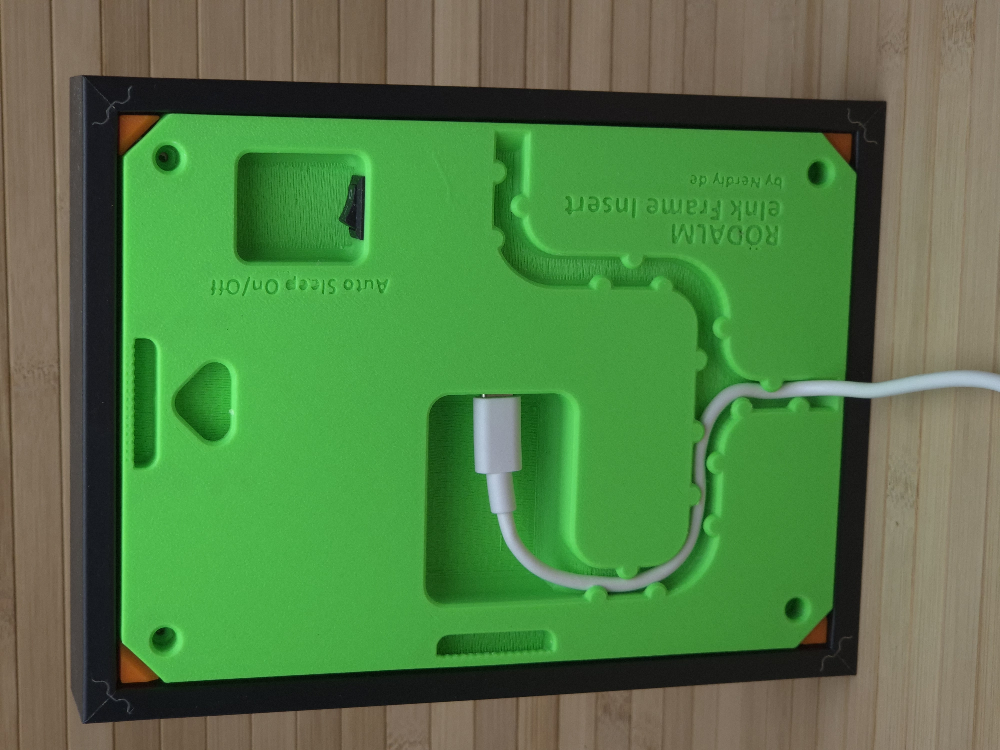

# Ikea RÖDALM - eInk frame insert for 13x18cm / 5″x7″ picture frames by Nerdiy.de

---

## 🎯 Project Overview

This product page provides a complete overview of the STL package, bill of materials, and recommended print settings.

---

## 📋 About This Product

- **Product Name**: Ikea RÖDALM - eInk frame insert for 13x18cm / 5″x7″ picture frames by Nerdiy.de
- **Nerdiy.de Shop**: [ View Product](https://nerdiy.de/en/product-2/ikea-roedalm-eink-rahmeneinsatz-fuer-13x18cm-5x7-bilderrahmen-3d-druckbar-stl-dateien/)
- **Created**: March 2026

---

## 🛒 Purchase Options

### Primary Source (Recommended)
- **[ Nerdiy.de Shop](https://nerdiy.de/en/product-2/ikea-roedalm-eink-rahmeneinsatz-fuer-13x18cm-5x7-bilderrahmen-3d-druckbar-stl-dateien/)** - Download the STL files here

### Alternative Sources
- **[ Printables](https://www.printables.com/model/1357158-ikea-rodalm-eink-frame-insert-for-13x18cm-5x7-pict)**
- **[ Cults3D](https://cults3d.com/de/modell-3d/gadget/ikea-roedalm-eink-frame-insert-for-13x18cm-5-x7-picture-frames-by-nerdiy-de)**

---

## 📦 Bill of Materials

### 🛠️ Required Tools

| Qty | Component | ASIN (DE) | Amazon (DE) |
|-----|-----------|-----------|-------------|
| 1x | Screwdriver Set | B086SQZGLJ | [Amazon](https://www.amazon.de/dp/B086SQZGLJ?tag=nerdiyde018-21&linkCode=ogi&th=1&psc=1) |
| 1x | Soldering Iron | B0D5M727WM | [Amazon](https://www.amazon.de/dp/B0D5M727WM?tag=nerdiyde018-21&linkCode=ogi&th=1&psc=1) |

### 📦 Required Components

| Qty | Component | ASIN (DE) | Amazon (DE) |
|-----|-----------|-----------|-------------|
| 1x | USB Power Supply 5V/3A (Optional) | B00WLI5E3M | [Amazon](https://www.amazon.de/dp/B00WLI5E3M?tag=nerdiyde018-21&linkCode=ogi&th=1&psc=1) |
| 1x | USB-C Cable 5V/3A | B098WVHH5L | [Amazon](https://www.amazon.de/dp/B098WVHH5L?tag=nerdiyde018-21&linkCode=ogi&th=1&psc=1) |
| 1x | Waveshare e-Paper Display HAT 7.5" V2 | B075R4QY3L | [Amazon](https://www.amazon.de/dp/B075R4QY3L?tag=nerdiyde018-21&linkCode=ogi&th=1&psc=1) |
| 1x | Seeed Studio XIAO ESP32 C3 | B0B94JZ2YF | [Amazon](https://www.amazon.de/dp/B0B94JZ2YF?tag=nerdiyde018-21&linkCode=ogi&th=1&psc=1) |
| 1x | ePaper Driver Board (for Seeed Studio XIAO) | - | - |
| 1x | LiPo 14500 Battery | B01BDRIX34 | [Amazon](https://www.amazon.de/dp/B01BDRIX34?tag=nerdiyde018-21&linkCode=ogi&th=1&psc=1) |
| 1x | 14500 Battery Holder | B000U1KYLO | [Amazon](https://www.amazon.de/dp/B000U1KYLO?tag=nerdiyde018-21&linkCode=ogi&th=1&psc=1) |
| 10x | M2 Thread Insert | B08DDBWKZF | [Amazon](https://www.amazon.de/dp/B08DDBWKZF?tag=nerdiyde018-21&linkCode=ogi&th=1&psc=1) |
| 5x | M3 Thread Insert | B08BCRZZS3 | [Amazon](https://www.amazon.de/dp/B08BCRZZS3?tag=nerdiyde018-21&linkCode=ogi&th=1&psc=1) |
| 5x | M3x8 Countersunk Screw | B0957T69W6 | [Amazon](https://www.amazon.de/dp/B0957T69W6?tag=nerdiyde018-21&linkCode=ogi&th=1&psc=1) |
| 4x | M2x10 Countersunk Screw | B0957SLZTB | [Amazon](https://www.amazon.de/dp/B0957SLZTB?tag=nerdiyde018-21&linkCode=ogi&th=1&psc=1) |
| 2x | M2x6 Countersunk Screw | B0957W34XS | [Amazon](https://www.amazon.de/dp/B0957W34XS?tag=nerdiyde018-21&linkCode=ogi&th=1&psc=1) |
| 4x | M2x12 Countersunk Screw | B0957VNMTS | [Amazon](https://www.amazon.de/dp/B0957VNMTS?tag=nerdiyde018-21&linkCode=ogi&th=1&psc=1) |
| 1x | Mini Switch | B08SJ8XY2B | [Amazon](https://www.amazon.de/dp/B08SJ8XY2B?tag=nerdiyde018-21&linkCode=ogi&th=1&psc=1) |
| 1x | MAX17043 Breakout Board | B07Z64D8TW | [Amazon](https://www.amazon.de/dp/B07Z64D8TW?tag=nerdiyde018-21&linkCode=ogi&th=1&psc=1) |
| 1x | Wire (Litze) | B0C7TJG9YB | [Amazon](https://www.amazon.de/dp/B0C7TJG9YB?tag=nerdiyde018-21&linkCode=ogi&th=1&psc=1) |
| 1x | USB-C Cable (General Purpose) | B0BPCBP15P | [Amazon](https://www.amazon.de/dp/B0BPCBP15P?tag=nerdiyde018-21&linkCode=ogi&th=1&psc=1) |
| 1x | Ikea RÖDALM Frame 5"x7" | B0DRGT6H7P | [Amazon](https://www.amazon.de/dp/B0DRGT6H7P?tag=nerdiyde018-21&linkCode=ogi&th=1&psc=1) |

---

## 🖼️ Product Images

| Image 1 | Image 2 |
|---------|---------|
|  |  |
|  |  |

---

## 🖨️ 3D Print Settings

### ⚙️ Recommended Print Settings
| Setting | Value |
|---------|-------|
| **Filament Type** | Weather and UV-resistant (for example PETG, ABS, or ASA) |
| **Layer Height** | 0.2 mm |
| **Infill** | 15-25% |
| **Wall Lines** | 3-5 |
| **Supports** | As needed by part geometry |

> 🖨️ **Print Orientation**: Use the orientation included in the STL package to maximize part strength and fit.

---

## 🔧 How to Use

1. Download the STL files from the Nerdiy.de product page.
2. Print all required parts with the recommended settings.
3. Prepare all parts from the bill of materials.
4. Assemble and test before final installation.

---

## 📄 License

See the license information on the product page.

---

**Last Updated**: February 27, 2026
**Status**: Active - Ready to build
