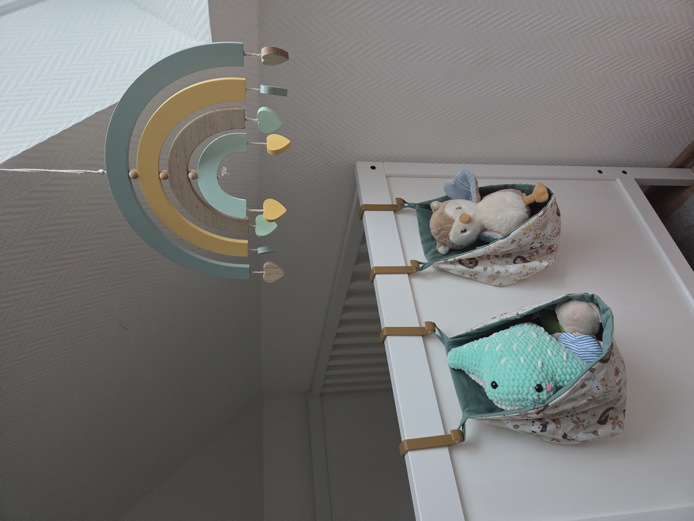
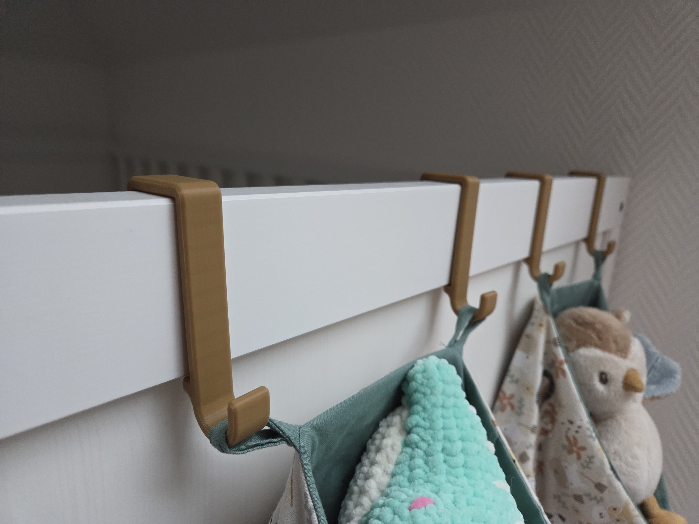
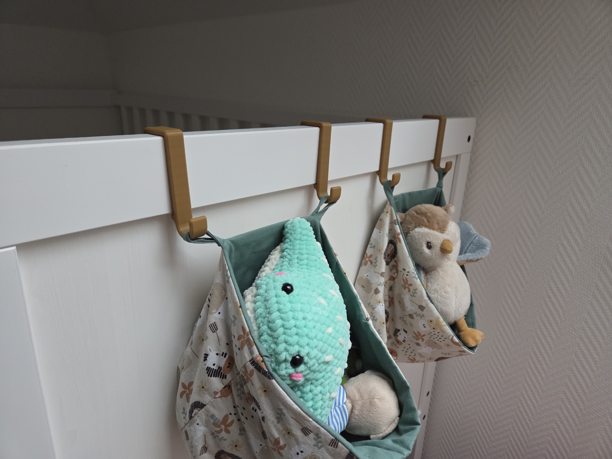
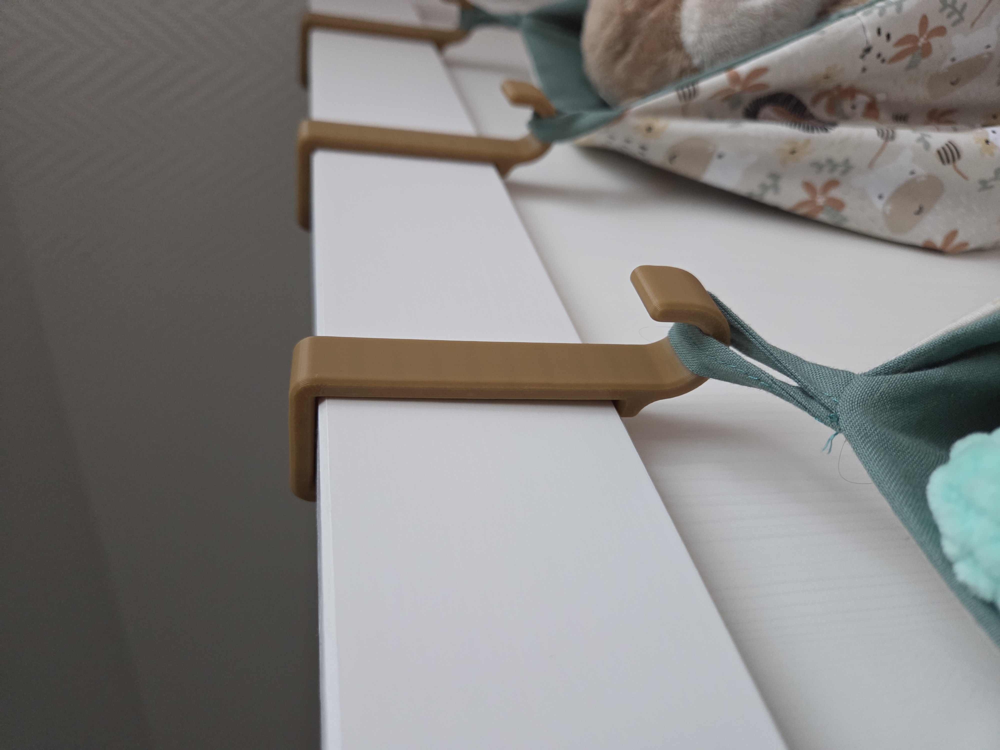

# IKEA SUNDVIK Bed Hook for Head and Foot Board by Nerdiy.de

---

## 🎯 Project Overview

This printable bed hook is designed as a replacement or repair part for the headboard and footboard connection on an IKEA SUNDVIK bed.

---

## 📋 About This Product

The hook is useful when an original bed connector is missing, worn out, or broken. It provides a straightforward way to restore the bed frame connection with a printable spare part instead of replacing the entire furniture assembly.

---

## 🛒 Purchase Options

### Primary Source (Recommended)
- **[Nerdiy.de Shop](https://www.nerdiy.de/)** - Download the STL files here

### Alternative Sources
- **[Printables](https://www.printables.com/model/1411649-ikea-sundvik-bed-hook-for-head-and-foot-board)**

> Support Nerdiy.de if you want to help fund future product updates, documentation improvements, and new maker projects.

---

## 📦 Bill of Materials

### 🛠️ Required Tools

| Qty | Tool | ASIN (DE) | Amazon (DE) |
|-----|------|-----------|-------------|
| 1x | 3D Printer | - | [Prusa3D](https://www.prusa3d.com/de/#a_aid=Nerdiy) |

### 📦 Required Components

| Qty | Component | ASIN (DE) | Amazon (DE) |
|-----|-----------|-----------|-------------|
| 1x | PETG Filament (1kg) | B07T2QZYS1 | [Amazon](https://www.amazon.de/dp/B07T2QZYS1?tag=nerdiyde018-21&linkCode=ogi&th=1&psc=1) |

---

## 🖼️ Product Images
<table>
  <tr>
    <td></td>
    <td></td>
  </tr>
  <tr>
    <td></td>
    <td></td>
  </tr>
</table>

---

## 🖨️ 3D Print Settings

## 3D Print Settings

### ⚙️ Recommended Print Settings
| Parameter | Value |
| --- | --- |
| Filament Type | Weather and UV-resistant (for example PETG, ABS, or ASA) |
| Layer Height | 0.2 mm |
| Infill | 15-25% |
| Wall Lines | 3-5 |
| Supports | As needed by part geometry |

Use the orientation included in the STL package to minimize supports and achieve better surface quality on visible faces.
## 🎯 How to Use

### Step-by-Step Guide

1. Download the STL files from Nerdiy.de or the linked Printables page.
2. Print the replacement hook with the recommended settings.
3. Remove the damaged or missing bed hook and compare the printed part with the original geometry.
4. Install the replacement hook on the IKEA SUNDVIK bed and test the headboard or footboard connection before full use.

---

## 📄 License

Refer to the original product page for the license terms that apply to this STL package.

---

**Last Updated**: March 17, 2026
**Status**: Active - Ready to build

