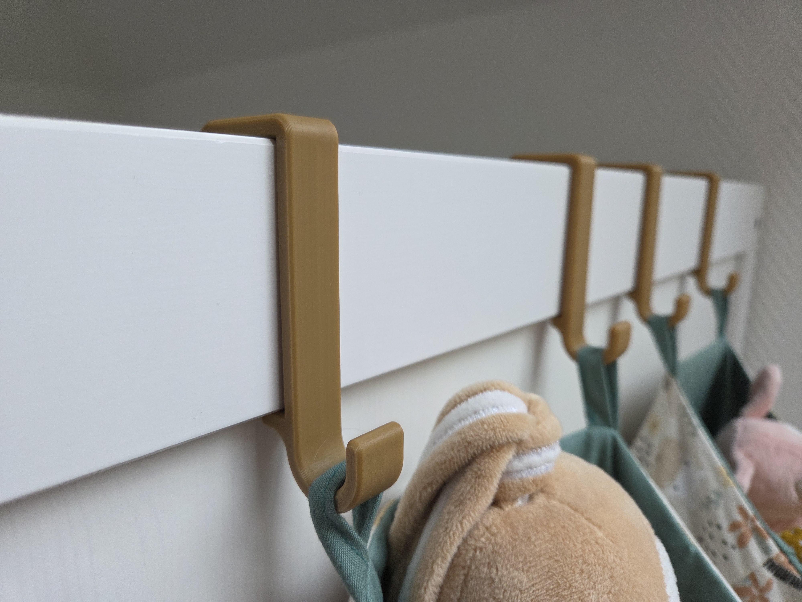
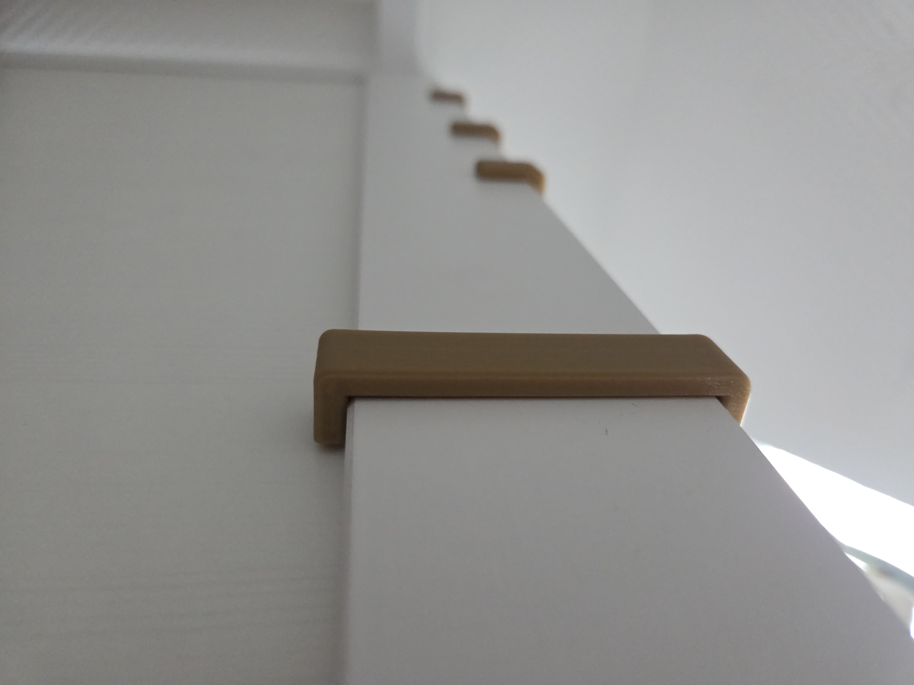
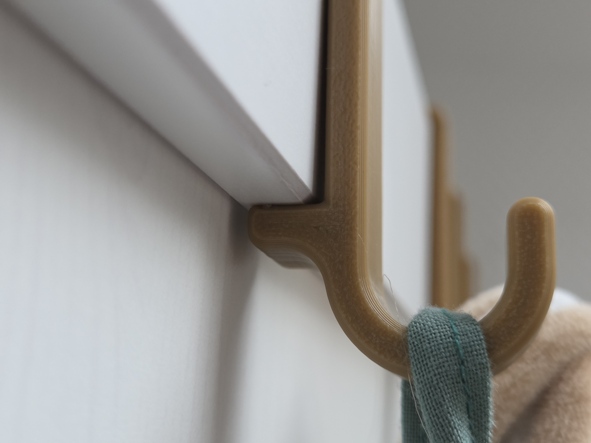

# IKEA SUNDVIK Bed Hook Strong for Head and Foot Board by Nerdiy.de

---

## 🎯 Project Overview

This reinforced printable bed hook is a stronger replacement variant for the headboard and footboard connection on an IKEA SUNDVIK bed.

---

## 📋 About This Product

The stronger version is intended for users who want more material around the load-bearing area or who already had issues with a lighter replacement design. It is meant as a practical repair part that restores bed stability with a printable upgrade.

---

## 🛒 Purchase Options

### Primary Source (Recommended)
- **[Nerdiy.de Shop](https://www.nerdiy.de/)** - Download the STL files here

### Alternative Sources
- **[Printables](https://www.printables.com/model/1424378-ikea-sundvik-bed-hook-strong-for-head-and-foot-boa)**

> Support Nerdiy.de if you want to help fund future product updates, documentation improvements, and new maker projects.

---

## 📦 Bill of Materials

### 🛠️ Required Tools

| Qty | Tool | ASIN (DE) | Amazon (DE) |
|-----|------|-----------|-------------|
| 1x | 3D Printer | - | [Prusa3D](https://www.prusa3d.com/de/#a_aid=Nerdiy) |

### 📦 Required Components

| Qty | Component | ASIN (DE) | Amazon (DE) |
|-----|-----------|-----------|-------------|
| 1x | PETG Filament (1kg) | B07T2QZYS1 | [Amazon](https://www.amazon.de/dp/B07T2QZYS1?tag=nerdiyde018-21&linkCode=ogi&th=1&psc=1) |

---

## 🖼️ Product Images
<table>
  <tr>
    <td></td>
    <td></td>
  </tr>
  <tr>
    <td></td>
    <td></td>
  </tr>
</table>

---

## 🖨️ 3D Print Settings

## 3D Print Settings

### ⚙️ Recommended Print Settings
| Parameter | Value |
| --- | --- |
| Filament Type | Weather and UV-resistant (for example PETG, ABS, or ASA) |
| Layer Height | 0.2 mm |
| Infill | 15-25% |
| Wall Lines | 3-5 |
| Supports | As needed by part geometry |

Use the orientation included in the STL package to minimize supports and achieve better surface quality on visible faces.
## 🎯 How to Use

### Step-by-Step Guide

1. Download the STL files from Nerdiy.de or the linked Printables page.
2. Print the reinforced replacement hook with the recommended settings.
3. Compare the part against the original bed connection and remove any damaged component from the frame.
4. Install the new hook and verify the headboard or footboard is locked in place before regular use.

---

## 📄 License

Refer to the original product page for the license terms that apply to this STL package.

---

**Last Updated**: March 17, 2026
**Status**: Active - Ready to build

