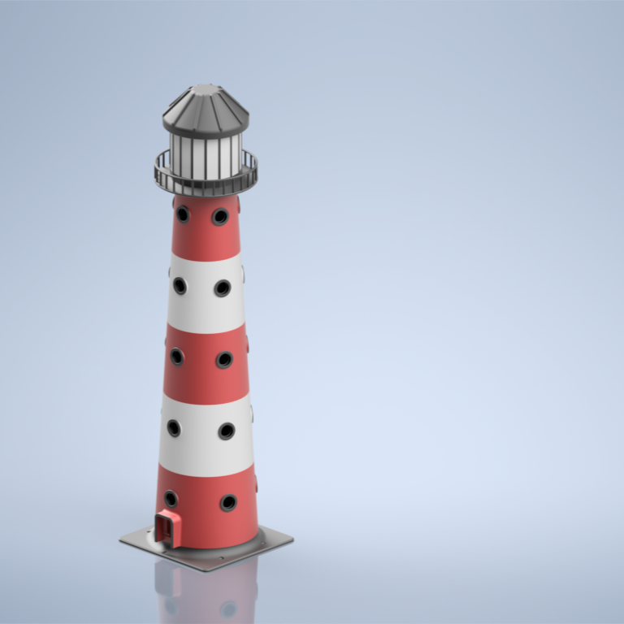
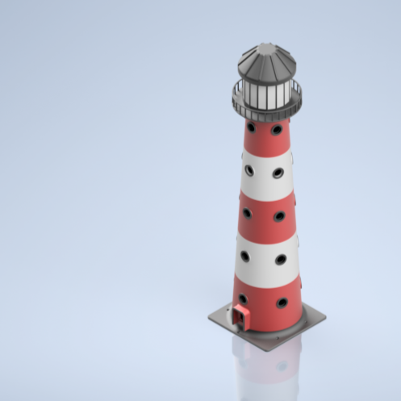
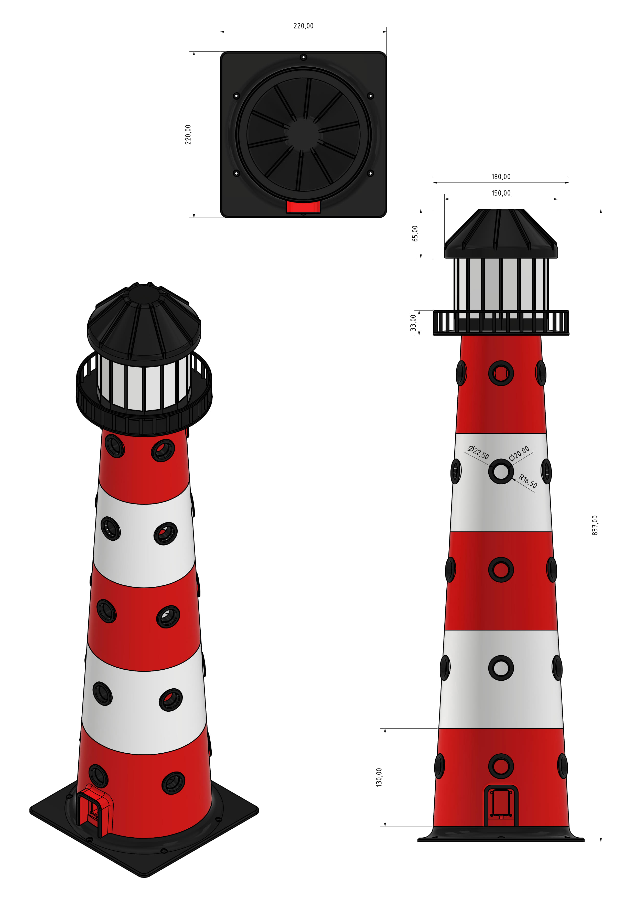

# LIYthouse - ESPHome Based Lighthouse with LEDs by Nerdiy.de

---

## 🎯 Project Overview

This project combines a decorative 3D printable lighthouse enclosure with LED lighting and ESPHome-based control for smart-home or ambient lighting setups.

---

## 📋 About This Product

LIYthouse is intended for makers who want to build a themed decorative light with programmable behavior. The printed enclosure is paired with LED and controller hardware to create a lighthouse that fits both display shelves and smart-home projects.

---

## 🛒 Purchase Options

### Primary Source (Recommended)
- **[Nerdiy.de Shop](https://www.nerdiy.de/)** - Download the STL files here

### Alternative Sources
- **[Printables](https://www.printables.com/model/1279693-liythouse-esphome-based-lighthouse-with-leds-by-ne)**

> Support Nerdiy.de if you want to help fund future product updates, documentation improvements, and new maker projects.

---

## 📦 Bill of Materials

### Required Tools

| Qty | Tool | ASIN (DE) | Amazon (DE) |
|-----|------|-----------|-------------|
| 1x | Screwdriver Set | B086SQZGLJ | [Amazon](https://www.amazon.de/dp/B086SQZGLJ?tag=nerdiyde018-21&linkCode=ogi&th=1&psc=1) |
| 1x | Soldering Iron | B0D5M727WM | [Amazon](https://www.amazon.de/dp/B0D5M727WM?tag=nerdiyde018-21&linkCode=ogi&th=1&psc=1) |
| 1x | Side Cutters | B005EXOF6S | [Amazon](https://www.amazon.de/Electronic-Elektronik-Seitenschneider-Lichtwellenleiter-Rostschutz-125/dp/B005EXOF6S?tag=nerdiyde018-21&linkCode=ogi&th=1&psc=1) |
| 1x | 3D Printer | - | [Prusa3D](https://www.prusa3d.com/de/#a_aid=Nerdiy) |

### 📦 Required Components

| Qty | Component | ASIN (DE) | Amazon (DE) |
|-----|-----------|-----------|-------------|
| 5x | PETG Filament (1kg) - 2kg white, 2kg red, 1kg black | B07T2QZYS1 | [Amazon](https://www.amazon.de/dp/B07T2QZYS1?tag=nerdiyde018-21&linkCode=ogi&th=1&psc=1) |
| 1x | Seeed Studio XIAO ESP32-S3 | B0BYSB66S5 | [Amazon](https://www.amazon.de/dp/B0BYSB66S5?tag=nerdiyde018-21&linkCode=ogi&th=1&psc=1) |
| 5x | M3x30 Countersunk | B09MZQC62G | [Amazon](https://www.amazon.de/dp/B09MZQC62G?tag=nerdiyde018-21&linkCode=ogi&th=1&psc=1) |
| 1x | M3x20 Countersunk | B09MZPK3KM | [Amazon](https://www.amazon.de/dp/B09MZPK3KM?tag=nerdiyde018-21&linkCode=ogi&th=1&psc=1) |
| 28x | M3x16 Countersunk | B0957VNMTS | [Amazon](https://www.amazon.de/dp/B0957VNMTS?tag=nerdiyde018-21&linkCode=ogi&th=1&psc=1) |
| 4x | M3x8 Countersunk | B0957T69W6 | [Amazon](https://www.amazon.de/dp/B0957T69W6?tag=nerdiyde018-21&linkCode=ogi&th=1&psc=1) |
| 30x | M3 Thread Insert | B08BCRZZS3 | [Amazon](https://www.amazon.de/dp/B08BCRZZS3?tag=nerdiyde018-21&linkCode=ogi&th=1&psc=1) |
| 4x | M2x6 Countersunk | B0957W34XS | [Amazon](https://www.amazon.de/dp/B0957W34XS?tag=nerdiyde018-21&linkCode=ogi&th=1&psc=1) |
| 4x | M2x20 Countersunk | B09N4WV1WP | [Amazon](https://www.amazon.de/dp/B09N4WV1WP?tag=nerdiyde018-21&linkCode=ogi&th=1&psc=1) |
| 8x | M2 Thread Insert | B08DDBWKZF | [Amazon](https://www.amazon.de/dp/B08DDBWKZF?tag=nerdiyde018-21&linkCode=ogi&th=1&psc=1) |
| 16x | Neodym Magnet 8x3mm | B0BX5WYRMJ | [Amazon](https://www.amazon.de/dp/B0BX5WYRMJ?tag=nerdiyde018-21&linkCode=ogi&th=1&psc=1) |
| 96x LEDs | WS2812 LED Strip (100 LEDs / 1m) | B088JZCBDR | [Amazon](https://www.amazon.de/dp/B088JZCBDR?tag=nerdiyde018-21&linkCode=ogi&th=1&psc=1) |
| 1x | USB-C Breakout Board | B0C1YV339S | [Amazon](https://www.amazon.de/dp/B0C1YV339S?tag=nerdiyde018-21&linkCode=ogi&th=1&psc=1) |
| 1x | USB-C Cable (5V/3A) | B098WVHH5L | [Amazon](https://www.amazon.de/dp/B098WVHH5L?tag=nerdiyde018-21&linkCode=ogi&th=1&psc=1) |
| 1x | USB Power Supply (5V/3A) | B00WLI5E3M | [Amazon](https://www.amazon.de/dp/B00WLI5E3M?tag=nerdiyde018-21&linkCode=ogi&th=1&psc=1) |
| 1x | Solder Wire | B0BW8Y66JJ | [Amazon](https://www.amazon.de/dp/B0BW8Y66JJ?tag=nerdiyde018-21&linkCode=ogi&th=1&psc=1) |
| 25x | LED Pixel 20mm | - | - |

---

## 🖼️ Product Images
<table>
  <tr>
    <td></td>
    <td></td>
  </tr>
  <tr>
    <td></td>
    <td></td>
  </tr>
  <tr>
    <td></td>
    <td></td>
  </tr>
</table>

---

## 🖨️ 3D Print Settings

## 3D Print Settings

### ⚙️ Recommended Print Settings
| Parameter | Value |
| --- | --- |
| Filament Type | Weather and UV-resistant (for example PETG, ABS, or ASA) |
| Layer Height | 0.2 mm |
| Infill | 15-25% |
| Wall Lines | 3-5 |
| Supports | As needed by part geometry |

Use the orientation included in the STL package to minimize supports and achieve better surface quality on visible faces.
## 🎯 How to Use

### Step-by-Step Guide

1. Download the STL files from Nerdiy.de or the linked Printables page.
2. Print the lighthouse housing parts with the recommended settings.
3. Prepare the LED and ESPHome-compatible electronics from the bill of materials.
4. Assemble the enclosure, install the electronics, and test the lighting behavior before final placement.

---

## 📄 License

Refer to the original product page for the license terms that apply to this STL package.

---

**Last Updated**: March 17, 2026
**Status**: Active - Ready to build

