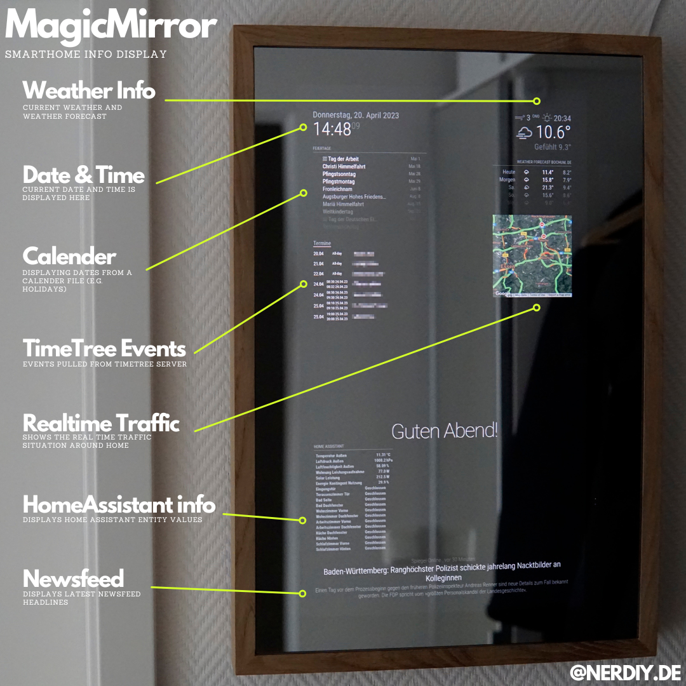

# MagicMirror frame parts for Lenovo Q24i-1L TFT display by Nerdiy.de

**Printables Store Produkt - Nerdiy.de**

---

## 📋 About This Product

This product provides 3D-printable mounting and assembly parts for building a MagicMirror with wooden frame.

- **Product Name**: MagicMirror frame parts for Lenovo Q24i-1L TFT display by Nerdiy.de
- **Nerdiy.de Shop**: [🛍️ Purchase STL Files](https://nerdiy.de/de_de/produkt/magicmirror-rahmenteile-anbauteile-zur-genauen-positionierung-des-tft-displays-3d-druckbar-stl-dateien/)
- **Created**: February 2026
- **Note**: The 3D printed parts are used for mounting and connecting components. The wooden frame parts must be made separately or purchased.

---

## 🛒 Purchase Options

### Primary Source (Recommended)
- **[🛍️ Nerdiy.de Shop](https://nerdiy.de/de_de/produkt/magicmirror-rahmenteile-anbauteile-zur-genauen-positionierung-des-tft-displays-3d-druckbar-stl-dateien/)** - Purchase the STL files here to support independent design and development

### Alternative Sources
- **[🎨 Printables Store](https://www.printables.com/model/1284713-magicmirror-frame-parts-for-lenovo-q24i-1l-tft-dis)**
- **[🖨️ Cults3D](https://cults3d.com/de/modell-3d/gadget/magicmirror-rahmenteile-anbauteile-zur-genauen-positionierung-des-tft-displays)**

> 💖 **Support independent makers**: By purchasing the STL files through [Nerdiy.de Shop](https://nerdiy.de/de_de/produkt/magicmirror-rahmenteile-anbauteile-zur-genauen-positionierung-des-tft-displays-3d-druckbar-stl-dateien/), you directly support further development and new projects!

---

## 📦 Bill of Materials

### 🛠️ Required Tools

| Qty | Tool | ASIN (DE) | Amazon (DE) |
|-----|------|-----------|-------------|
| 1x | Screwdriver Set | B092LVWNX8 | [Amazon](https://www.amazon.de/dp/B092LVWNX8?tag=nerdiyde018-21&linkCode=ogi&th=1&psc=1) |
| 1x | SD Card Reader | B081VHSB2V | [Amazon](https://www.amazon.de/dp/B081VHSB2V?tag=nerdiyde018-21&linkCode=ogi&th=1&psc=1) |
| 1x | Tweezers Set | B09BQGT6GZ | [Amazon](https://www.amazon.de/dp/B09BQGT6GZ?tag=nerdiyde018-21&linkCode=ogi&th=1&psc=1) |
| 1x | One-Handed Clamp | B07ZTVY1PM | [Amazon](https://www.amazon.de/dp/B07ZTVY1PM?tag=nerdiyde018-21&linkCode=ogi&th=1&psc=1) |
| 1x | Frame Clamp | B000P37JJC | [Amazon](https://www.amazon.de/dp/B000P37JJC?tag=nerdiyde018-21&linkCode=ogi&th=1&psc=1) |
| 1x | Soldering Iron | B0CCV6T329 | [Amazon](https://www.amazon.de/dp/B0CCV6T329?tag=nerdiyde018-21&linkCode=ogi&th=1&psc=1) |

### 📦 Electronics

| Qty | Component | ASIN (DE) | Amazon (DE) |
|-----|-----------|-----------|-------------|
| 1x | Lenovo Q24i-1L Display | B08K9743BK | [Amazon](https://www.amazon.de/dp/B08K9743BK?tag=nerdiyde018-21&linkCode=ogi&th=1&psc=1) |
| 1x | Lenovo Adapter (USB-C) | B00N42IT4U | [Amazon](https://www.amazon.de/dp/B00N42IT4U?tag=nerdiyde018-21&linkCode=ogi&th=1&psc=1) |
| 1x | Mini HDMI Cable 0.9M | B089GN67HL | [Amazon](https://www.amazon.de/dp/B089GN67HL?tag=nerdiyde018-21&linkCode=ogi&th=1&psc=1) |
| 1x | Micro USB Cable Short | B095JZSHXQ | [Amazon](https://www.amazon.de/dp/B095JZSHXQ?tag=nerdiyde018-21&linkCode=ogi&th=1&psc=1) |
| 1x | HDMI Ribbon Cable | B07D9FSMD7 | [Amazon](https://www.amazon.de/dp/B07D9FSMD7?tag=nerdiyde018-21&linkCode=ogi&th=1&psc=1) |
| 1x | Power Delivery Trigger Board | B0BTVV5PB4 | [Amazon](https://www.amazon.de/dp/B0BTVV5PB4?tag=nerdiyde018-21&linkCode=ogi&th=1&psc=1) |
| 1x | USB StepDown Converter | B07NLV411C | [Amazon](https://www.amazon.de/dp/B07NLV411C?tag=nerdiyde018-21&linkCode=ogi&th=1&psc=1) |

### ⚙️ Mechanical Parts & Hardware

| Qty | Component | ASIN (DE) | Amazon (DE) |
|-----|-----------|-----------|-------------|
| 10x | M3x16 Countersunk Screw | B0BF16195Q | [Amazon](https://www.amazon.de/dp/B0BF16195Q?tag=nerdiyde018-21&linkCode=ogi&th=1&psc=1) |
| 5x | M3x25 Countersunk Screw | B0BF17YVHP | [Amazon](https://www.amazon.de/dp/B0BF17YVHP?tag=nerdiyde018-21&linkCode=ogi&th=1&psc=1) |
| 4x | 3x16mm Timber Screw | B07MZXY4BF | [Amazon](https://www.amazon.de/dp/B07MZXY4BF?tag=nerdiyde018-21&linkCode=ogi&th=1&psc=1) |

### 🎨 Supplies & Consumables

| Qty | Component | ASIN (DE) | Amazon (DE) |
|-----|-----------|-----------|-------------|
| 1x | PLA Filament Black (1kg) | B07T6WLFML | [Amazon](https://www.amazon.de/dp/B07T6WLFML?tag=nerdiyde018-21&linkCode=ogi&th=1&psc=1) |
| 1x | Ponal Pur Glue | B000U40L28 | [Amazon](https://www.amazon.de/dp/B000U40L28?tag=nerdiyde018-21&linkCode=ogi&th=1&psc=1) |
| 1x | Cable Ties Black | B072SLJR2T | [Amazon](https://www.amazon.de/dp/B072SLJR2T?tag=nerdiyde018-21&linkCode=ogi&th=1&psc=1) |
| 1x | Mounting Adhesive Tape 3M | B00EDLCS9S | [Amazon](https://www.amazon.de/dp/B00EDLCS9S?tag=nerdiyde018-21&linkCode=ogi&th=1&psc=1) |

### 🪵 Oak Wood Frame Parts (Required)

> **⚠️ Important:** The wooden frame parts are essential for this project. The 3D printed parts only serve as mounting and connecting components!
>
> You have two options for obtaining the wooden frame:
> - **Option 1:** Purchase pre-made oak wood frame parts from the shop below
> - **Option 2:** Make the wooden frame parts yourself

| Qty | Component | Shop |
|-----|-----------|------|
| 1 Set | Pre-made Oak Wood MagicMirror Frame | [Massivholzleiste.de](https://www.massivholzleiste.de/de/leisten/192-magicmirror.html) |

---

## 🎯 How to Use

### Step-by-Step Guide

1. **Gather Your Materials**
   - Purchase all components from the "Bill of Materials" section above
   - All Amazon links are pre-configured with affiliate tags to support Nerdiy.de development
   - For STL files, [purchase through Nerdiy.de Shop](https://nerdiy.de/de_de/produkt/magicmirror-rahmenteile-anbauteile-zur-genauen-positionierung-des-tft-displays-3d-druckbar-stl-dateien/) to support independent makers

2. **Download 3D Files**
   - [🛍️ Download from Nerdiy.de Shop](https://nerdiy.de/de_de/produkt/magicmirror-rahmenteile-anbauteile-zur-genauen-positionierung-des-tft-displays-3d-druckbar-stl-dateien/) (recommended - supports independent makers)
   - Alternative: [Download from Printables](https://www.printables.com/model/1284713-magicmirror-frame-parts-for-lenovo-q24i-1l-tft-dis)
   - Alternative: [Download from Cults3D](https://cults3d.com/de/modell-3d/gadget/magicmirror-rahmenteile-anbauteile-zur-genauen-positionierung-des-tft-displays)
   - Recommended: Get the premium version from [Nerdiy.de Shop](https://nerdiy.de/de_de/produkt/magicmirror-rahmenteile-anbauteile-zur-genauen-positionierung-des-tft-displays-3d-druckbar-stl-dateien/) with support and updates

3. **Obtain Wooden Frame Parts**
   - Either purchase pre-made oak wood frame from [Massivholzleiste.de](https://www.massivholzleiste.de/de/leisten/192-magicmirror.html)
   - Or make the wooden frame parts yourself according to specifications

4. **Prepare for 3D Printing**
   - Print the mounting and assembly parts with these settings (recommended):
     - **Layer Height**: 0.2mm
     - **Infill**: 20-25%
     - **Supports**: Yes (for overhangs > 45°)
     - **Material**: PETG or PLA (PLA recommended for indoor use)
   - Slice and prepare files in your slicing software

5. **Assembly**
   - Clean all printed parts after removal from build plate
   - Assemble the wooden frame using the 3D printed connecting parts
   - Mount the Lenovo Q24i-1L display into the wooden frame using the 3D printed mounting parts
   - Connect electronics (Raspberry Pi, cables, power supply)
   - Install all countersunk screws (M3x16, M3x25) and timber screws (3x16)
   - Use cable ties for cable management inside the frame
   - Apply mounting adhesive tape for final installation

6. **Configuration**
   - Install Raspberry Pi OS (or compatible system) on the Micro SD card
   - Configure MagicMirror² software and modules
   - Set up display orientation and resolution
   - Test all functions before wall mounting

### Required Tools from BOM
- Screwdriver Set, SD Card Reader, Tweezers Set, One-Handed Clamp, Frame Clamp, Soldering Iron

---

## �️ Project Images

### Gallery

---

## �📄 License

The license for these STL files is included with your purchase. When you purchase the STL files, you receive the complete license terms along with the downloadable files.

---

**Last Updated**: 25. February 2026  
**Status**: Complete - All materials and assembly guide documented
