# Marstek Modbus Companion by Nerdiy.de

---

## Project Overview

Build an ESPHome-based Modbus companion for Marstek battery and inverter systems.

Marstek Modbus Companion is designed as a dedicated ESP32-based bridge that communicates with supported Marstek hardware over RS485 and integrates device data and controls into Home Assistant via ESPHome. The firmware also provides local diagnostics, a web interface, and status LED feedback for installation and troubleshooting.

This product supports two firmware variants: one for Wi-Fi connectivity and one for Ethernet connectivity via a W5500 module. The code can be adapted by commenting or uncommenting the marked sections in the firmware YAML; the matching tips are documented directly in that file.

There are also two matching enclosure versions: one housing version for Wi-Fi operation and one housing version for Ethernet operation (with W5500 module).

---

## About This Product

This product provides the firmware and product structure for an ESPHome-powered Modbus integration companion for Marstek systems.

- **Product Name**: Marstek Modbus Companion by Nerdiy.de
- **Nerdiy.de Shop**: [Purchase Product](https://nerdiy.de/)
- **Created**: June 2026

---

## Purchase Options

### Primary Source (Recommended)
- **[Nerdiy.de Shop](https://nerdiy.de/)** - Purchase the product here to support independent design and development

### Alternative Sources
- Additional distribution links can be added here later.

---

## Bill of Materials

### Required Tools

| Qty | Tool | ASIN (DE) | Amazon (DE) |
|-----|------|-----------|-------------|
| 1x | Screwdriver Set | B086SQZGLJ | [Amazon](https://www.amazon.de/dp/B086SQZGLJ?tag=nerdiyde018-21&linkCode=ogi&th=1&psc=1) |
| 1x | Wire Stripper | B001NUMVHQ | [Amazon](https://www.amazon.de/WEICON-automatische-Abisolierzange-Abisolierer-selbsteinstellend/dp/B001NUMVHQ?tag=nerdiyde018-21&linkCode=ogi&th=1&psc=1) |
| 1x | Side Cutters | B005EXOF6S | [Amazon](https://www.amazon.de/Electronic-Elektronik-Seitenschneider-Lichtwellenleiter-Rostschutz-125/dp/B005EXOF6S?tag=nerdiyde018-21&linkCode=ogi&th=1&psc=1) |

### Electronics

| Qty | Component | ASIN (DE) | Amazon (DE) |
|-----|-----------|-----------|-------------|
| 1x | LilyGo T-CAN485 Board | B0BNQ4KXTX | [Amazon](https://www.amazon.de/dp/B0BNQ4KXTX?tag=nerdiyde018-21&linkCode=ogi&th=1&psc=1) |
| 1x | W5500 Ethernet Module | B0CQ8HGP8V | [Amazon](https://www.amazon.de/dp/B0CQ8HGP8V?tag=nerdiyde018-21&linkCode=ogi&th=1&psc=1) |
| 1x | USB-C Cable | B0BPCBP15P | [Amazon](https://www.amazon.de/dp/B0BPCBP15P?tag=nerdiyde018-21&linkCode=ogi&th=1&psc=1) |
| 1x | WS2812 Status LED | B088K6C7TJ | [Amazon](https://www.amazon.de/dp/B088K6C7TJ?tag=nerdiyde018-21&linkCode=ogi&th=1&psc=1) |

### Connection Materials

| Qty | Component | ASIN (DE) | Amazon (DE) |
|-----|-----------|-----------|-------------|
| 1x | RJ45 Cable / Adapter Material | B0D5M6S7NR | [Amazon](https://www.amazon.de/dp/B0D5M6S7NR?tag=nerdiyde018-21&linkCode=ogi&th=1&psc=1) |
| 1x | Hookup Wire | B0C7TJG9YB | [Amazon](https://www.amazon.de/dp/B0C7TJG9YB?tag=nerdiyde018-21&linkCode=ogi&th=1&psc=1) |

---

## Product Images

| | |
|---|---|
| 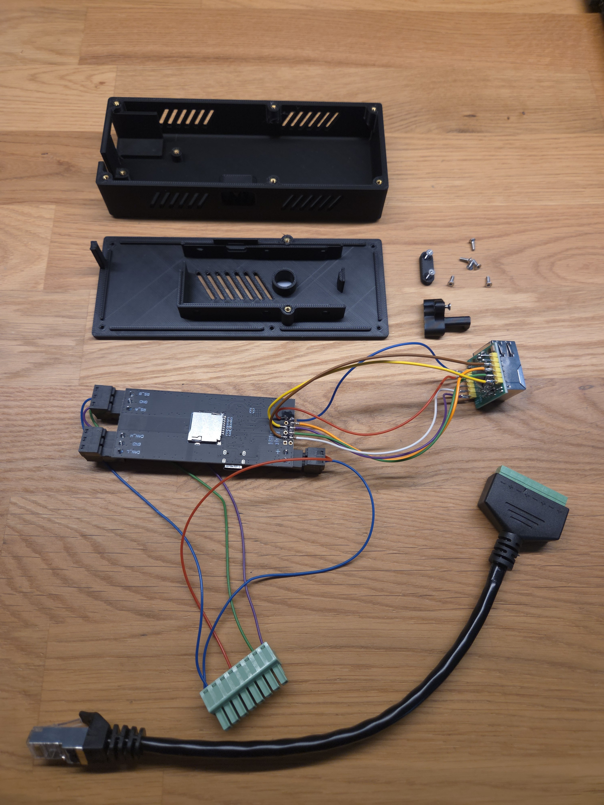 | 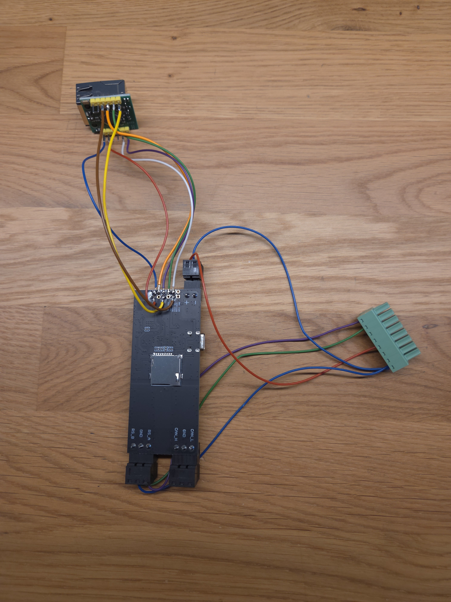 |
| 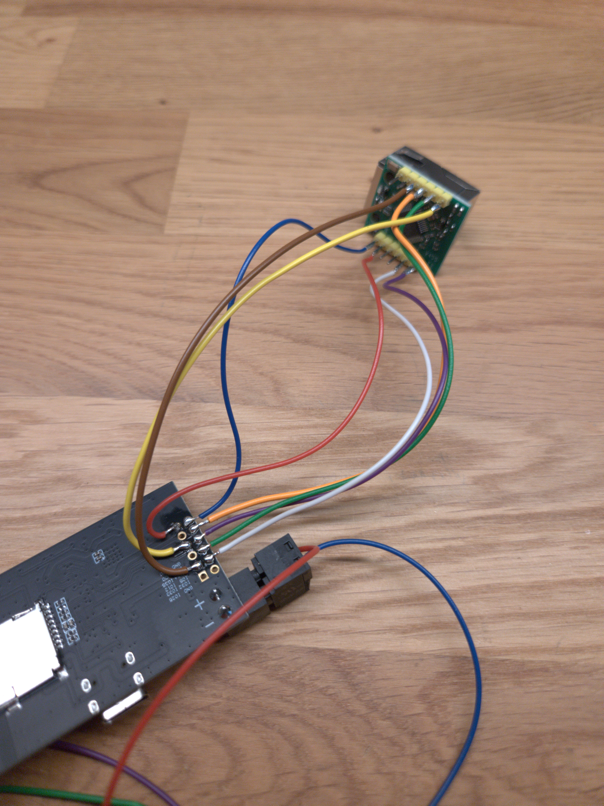 | 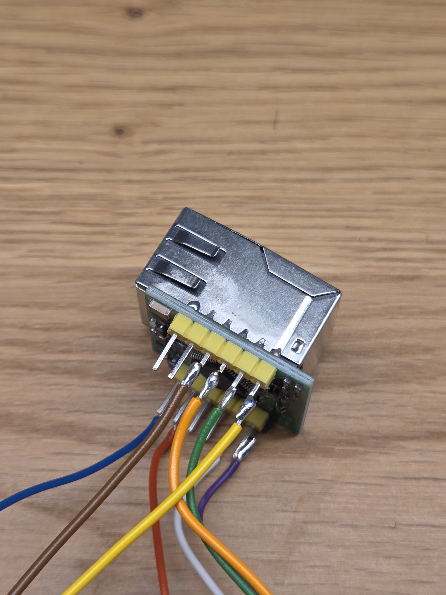 |
| 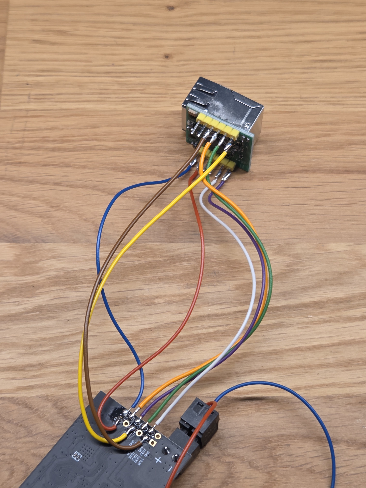 | 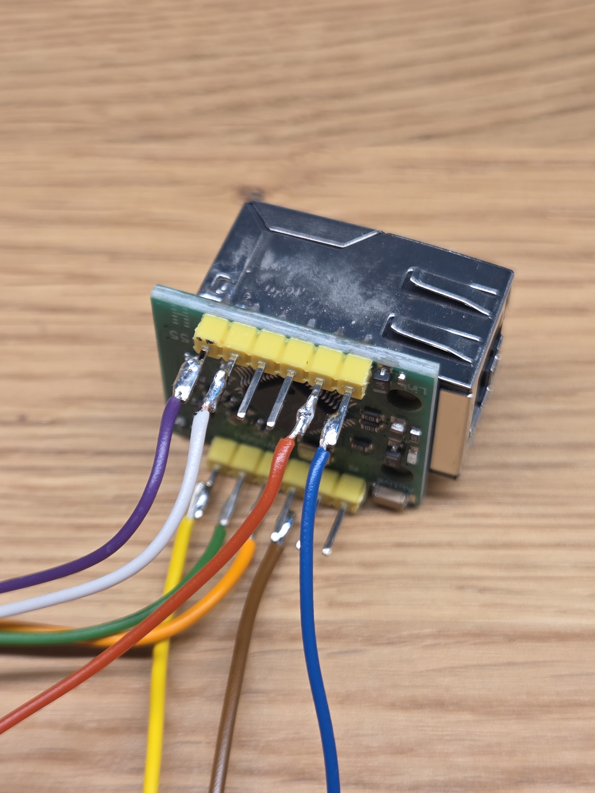 |
| 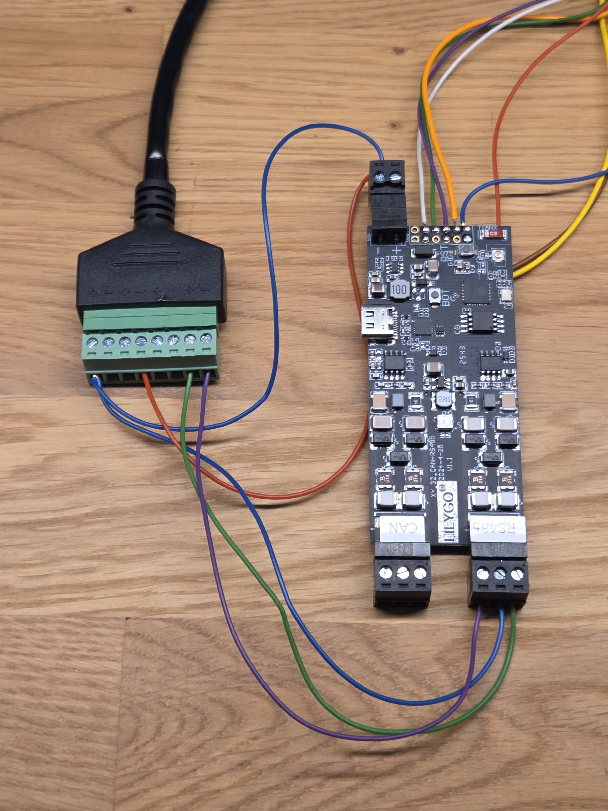 | 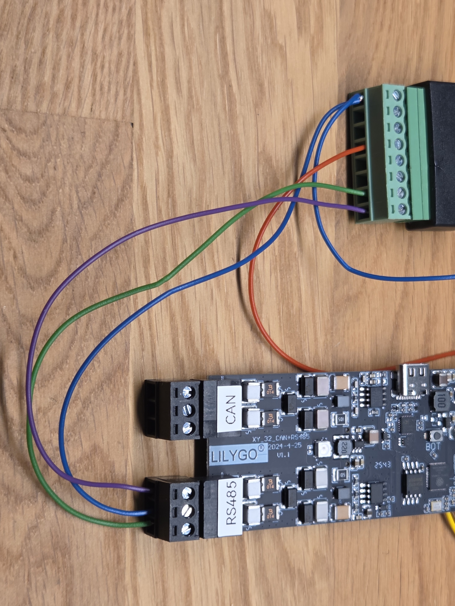 |
| 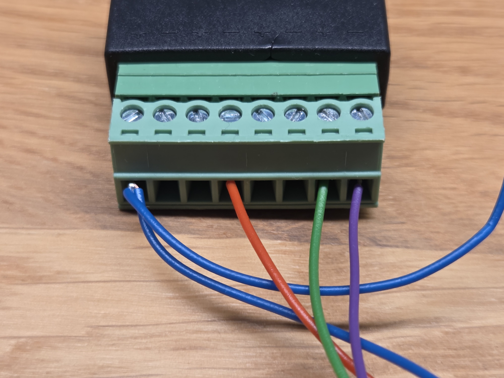 | 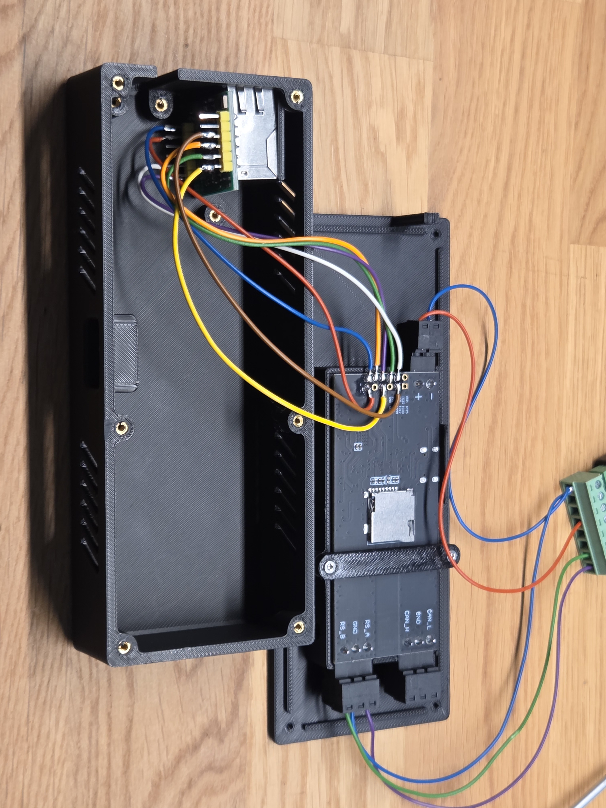 |
| 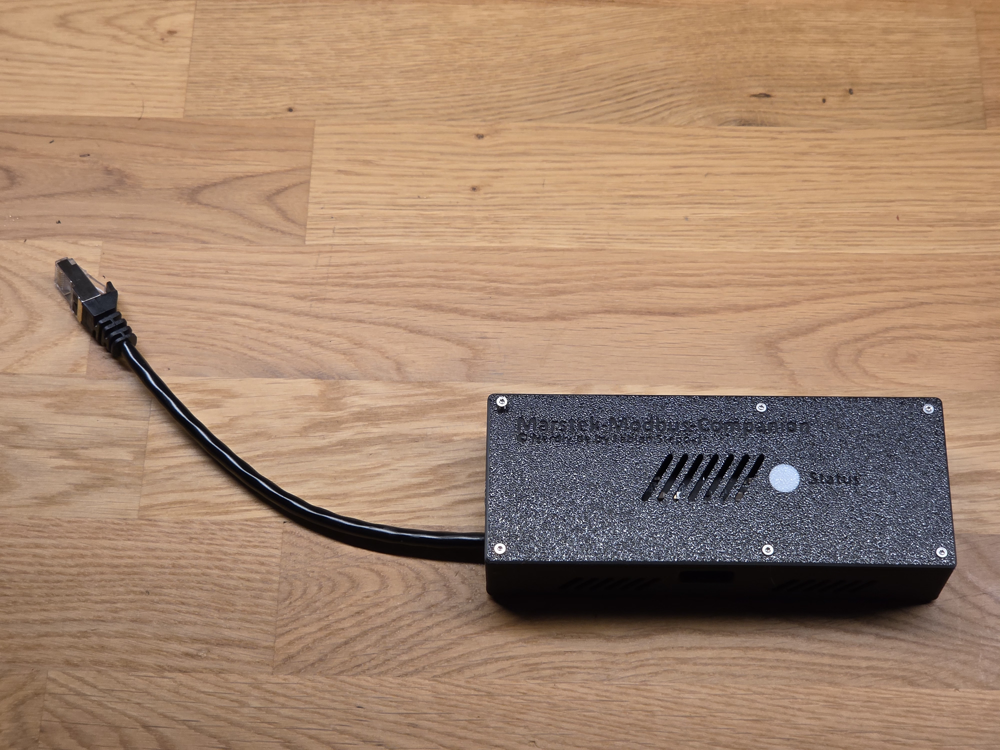 | 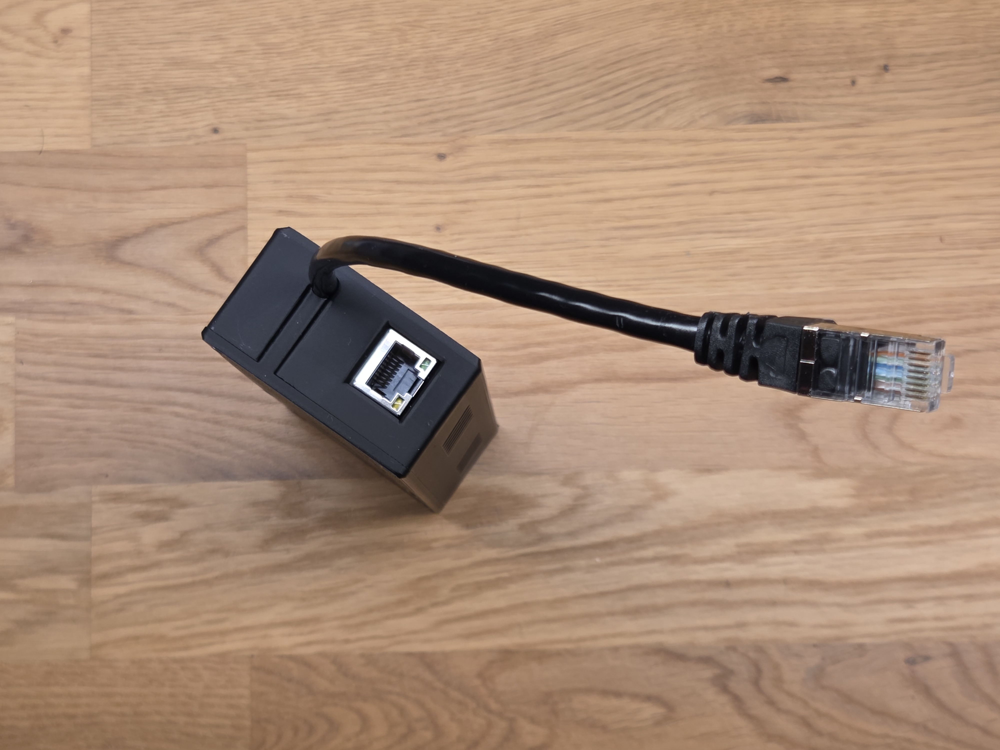 |
| 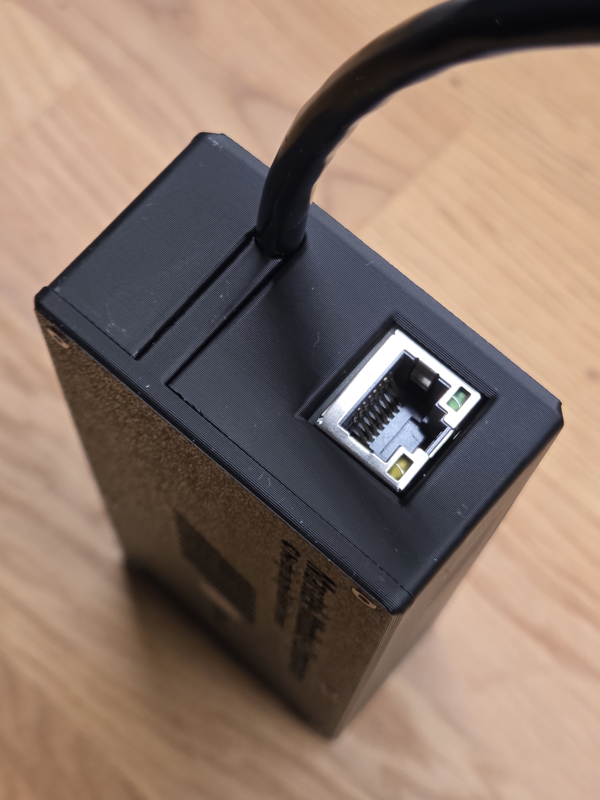 | |

---

## Firmware

The ESPHome firmware for this product is provided in the `firmware/` folder.

- Main configuration: `firmware/marstek_modbus_companion.yaml`

The firmware already contains notes for both operation modes:
- Wi-Fi mode: use the active Wi-Fi sections as-is.
- Ethernet mode: use the W5500 module and comment out the Wi-Fi-specific sections that are marked in the YAML.

---

## How to Use

1. Gather the required tools, controller hardware, and cabling.
2. Connect the LilyGo T-CAN485 board to the Marstek RS485 side according to the pin mapping documented in the firmware YAML.
3. Adjust the substitutions in the ESPHome configuration to match your target setup.
4. Compile and flash the firmware to the controller.
5. Add the device to Home Assistant via ESPHome and verify communication.

---

## License

See the license information in the firmware header and on Nerdiy.de.

---

**Last Updated**: June 12, 2026
**Status**: Active - Initial product setup
