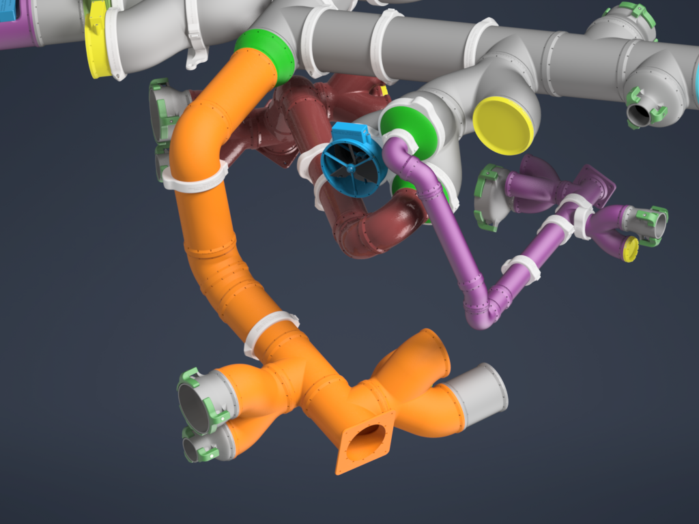
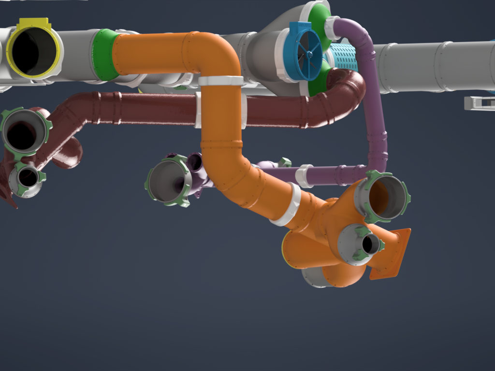

# PrintAirPipe - 100mm Pipe system - complete set by Nerdiy.de

---

## 🎯 Project Overview

This product page provides a complete overview of the STL package, bill of materials, and recommended print settings.

---

## 📋 About This Product

- **Product Name**: PrintAirPipe - 100mm Pipe system - complete set by Nerdiy.de
- **Nerdiy.de Shop**: [ View Product](https://www.nerdiy.de/)
- **Created**: March 2026

---

## 🛒 Purchase Options

### Primary Source (Recommended)
- **[ Nerdiy.de Shop](https://www.nerdiy.de/)** - Download the STL files here

### Alternative Sources
- **[🎨 Printables](https://www.printables.com/model/1009690-printairpipe-100mm-pipe-system-complete-set-by-ner)**

> 💖 **Support independent makers**: By purchasing the STL files through [Nerdiy.de Shop](https://www.nerdiy.de/), you directly support further development and new projects!

---

## 📦 Bill of Materials

### 🛠️ Required Tools

| Qty | Component | ASIN (DE) | Amazon (DE) |
|-----|-----------|-----------|-------------|
| 1x | Screwdriver Set | B092LVWNX8 | [Amazon](https://www.amazon.de/dp/B086SQZGLJ?tag=nerdiyde018-21&linkCode=ogi&th=1&psc=1) |
| 1x | Soldering Iron | B0CCV6T329 | [Amazon](https://www.amazon.de/dp/B0CCV6T329?tag=nerdiyde018-21&linkCode=ogi&th=1&psc=1) |
| 1x | 3D Printer | - | N/A |

### 📦 Required Components

| Qty | Component | ASIN (DE) | Amazon (DE) |
|-----|-----------|-----------|-------------|
| 1-100x | Countersunk Screw | B09N5DWFQ8 | [Amazon](https://www.amazon.de/dp/B09N5DWFQ8?tag=nerdiyde018-21&linkCode=ogi&th=1&psc=1) |
| 1-100x | M3 Thread Insert | B08BCRZZS3 | [Amazon](https://www.amazon.de/dp/B08BCRZZS3?tag=nerdiyde018-21&linkCode=ogi&th=1&psc=1) |

---

## 🖼️ Product Images

<table>
  <tr>
    <td></td>
    <td></td>
  </tr>
  <tr>
    <td></td>
    <td></td>
  </tr>
</table>

---

## 🖨️ 3D Print Settings

### ⚙️ Recommended Print Settings
| Setting | Value |
|---------|-------|
| **Filament Type** | Weather and UV-resistant (for example PETG, ABS, or ASA) |
| **Layer Height** | 0.2 mm |
| **Infill** | 15-25% |
| **Wall Lines** | 3-5 |
| **Supports** | As needed by part geometry |

> 🖨️ **Print Orientation**: Use the orientation included in the STL package to maximize part strength and fit.

---

## 🎯 How to Use

### Step-by-Step Guide

1. **Gather Your Materials** — Review the complete bill of materials and acquire all necessary hardware components.
2. **Download 3D Files** — [🛍️ Download from Nerdiy.de Shop](https://www.nerdiy.de/) (recommended) or from [Printables](https://www.printables.com/model/1009690-printairpipe-100mm-pipe-system-complete-set-by-ner).
3. **Prepare for Printing** — Slice using the recommended settings (PETG, 0.2 mm layers, 15–25% infill, 3–5 wall lines).
4. **Print All Parts** — Print all required pipe segments and connectors.
5. **Assemble** — Install thread inserts, connect pipe segments and secure with the included screws.
6. **Test** — Test the airflow path before final installation.

---

## 📄 License

See the license information on the product page.

---

**Last Updated**: 22. February 2026
**Status**: Active - Ready to build
