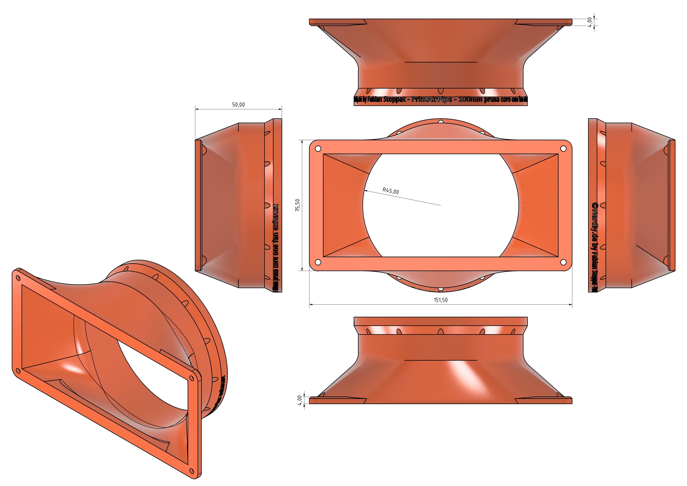

# PrintAirPipe - 100mm Prusa CORE One Fan Exhaust Connector by Nerdiy.de

---

## 🎯 Project Overview

This connector adapts the Prusa CORE One fan exhaust to the 100 mm PrintAirPipe ecosystem for cleaner guided airflow management.

---

## 📋 About This Product

The design is intended for users who want to connect their printer exhaust to a printable duct system instead of relying on open airflow around the machine. It is especially useful when integrating the printer into a workshop extraction or enclosure setup.

---

## 🛒 Purchase Options

### Primary Source (Recommended)
- **[Nerdiy.de Shop](https://www.nerdiy.de/)** - Download the STL files here

### Alternative Sources
- **[Printables](https://www.printables.com/model/1409300-printairpipe-100mm-prusa-core-one-fan-exhaust-conn)**

> Support Nerdiy.de if you want to help fund future product updates, documentation improvements, and new maker projects.

---

## 📦 Bill of Materials

### 📦 Required Components

| Qty | Component | ASIN (DE) | Amazon (DE) |
|-----|-----------|-----------|-------------|
| 1x | 3D Printed Connector Set (STL Files) | - | N/A |
| 1x | Prusa CORE One Printer | - | N/A |
| 1x | Matching 100 mm PrintAirPipe Segment | - | N/A |

---

## 🖼️ Product Images
<table>
  <tr>
    <td></td>
    <td></td>
  </tr>
</table>

---

## 🖨️ 3D Print Settings

## 3D Print Settings

### ⚙️ Recommended Print Settings
| Parameter | Value |
| --- | --- |
| Filament Type | Weather and UV-resistant (for example PETG, ABS, or ASA) |
| Layer Height | 0.2 mm |
| Infill | 15-25% |
| Wall Lines | 3-5 |
| Supports | As needed by part geometry |

Use the orientation included in the STL package to minimize supports and achieve better surface quality on visible faces.
## 🎯 How to Use

### Step-by-Step Guide

1. Download the STL files from Nerdiy.de or the linked Printables page.
2. Print the connector with the recommended settings and remove any support remnants from the airflow path.
3. Check the fit against the Prusa CORE One exhaust outlet and the matching 100 mm PrintAirPipe part.
4. Install the connector and test the airflow before using the printer for longer runs.

---

## 📄 License

Refer to the original product page for the license terms that apply to this STL package.

---

**Last Updated**: March 17, 2026
**Status**: Active - Ready to build

