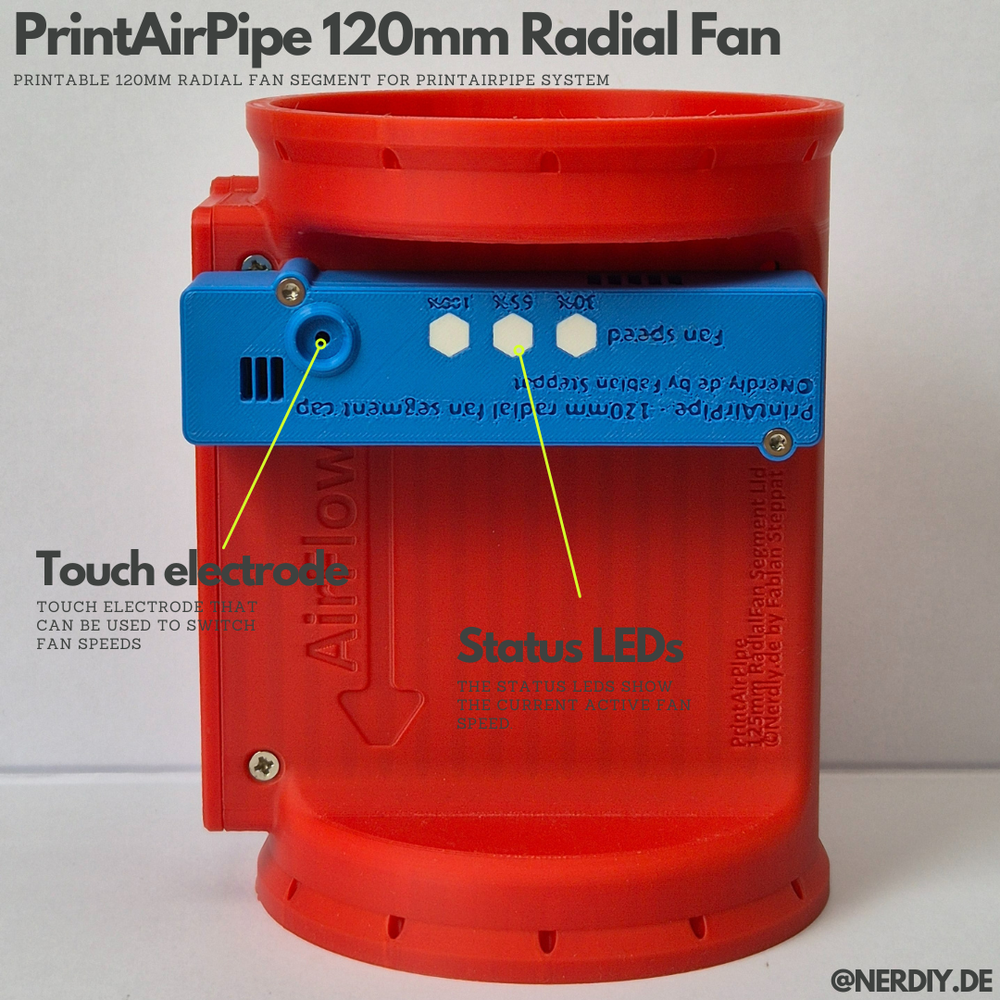
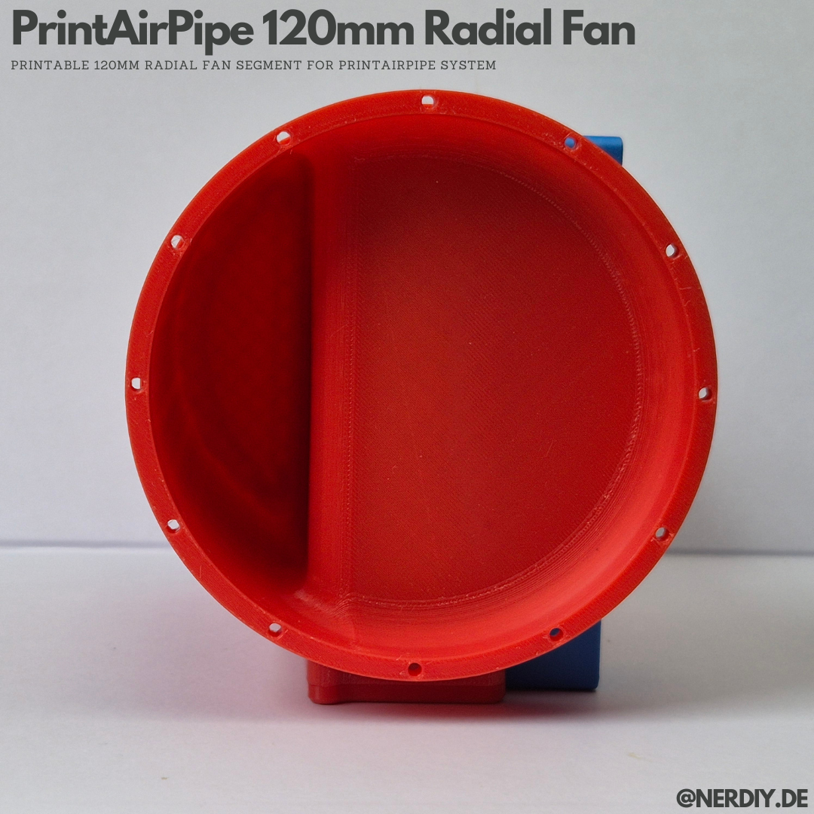
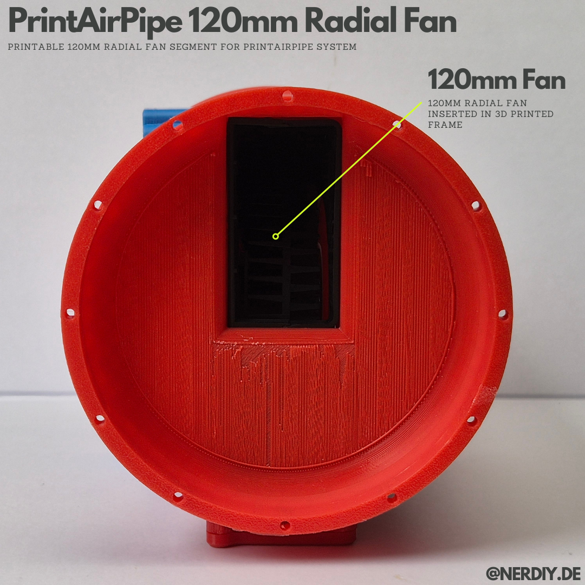
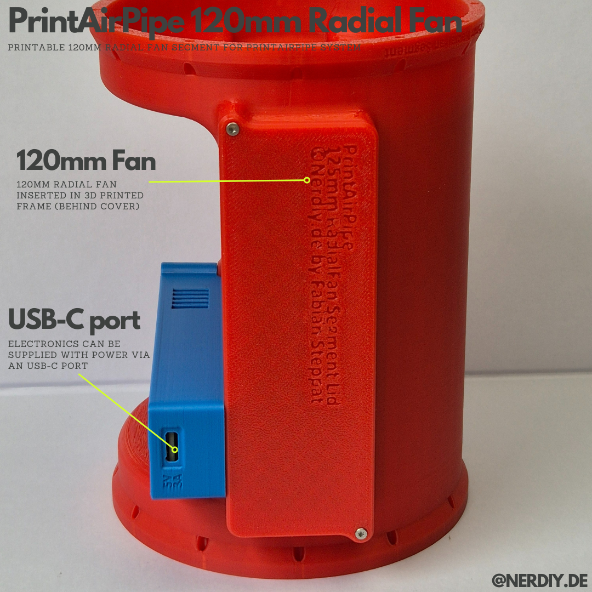
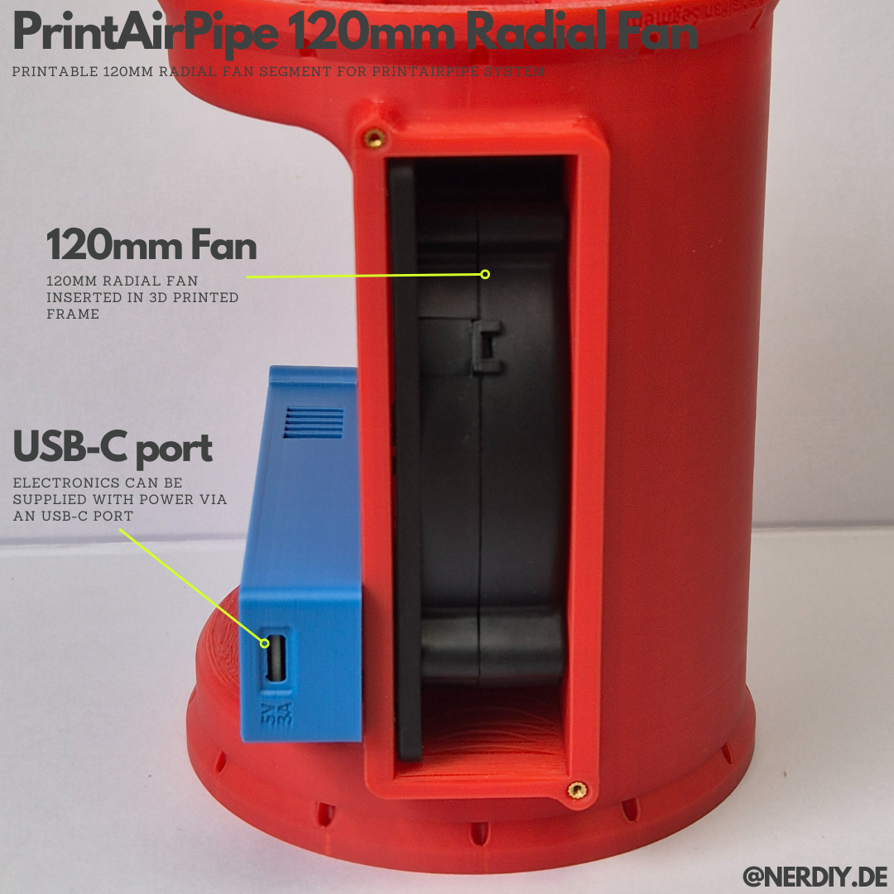
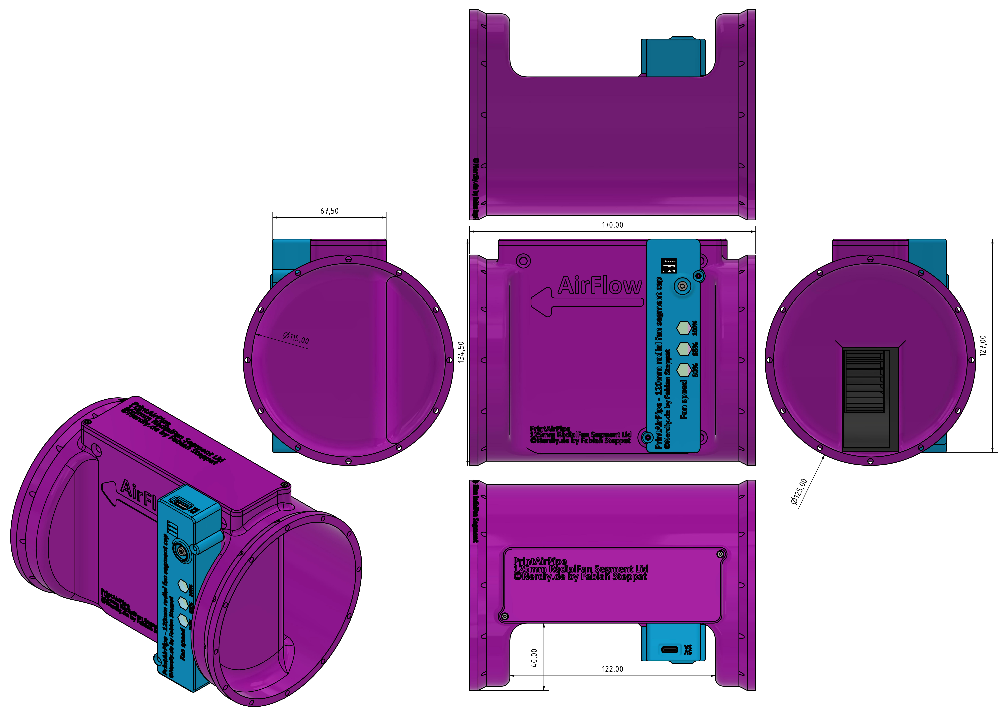

# PrintAirPipe – 120mm Radial Fan Segment for 125mm PrintAirPipe system by Nerdiy.de

---

## 🎯 Project Overview

This product page provides a complete overview of the STL package, bill of materials, and recommended print settings.

---

## 📋 About This Product

- **Product Name**: PrintAirPipe – 120mm Radial Fan Segment for 125mm PrintAirPipe system by Nerdiy.de
- **Nerdiy.de Shop**: [ View Product](https://www.nerdiy.de/)
- **Created**: March 2026

---

## 🛒 Purchase Options

### Primary Source (Recommended)
- **[ Nerdiy.de Shop](https://www.nerdiy.de/)** - Download the STL files here

### Alternative Sources
- **[ Printables](https://www.printables.com/model/1281908-printairpipe-120mm-radial-fan-segment-for-125mm-pr)**

---

## 📦 Bill of Materials

### 🛠️ Required Tools

| Qty | Component | ASIN (DE) | Amazon (DE) |
|-----|-----------|-----------|-------------|
| 1x | Screwdriver Set | B092LVWNX8 | [Amazon](https://www.amazon.de/dp/B086SQZGLJ?tag=nerdiyde018-21&linkCode=ogi&th=1&psc=1) |
| 1x | Soldering Iron | B0CCV6T329 | [Amazon](https://www.amazon.de/dp/B0CCV6T329?tag=nerdiyde018-21&linkCode=ogi&th=1&psc=1) |
| 1x | 3D Printer | - | N/A |

### 📦 Required Components

| Qty | Component | ASIN (DE) | Amazon (DE) |
|-----|-----------|-----------|-------------|
| 1x | Seeed Studio XIAO ESP32-S3 | B0BYSB66S5 | [Amazon](https://www.amazon.de/dp/B0BYSB66S5?tag=nerdiyde018-21&linkCode=ogi&th=1&psc=1) |
| 3x | Thread Insert | B088QJG676 | [Amazon](https://www.amazon.de/dp/B088QJG676?tag=nerdiyde018-21&linkCode=ogi&th=1&psc=1) |
| 3x | WS2812 LED on PCB | B088K6C7TJ | [Amazon](https://www.amazon.de/dp/B088K6C7TJ?tag=nerdiyde018-21&linkCode=ogi&th=1&psc=1) |
| 3x | M2x8 Countersunk | B0957TSYBY | [Amazon](https://www.amazon.de/dp/B0957TSYBY?tag=nerdiyde018-21&linkCode=ogi&th=1&psc=1) |
| 1x | Radial Lüfter 120mm | B076X11CT6 | [Amazon](https://www.amazon.de/dp/B076X11CT6?tag=nerdiyde018-21&linkCode=ogi&th=1&psc=1) |
| 3x | Fan Screws 5.0 x 10.0mm | B000TG3IGS | [Amazon](https://www.amazon.de/dp/B000TG3IGS?tag=nerdiyde018-21&linkCode=ogi&th=1&psc=1) |
| 1x | M3x6 Zylinderkopfschraube | B01GQX0JVY | [Amazon](https://www.amazon.de/dp/B01GQX0JVY?tag=nerdiyde018-21&linkCode=ogi&th=1&psc=1) |
| 1x | Unterlegscheibe für M3 | B0CJWP92X1 | [Amazon](https://www.amazon.de/dp/B0CJWP92X1?tag=nerdiyde018-21&linkCode=ogi&th=1&psc=1) |
| 1x | Mutter M3 | B07JMF3KMD | [Amazon](https://www.amazon.de/dp/B07JMF3KMD?tag=nerdiyde018-21&linkCode=ogi&th=1&psc=1) |
| 1x | M3x25 Countersunk | B09MZQ8C84 | [Amazon](https://www.amazon.de/dp/B09MZQ8C84?tag=nerdiyde018-21&linkCode=ogi&th=1&psc=1) |
| 2x | M3 Thread Insert | B08BCRZZS3 | [Amazon](https://www.amazon.de/dp/B08BCRZZS3?tag=nerdiyde018-21&linkCode=ogi&th=1&psc=1) |
| 1x | Wire (Litze) | B0C7TJG9YB | [Amazon](https://www.amazon.de/dp/B0C7TJG9YB?tag=nerdiyde018-21&linkCode=ogi&th=1&psc=1) |
| 1x | USB-C Cable | B098WVHH5L | [Amazon](https://www.amazon.de/dp/B098WVHH5L?tag=nerdiyde018-21&linkCode=ogi&th=1&psc=1) |
| 1x | USB Power Supply | B00WLI5E3M | [Amazon](https://www.amazon.de/dp/B00WLI5E3M?tag=nerdiyde018-21&linkCode=ogi&th=1&psc=1) |
| 1x | PETG Filament | B0C6MMM51Y | [Amazon](https://www.amazon.de/dp/B0C6MMM51Y?tag=nerdiyde018-21&linkCode=ogi&th=1&psc=1) |
| 1x | 3D Printer | - | N/A |

---

## 🖼️ Product Images

| Image 1 | Image 2 |
|---------|---------|
|  |  |
|  |  |
|  |  |

---

## 🖨️ 3D Print Settings

### ⚙️ Recommended Print Settings
| Setting | Value |
|---------|-------|
| **Filament Type** | Weather and UV-resistant (for example PETG, ABS, or ASA) |
| **Layer Height** | 0.2 mm |
| **Infill** | 15-25% |
| **Wall Lines** | 3-5 |
| **Supports** | As needed by part geometry |

> 🖨️ **Print Orientation**: Use the orientation included in the STL package to maximize part strength and fit.

---

## 🔧 How to Use

1. Download the STL files from the Nerdiy.de product page.
2. Print all required parts with the recommended settings.
3. Prepare all parts from the bill of materials.
4. Assemble and test before final installation.

---

## 📄 License

See the license information on the product page.

---

**Last Updated**: 22. February 2026
**Status**: Active - Ready to build
