# PrintAirPipe - 125mm AirFlowSensor Segment by Nerdiy.de

---

## 🎯 Project Overview

Measure airflow velocity and transported air volume directly inside a 125mm PrintAirPipe duct segment.

This segment uses an ESP32-S3, Hall sensors, and WS2812 LEDs. Rotor movement is measured magnetically and displayed as an external LED animation. The full setup is powered via USB-C and integrates cleanly into existing PrintAirPipe systems.

---

## 📋 About This Product

This product provides 3D-printable housing parts and the electronics BOM for a smart 125mm airflow sensing segment.

- **Product Name**: PrintAirPipe - 125mm AirFlowSensor Segment by Nerdiy.de
- **Printables Store**: [🎨 View on Printables](https://www.printables.com/model/1283622-printairpipe-125mm-airflowsensor-segment-by-nerdiy)
- **Created**: February 2026
- **Note**: The segment is designed for 125mm duct systems and is intended for airflow visualization and sensor-based airflow monitoring.

---

## 🛒 Purchase Options

### Primary Source (Recommended)
- **[🎨 Printables Store](https://www.printables.com/model/1283622-printairpipe-125mm-airflowsensor-segment-by-nerdiy)** - Download the STL files here

### Alternative Sources
- **[🛍️ Nerdiy.de Shop](https://www.nerdiy.de/)** - Check for availability

> 💖 **Support independent makers**: A download, like, and rating on Printables directly supports future development.

---

## 📦 Bill of Materials

### 🛠️ Required Tools

| Qty | Component | ASIN (DE) | Amazon (DE) |
|-----|-----------|-----------|-------------|
| 1x | Soldering Iron | B0D5M727WM | [Amazon](https://www.amazon.de/dp/B0D5M727WM?tag=nerdiyde018-21&linkCode=ogi&th=1&psc=1) |
| 1x | Screwdriver Set | B086SQZGLJ | [Amazon](https://www.amazon.de/dp/B086SQZGLJ?tag=nerdiyde018-21&linkCode=ogi&th=1&psc=1) |
| 1x | Side Cutters | B005EXOF6S | [Amazon](https://www.amazon.de/dp/B005EXOF6S?tag=nerdiyde018-21&linkCode=ogi&th=1&psc=1) |
| 1x | Wire Stripper | B001NUMVHQ | [Amazon](https://www.amazon.de/dp/B001NUMVHQ?tag=nerdiyde018-21&linkCode=ogi&th=1&psc=1) |
| 1x | Tweezers Set | B09BQGT6GZ | [Amazon](https://www.amazon.de/dp/B09BQGT6GZ?tag=nerdiyde018-21&linkCode=ogi&th=1&psc=1) |
| 1x | Precision Tweezers (Alternative) | B06XXXQHS8 | [Amazon](https://www.amazon.de/Pinzette-Pr%C3%A4zision-Antistatische-nicht-magnetische-Elektronik/dp/B06XXXQHS8?tag=nerdiyde018-21&linkCode=ogi&th=1&psc=1) |
| 1x | 3D Printer | - | [Prusa3D](https://www.prusa3d.com/de/#a_aid=Nerdiy) |

### 📦 Required Components

| Qty | Component | ASIN (DE) | Amazon (DE) |
|-----|-----------|-----------|-------------|
| 1x | Seeed Studio XIAO ESP32-S3 | B0BYSB66S5 | [Amazon](https://www.amazon.de/dp/B0BYSB66S5?tag=nerdiyde018-21&linkCode=ogi&th=1&psc=1) |
| 2x | 623ZZ Ball Bearing | B07CXMYT2Q | [Amazon](https://www.amazon.de/dp/B07CXMYT2Q?tag=nerdiyde018-21&linkCode=ogi&th=1&psc=1) |
| 3x | WS2812 LED on PCB | B088K6C7TJ | [Amazon](https://www.amazon.de/dp/B088K6C7TJ?tag=nerdiyde018-21&linkCode=ogi&th=1&psc=1) |
| 3x | Hall Sensor Melexis US1881 | B0CKS22CNX | [Amazon](https://www.amazon.de/dp/B0CKS22CNX?tag=nerdiyde018-21&linkCode=ogi&th=1&psc=1) |
| 3x | Resistor 15k | B0CL6YGQ66 | [Amazon](https://www.amazon.de/dp/B0CL6YGQ66?tag=nerdiyde018-21&linkCode=ogi&th=1&psc=1) |
| 3x | Neodymium Magnet 5x5mm | B07N7NS16G | [Amazon](https://www.amazon.de/dp/B07N7NS16G?tag=nerdiyde018-21&linkCode=ogi&th=1&psc=1) |
| 3x | M2x8 Countersunk Screw | B0957TSYBY | [Amazon](https://www.amazon.de/dp/B0957TSYBY?tag=nerdiyde018-21&linkCode=ogi&th=1&psc=1) |
| 3x | M2x10 Countersunk Screw | B0957SLZTB | [Amazon](https://www.amazon.de/dp/B0957SLZTB?tag=nerdiyde018-21&linkCode=ogi&th=1&psc=1) |
| 2x | M3x6 Countersunk Screw | B0957V5GHV | [Amazon](https://www.amazon.de/dp/B0957V5GHV?tag=nerdiyde018-21&linkCode=ogi&th=1&psc=1) |
| 1x | M3x30 Countersunk Screw | B09MZQC62G | [Amazon](https://www.amazon.de/dp/B09MZQC62G?tag=nerdiyde018-21&linkCode=ogi&th=1&psc=1) |
| 6x | M2 Thread Insert | B08DDBWKZF | [Amazon](https://www.amazon.de/dp/B08DDBWKZF?tag=nerdiyde018-21&linkCode=ogi&th=1&psc=1) |
| 3x | M3 Thread Insert | B08BCRZZS3 | [Amazon](https://www.amazon.de/dp/B08BCRZZS3?tag=nerdiyde018-21&linkCode=ogi&th=1&psc=1) |
| 1x | Wire (Litze) | B0C7TJG9YB | [Amazon](https://www.amazon.de/dp/B0C7TJG9YB?tag=nerdiyde018-21&linkCode=ogi&th=1&psc=1) |
| 1x | USB-C Cable 5V/3A | B098WVHH5L | [Amazon](https://www.amazon.de/dp/B098WVHH5L?tag=nerdiyde018-21&linkCode=ogi&th=1&psc=1) |
| 1x | USB-C Cable (Alternative) | B0BPCBP15P | [Amazon](https://www.amazon.de/dp/B0BPCBP15P?tag=nerdiyde018-21&linkCode=ogi&th=1&psc=1) |
| 1x | USB Power Supply 5V/3A | B00WLI5E3M | [Amazon](https://www.amazon.de/dp/B00WLI5E3M?tag=nerdiyde018-21&linkCode=ogi&th=1&psc=1) |

### 🎨 3D Print Materials

| Qty | Component | ASIN (DE) | Amazon (DE) |
|-----|-----------|-----------|-------------|
| 1x | PETG Filament (1kg) | B07T2QZYS1 | [Amazon](https://www.amazon.de/dp/B07T2QZYS1?tag=nerdiyde018-21&linkCode=ogi&th=1&psc=1) |

---

## 🖨️ 3D Print Settings

### Recommended Print Settings

| Setting | Value |
|---------|-------|
| **Filament Type** | PETG (recommended), ABS or ASA |
| **Layer Height** | 0.2mm |
| **Infill** | 15-25% |
| **Wall Lines** | 3-5 |
| **Support** | Usually not required |

> 💡 **Print Orientation**: Keep the orientation from the provided STL files to maximize strength and ensure proper airflow behavior in the sensing segment.

---

## 🎯 How to Use

### Step-by-Step Assembly Guide

1. **Gather all components**
	- Use the BOM above
	- All Amazon links are affiliate-tagged for Nerdiy.de support

2. **Download STL files**
	- [🎨 Download from Printables](https://www.printables.com/model/1283622-printairpipe-125mm-airflowsensor-segment-by-nerdiy)

3. **Print all parts**
	- Use the recommended settings
	- Clean and deburr printed parts after printing

4. **Assemble mechanics**
	- Install thread inserts in the defined mounting points
	- Install rotor, bearings, and magnets
	- Verify smooth rotor movement

5. **Assemble electronics**
	- Solder Hall sensors, LEDs, and wiring
	- Install ESP32-S3 and route the USB-C cable

6. **Power and test**
	- Connect 5V USB power
	- Check LED animation and sensor behavior
	- Integrate the segment into your 125mm duct run

---

## 📸 Product Images

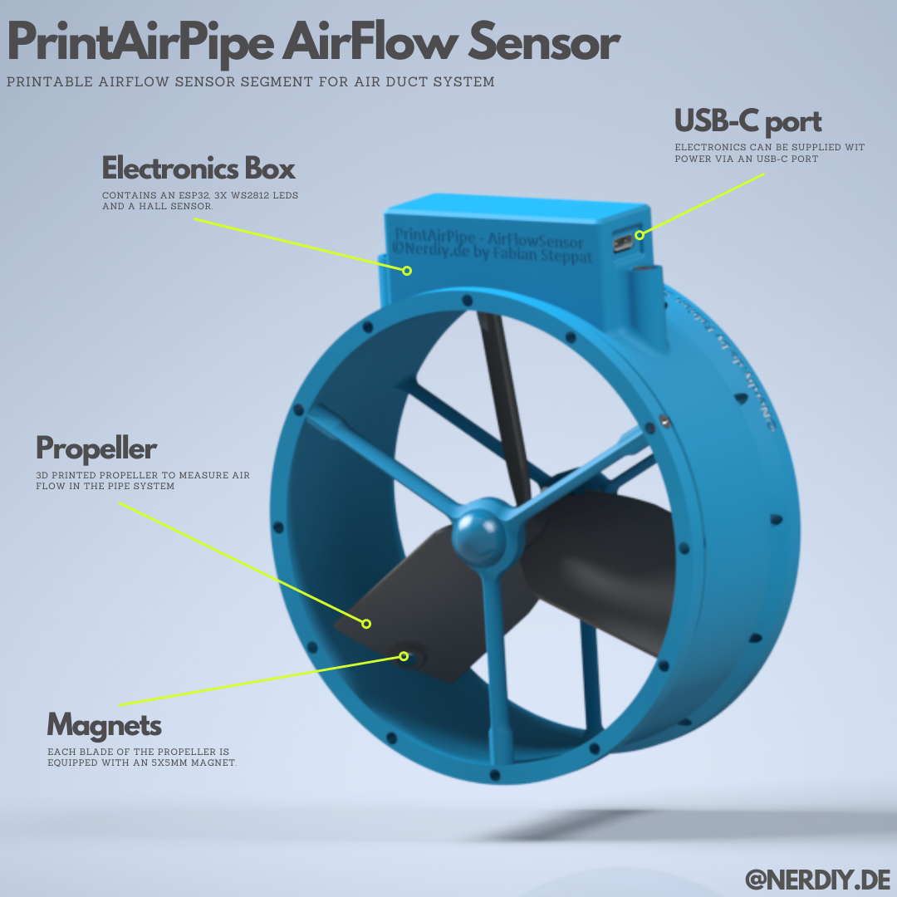

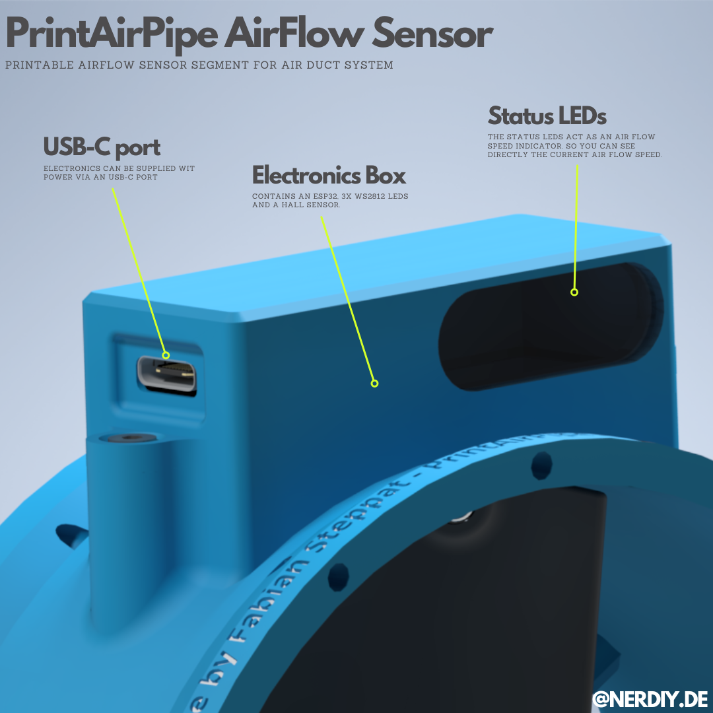

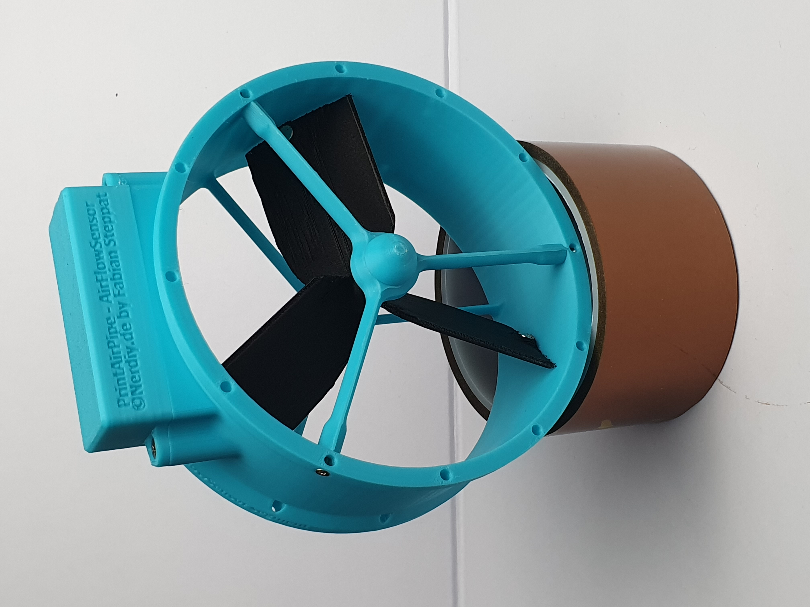

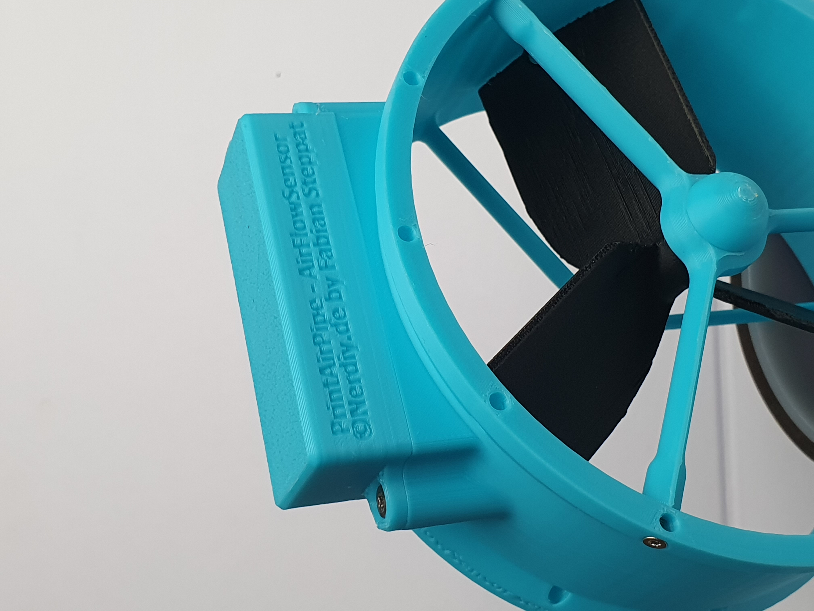

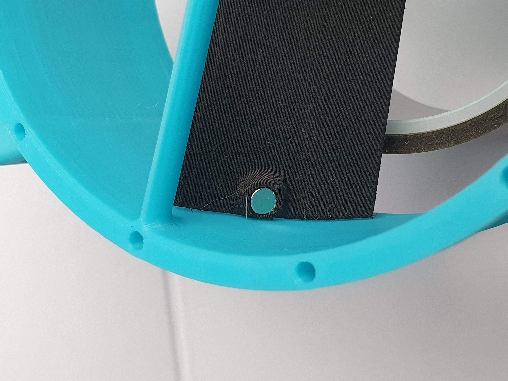

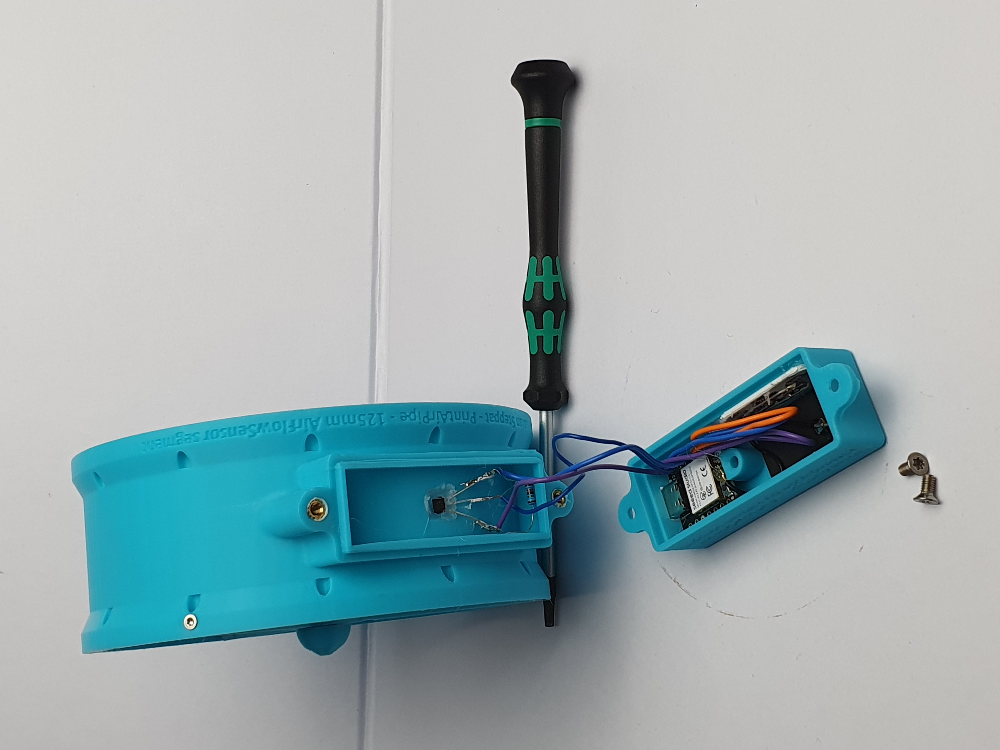

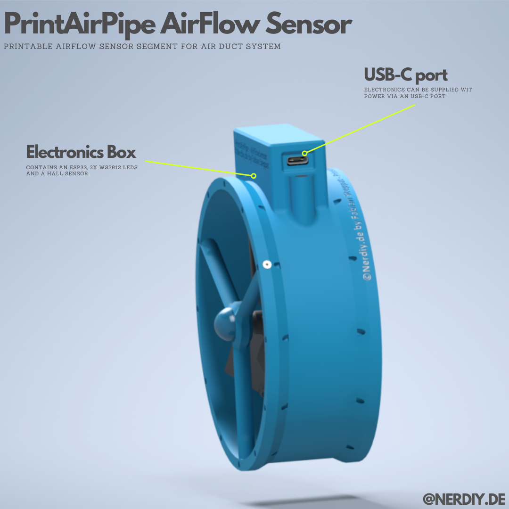

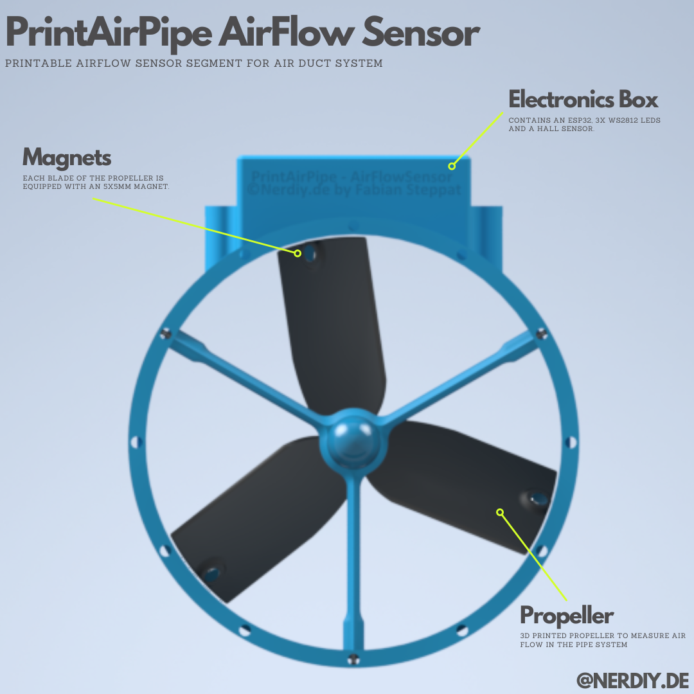

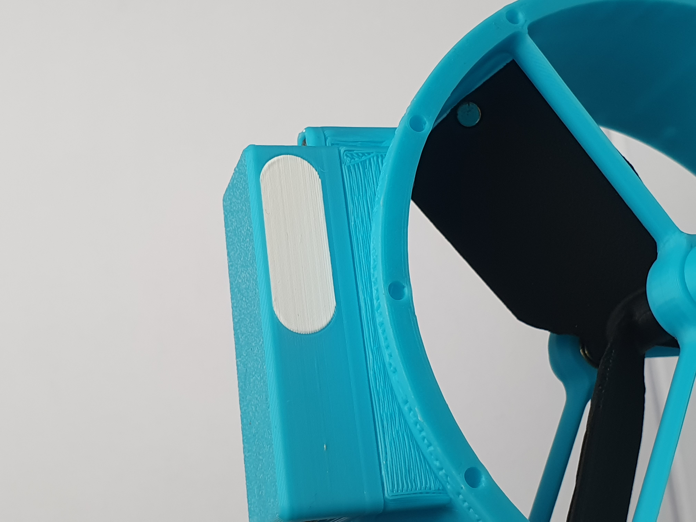

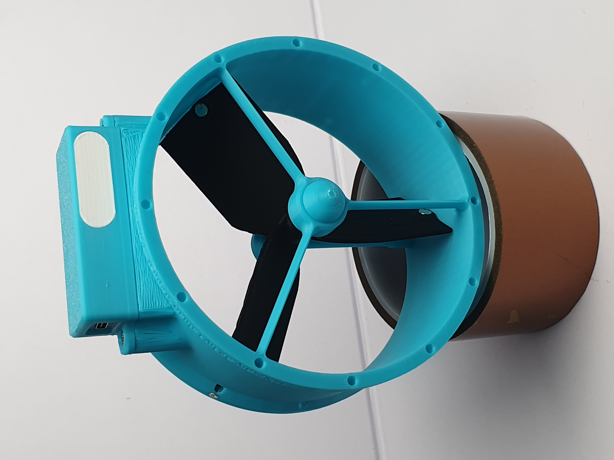

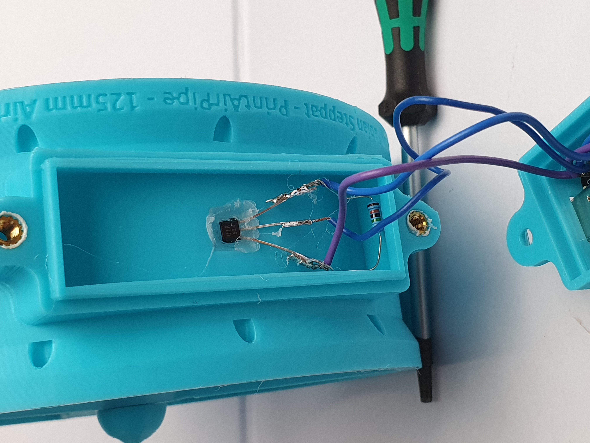

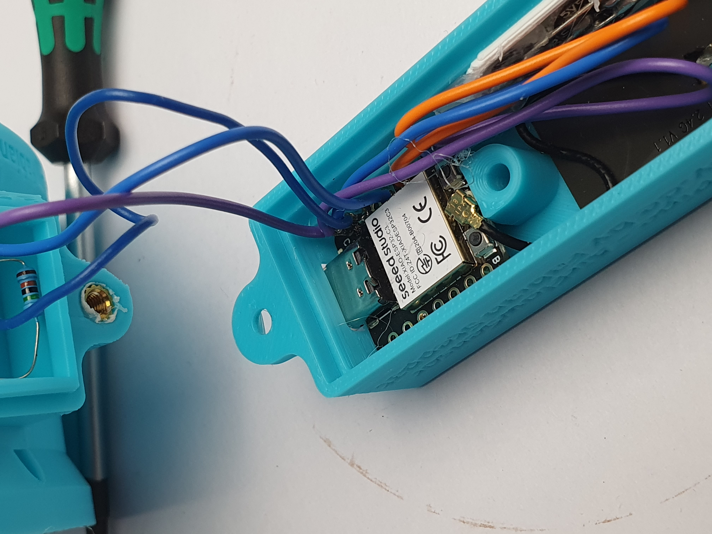

---

## 📄 License

See the license information on the Printables product page.

---

**Last Updated**: March 15, 2026  
**Status**: Complete - Ready to build
