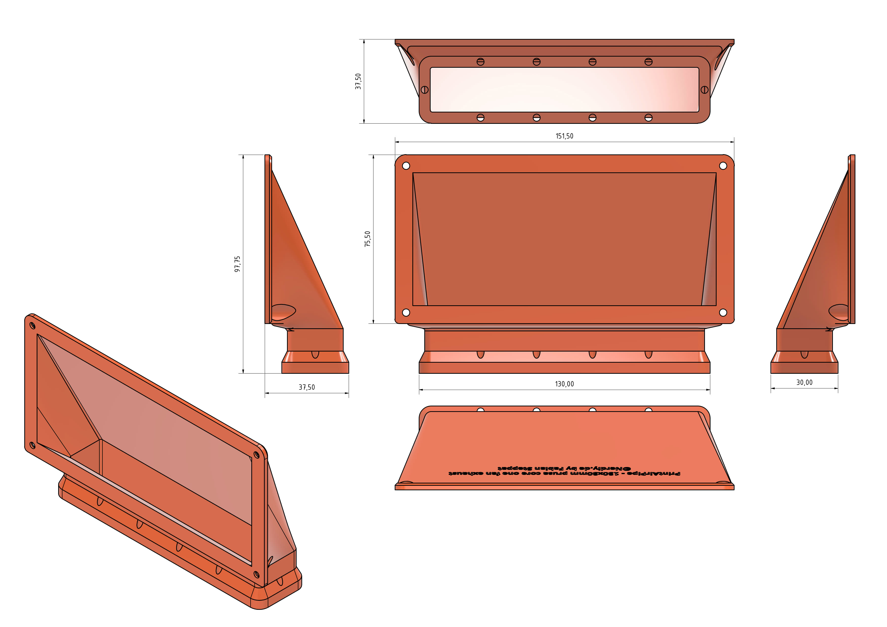

# PrintAirPipe - 130x30mm Prusa CORE One Fan Exhaust Connector by Nerdiy.de

---

## 🎯 Project Overview

This connector adapts the Prusa CORE One exhaust to the flat 130x30 mm PrintAirPipe format for installations with limited depth.

---

## 📋 About This Product

The flat profile version is intended for printer setups where a round duct would take up too much space behind the machine or inside an enclosure. It provides a low-profile transition into the PrintAirPipe flat duct system.

---

## 🛒 Purchase Options

### Primary Source (Recommended)
- **[Nerdiy.de Shop](https://www.nerdiy.de/)** - Download the STL files here

### Alternative Sources
- **[Printables](https://www.printables.com/model/1409050-printairpipe-130x30mm-prusa-core-one-fan-exhaust-c)**

> Support Nerdiy.de if you want to help fund future product updates, documentation improvements, and new maker projects.

---

## 📦 Bill of Materials

### 📦 Required Components

| Qty | Component | ASIN (DE) | Amazon (DE) |
|-----|-----------|-----------|-------------|
| 1x | 3D Printed Connector Set (STL Files) | - | N/A |
| 1x | Prusa CORE One Printer | - | N/A |
| 1x | Matching 130x30 mm PrintAirPipe Flat Duct Segment | - | N/A |

---

## 🖼️ Product Images
<table>
  <tr>
    <td></td>
    <td></td>
  </tr>
</table>

---

## 🖨️ 3D Print Settings

## 3D Print Settings

### ⚙️ Recommended Print Settings
| Parameter | Value |
| --- | --- |
| Filament Type | Weather and UV-resistant (for example PETG, ABS, or ASA) |
| Layer Height | 0.2 mm |
| Infill | 15-25% |
| Wall Lines | 3-5 |
| Supports | As needed by part geometry |

Use the orientation included in the STL package to minimize supports and achieve better surface quality on visible faces.
## 🎯 How to Use

### Step-by-Step Guide

1. Download the STL files from Nerdiy.de or the linked Printables page.
2. Print the connector with the recommended settings and clean the airflow channel.
3. Check the fit between the Prusa CORE One exhaust outlet and your flat 130x30 mm PrintAirPipe segment.
4. Install the connector and verify there are no gaps before running the printer with exhaust airflow.

---

## 📄 License

Refer to the original product page for the license terms that apply to this STL package.

---

**Last Updated**: March 17, 2026
**Status**: Active - Ready to build

