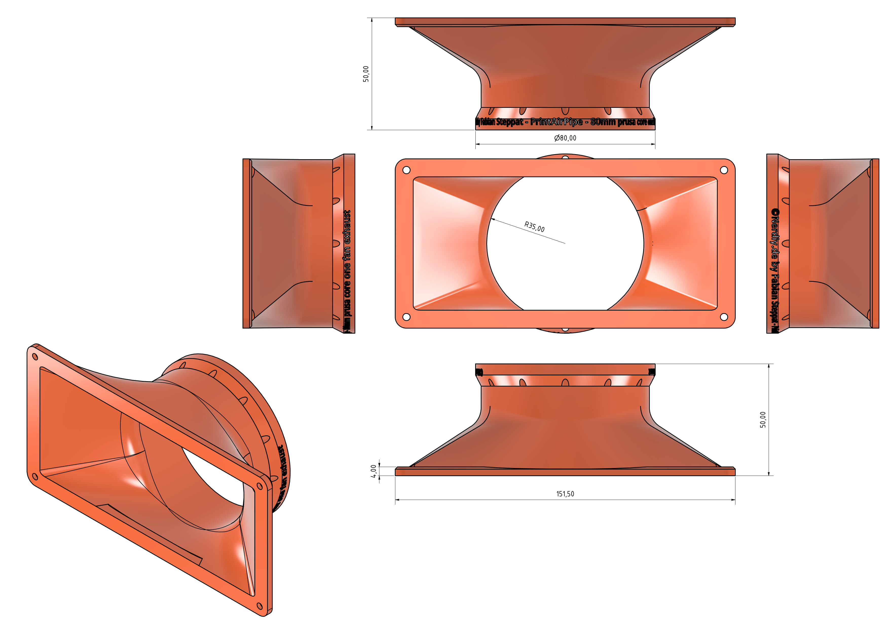

# PrintAirPipe - 80mm Prusa CORE One Fan Exhaust Connector by Nerdiy.de

---

## 🎯 Project Overview

This connector adapts the Prusa CORE One fan exhaust to the 80 mm PrintAirPipe format for a compact but less restrictive printable duct connection.

---

## 📋 About This Product

The 80 mm format is a useful middle ground between very compact ducts and larger extraction systems. It is well suited for printer exhaust routing where available space is limited but airflow should still remain relatively open.

---

## 🛒 Purchase Options

### Primary Source (Recommended)
- **[Nerdiy.de Shop](https://www.nerdiy.de/)** - Download the STL files here

### Alternative Sources
- **[Printables](https://www.printables.com/model/1409299-printairpipe-80mm-prusa-core-one-fan-exhaust-conne)**

> Support Nerdiy.de if you want to help fund future product updates, documentation improvements, and new maker projects.

---

## 📦 Bill of Materials

### 📦 Required Components

| Qty | Component | ASIN (DE) | Amazon (DE) |
|-----|-----------|-----------|-------------|
| 1x | 3D Printed Connector Set (STL Files) | - | N/A |
| 1x | Prusa CORE One Printer | - | N/A |
| 1x | Matching 80 mm PrintAirPipe Segment | - | N/A |

---

## 🖼️ Product Images
<table>
  <tr>
    <td></td>
    <td></td>
  </tr>
</table>

---

## 🖨️ 3D Print Settings

## 3D Print Settings

### ⚙️ Recommended Print Settings
| Parameter | Value |
| --- | --- |
| Filament Type | Weather and UV-resistant (for example PETG, ABS, or ASA) |
| Layer Height | 0.2 mm |
| Infill | 15-25% |
| Wall Lines | 3-5 |
| Supports | As needed by part geometry |

Use the orientation included in the STL package to minimize supports and achieve better surface quality on visible faces.
## 🎯 How to Use

### Step-by-Step Guide

1. Download the STL files from Nerdiy.de or the linked Printables page.
2. Print the connector with the recommended settings and remove any support residue.
3. Test the fit on the Prusa CORE One exhaust outlet and the 80 mm PrintAirPipe system.
4. Install the connector and confirm the exhaust air is routed cleanly through the duct.

---

## 📄 License

Refer to the original product page for the license terms that apply to this STL package.

---

**Last Updated**: March 17, 2026
**Status**: Active - Ready to build

