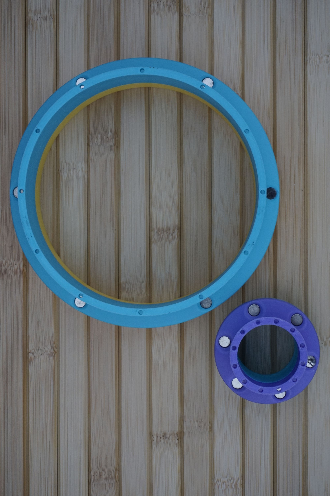
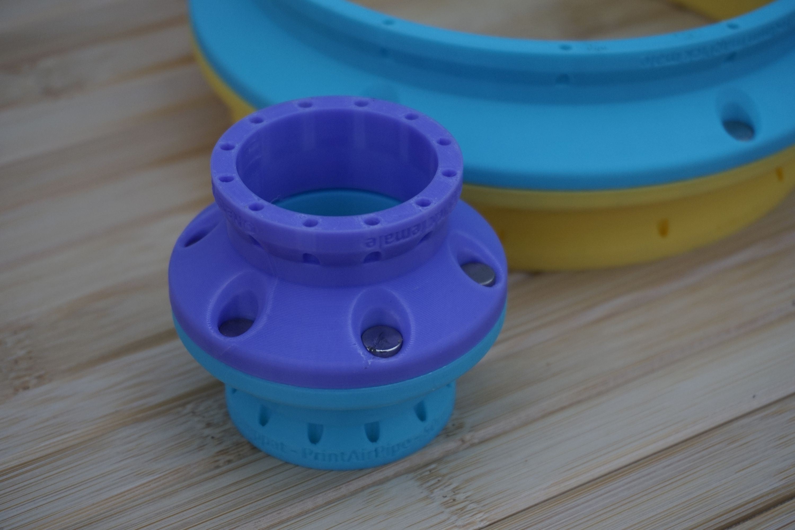
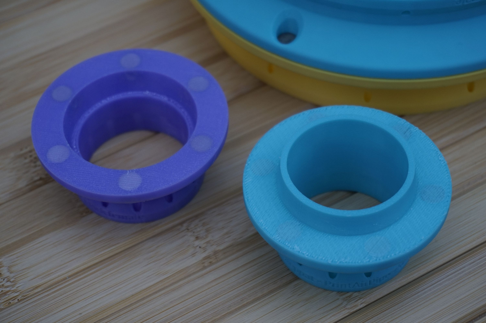
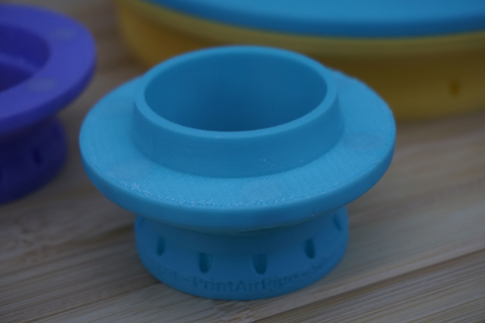
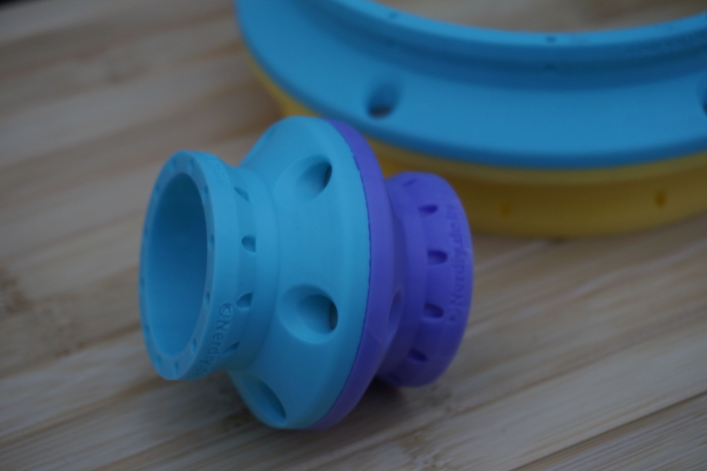
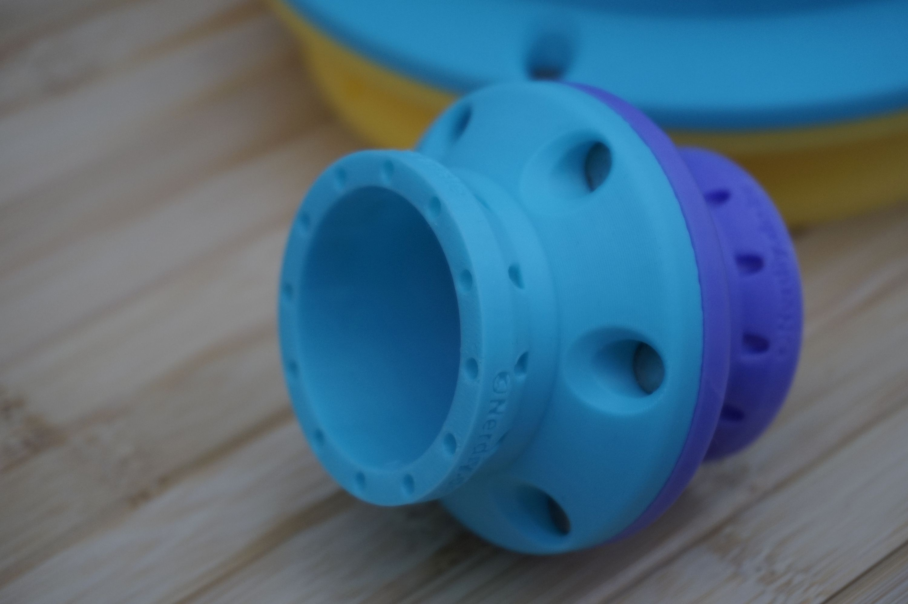
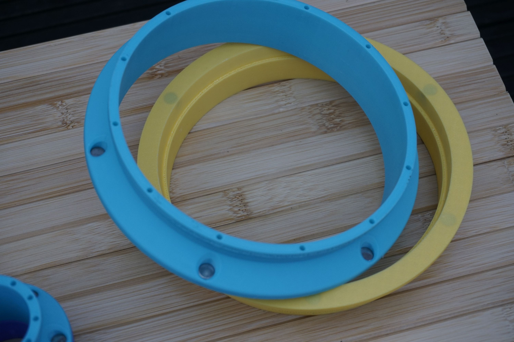

# PrintAirPipe - MagPick Set by Nerdiy.de

---

## 🎯 Project Overview

This accessory set extends the PrintAirPipe system with magnetic pickup-style parts for quick attachment and flexible handling.

---

## 📋 About This Product

The MagPick set is designed for workflows where modular attachment, removal, or repositioning is important. It gives the PrintAirPipe ecosystem a more convenient handling option for compatible parts and setups.

---

## 🛒 Purchase Options

### Primary Source (Recommended)
- **[Nerdiy.de Shop](https://www.nerdiy.de/)** - Download the STL files here

### Alternative Sources
- **[Printables](https://www.printables.com/model/1279727-printairpipe-magpick-set-by-nerdiyde)**

> Support Nerdiy.de if you want to help fund future product updates, documentation improvements, and new maker projects.

---

## 📦 Bill of Materials

### 📦 Required Components

| Qty | Component | ASIN (DE) | Amazon (DE) |
|-----|-----------|-----------|-------------|
| 1x | 3D Printed MagPick Set (STL Files) | - | N/A |
| As needed | Compatible PrintAirPipe Parts | - | N/A |

---

## 🖼️ Product Images
<table>
  <tr>
    <td></td>
    <td></td>
  </tr>
  <tr>
    <td></td>
    <td></td>
  </tr>
  <tr>
    <td></td>
    <td></td>
  </tr>
</table>

Additional Images

<table>
  <tr>
    <td></td>
    <td></td>
  </tr>
</table>

---

## 🖨️ 3D Print Settings

## 3D Print Settings

### ⚙️ Recommended Print Settings
| Parameter | Value |
| --- | --- |
| Filament Type | Weather and UV-resistant (for example PETG, ABS, or ASA) |
| Layer Height | 0.2 mm |
| Infill | 15-25% |
| Wall Lines | 3-5 |
| Supports | As needed by part geometry |

Use the orientation included in the STL package to minimize supports and achieve better surface quality on visible faces.
## 🎯 How to Use

### Step-by-Step Guide

1. Download the STL files from Nerdiy.de or the linked Printables page.
2. Print all MagPick parts with the recommended settings.
3. Prepare the compatible PrintAirPipe components from the bill of materials.
4. Assemble the pickup-style parts and test attachment, removal, and fit before regular use.

---

## 📄 License

Refer to the original product page for the license terms that apply to this STL package.

---

**Last Updated**: March 17, 2026
**Status**: Active - Ready to build

