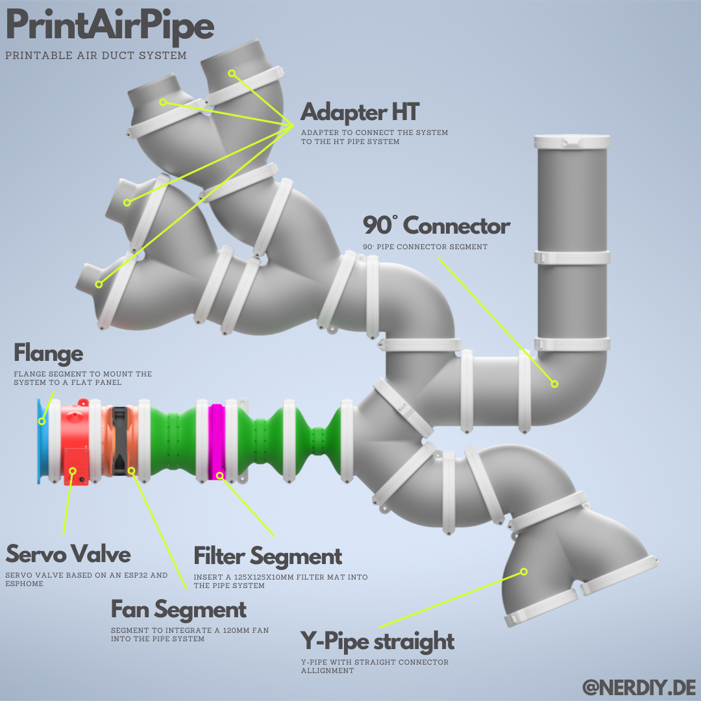
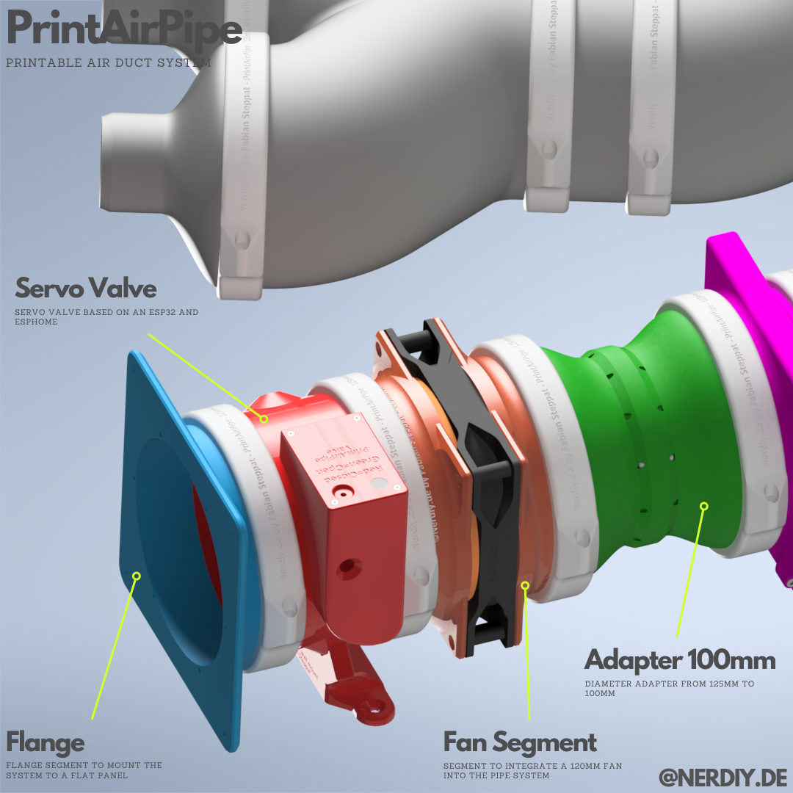
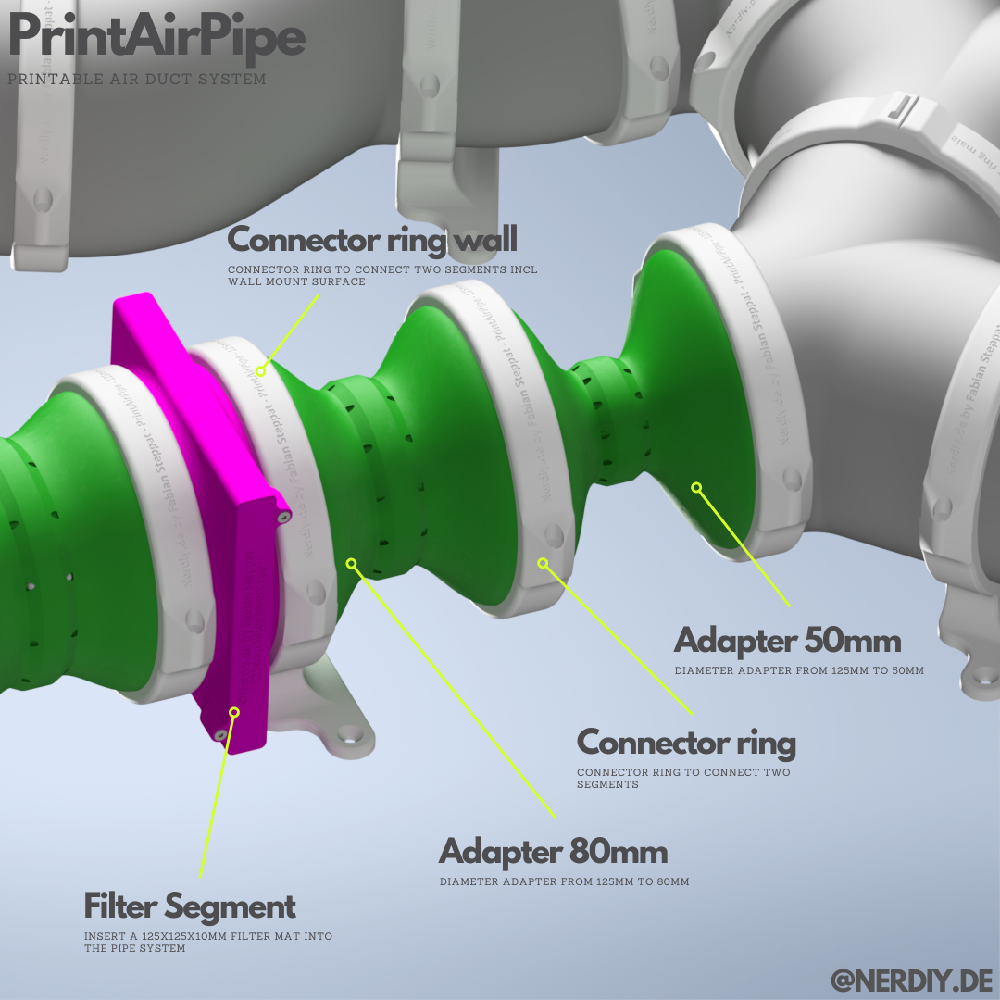
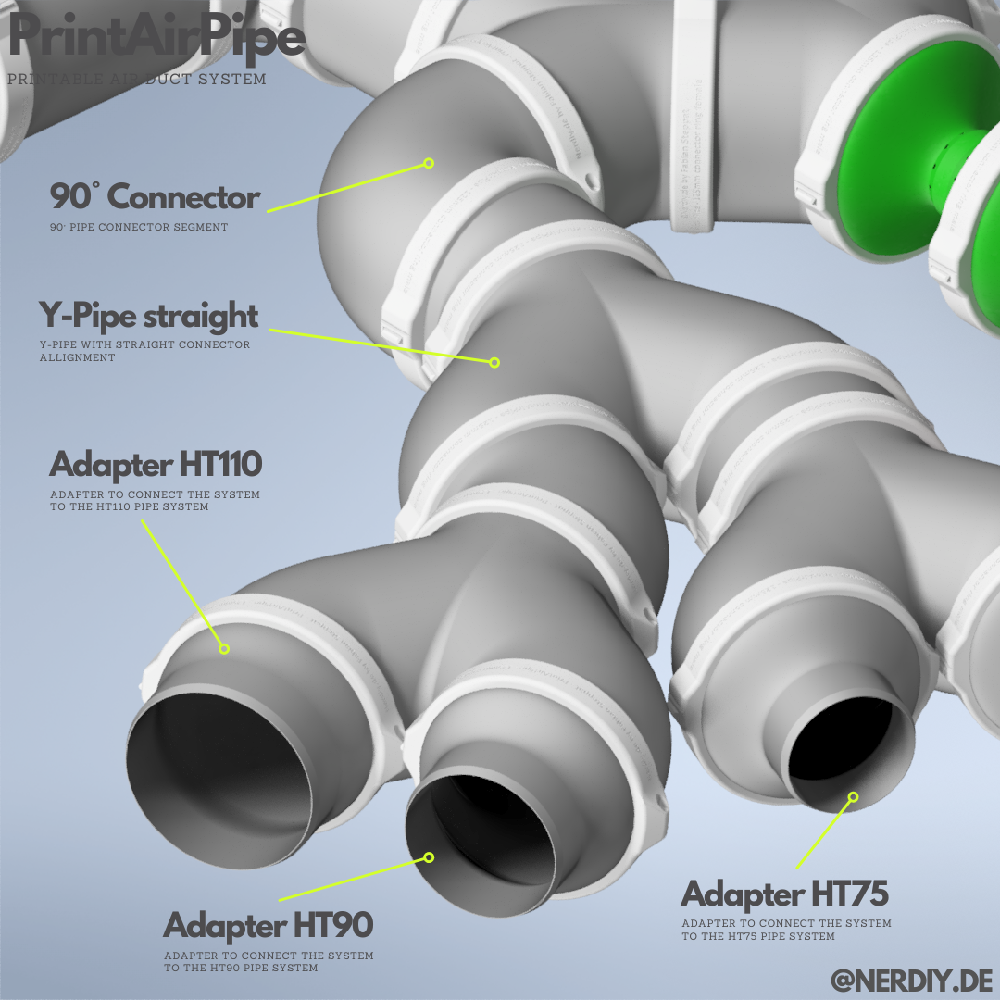
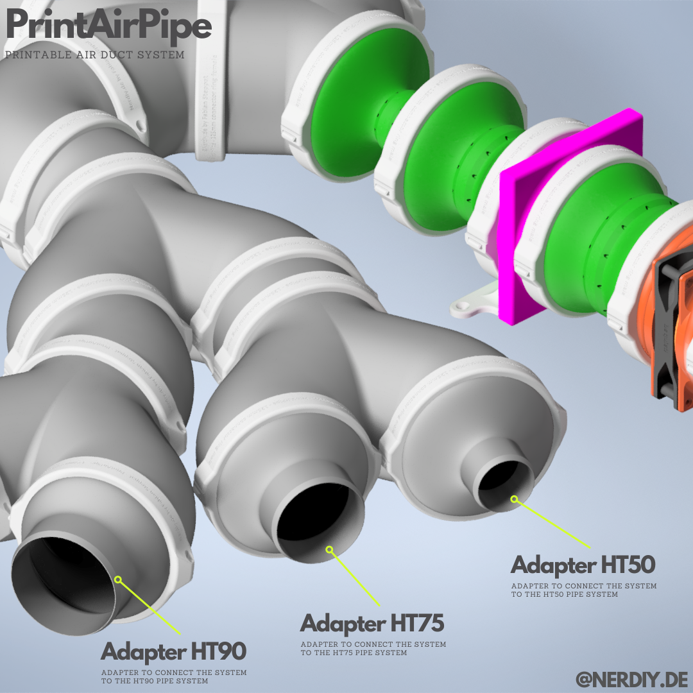

# PrintAirPipe – Printable pipe system – complete set by Nerdiy.de

---

## 🎯 Project Overview

This product page provides a complete overview of the STL package, bill of materials, and recommended print settings.

---

## 📋 About This Product

- **Product Name**: PrintAirPipe – Printable pipe system – complete set by Nerdiy.de
- **Nerdiy.de Shop**: [ View Product](https://www.nerdiy.de/)
- **Created**: March 2026

---

## 🛒 Purchase Options

### Primary Source (Recommended)
- **[ Nerdiy.de Shop](https://www.nerdiy.de/)** - Download the STL files here

### Alternative Sources
- **[ Printables](https://www.printables.com/model/843996-printairpipe-printable-pipe-system-complete-set-by)**

---

## 📦 Bill of Materials

### 🛠️ Required Tools

| Qty | Component | ASIN (DE) | Amazon (DE) |
|-----|-----------|-----------|-------------|
| 1x | Screwdriver Set | B092LVWNX8 | [Amazon](https://www.amazon.de/dp/B086SQZGLJ?tag=nerdiyde018-21&linkCode=ogi&th=1&psc=1) |
| 1x | Soldering Iron | B0CCV6T329 | [Amazon](https://www.amazon.de/dp/B0CCV6T329?tag=nerdiyde018-21&linkCode=ogi&th=1&psc=1) |
| 1x | 3D Printer | - | N/A |

### 📦 Required Components

| Qty | Component | ASIN (DE) | Amazon (DE) |
|-----|-----------|-----------|-------------|
| 1x | ESP32 Breakoutboard | B08BTRQNB3 | [Amazon](https://www.amazon.de/dp/B08BTRQNB3?tag=nerdiyde018-21&linkCode=ogi&th=1&psc=1) |
| 1x | MG90 Servo | B086V3VP72 | [Amazon](https://www.amazon.de/dp/B086V3VP72?tag=nerdiyde018-21&linkCode=ogi&th=1&psc=1) |
| 2x | 623ZZ Ball Bearing | B07CXMYT2Q | [Amazon](https://www.amazon.de/dp/B07CXMYT2Q?tag=nerdiyde018-21&linkCode=ogi&th=1&psc=1) |
| 2x | M2x6 Countersunk | B0957W34XS | [Amazon](https://www.amazon.de/dp/B0957W34XS?tag=nerdiyde018-21&linkCode=ogi&th=1&psc=1) |
| 5x | M2x8 Countersunk | B0957TSYBY | [Amazon](https://www.amazon.de/dp/B0957TSYBY?tag=nerdiyde018-21&linkCode=ogi&th=1&psc=1) |
| 4x | M2x10 Countersunk | B0957SLZTB | [Amazon](https://www.amazon.de/dp/B0957SLZTB?tag=nerdiyde018-21&linkCode=ogi&th=1&psc=1) |
| 2x | Countersunk Screw | B07NMQDV1Q | [Amazon](https://www.amazon.de/dp/B07NMQDV1Q?tag=nerdiyde018-21&linkCode=ogi&th=1&psc=1) |
| 1x | Countersunk Screw | B09N5DWFQ8 | [Amazon](https://www.amazon.de/dp/B09N5DWFQ8?tag=nerdiyde018-21&linkCode=ogi&th=1&psc=1) |
| 2x | Countersunk Screw | B07PWFD14W | [Amazon](https://www.amazon.de/dp/B07PWFD14W?tag=nerdiyde018-21&linkCode=ogi&th=1&psc=1) |
| 2x | Countersunk Screw | B07PXLG3X7 | [Amazon](https://www.amazon.de/dp/B07PXLG3X7?tag=nerdiyde018-21&linkCode=ogi&th=1&psc=1) |
| 3x | M3x6 Zylinderkopfschraube | B01GQX0JVY | [Amazon](https://www.amazon.de/dp/B01GQX0JVY?tag=nerdiyde018-21&linkCode=ogi&th=1&psc=1) |
| 1x | Unterlegscheibe für M3 | B0CJWP92X1 | [Amazon](https://www.amazon.de/dp/B0CJWP92X1?tag=nerdiyde018-21&linkCode=ogi&th=1&psc=1) |
| 1x | Mutter M3 | B07JMF3KMD | [Amazon](https://www.amazon.de/dp/B07JMF3KMD?tag=nerdiyde018-21&linkCode=ogi&th=1&psc=1) |
| 11x | Thread Insert | B088QJG676 | [Amazon](https://www.amazon.de/dp/B088QJG676?tag=nerdiyde018-21&linkCode=ogi&th=1&psc=1) |
| 7x | M3 Thread Insert | B08BCRZZS3 | [Amazon](https://www.amazon.de/dp/B08BCRZZS3?tag=nerdiyde018-21&linkCode=ogi&th=1&psc=1) |
| 1x | Seeed Studio XIAO ESP32-S3 | B0BYSB66S5 | [Amazon](https://www.amazon.de/dp/B0BYSB66S5?tag=nerdiyde018-21&linkCode=ogi&th=1&psc=1) |
| 1x | M2x16 Countersunk | B0957SL8PN | [Amazon](https://www.amazon.de/dp/B0957SL8PN?tag=nerdiyde018-21&linkCode=ogi&th=1&psc=1) |
| 2x | M3x16 Countersunk | B0957VNMTS | [Amazon](https://www.amazon.de/dp/B0957VNMTS?tag=nerdiyde018-21&linkCode=ogi&th=1&psc=1) |
| 1x | Countersunk Screw | B0957TG1T9 | [Amazon](https://www.amazon.de/dp/B0957TG1T9?tag=nerdiyde018-21&linkCode=ogi&th=1&psc=1) |
| 1x | Wire (Litze) | B0C7TJG9YB | [Amazon](https://www.amazon.de/dp/B0C7TJG9YB?tag=nerdiyde018-21&linkCode=ogi&th=1&psc=1) |
| 1x | USB-C Cable | B098WVHH5L | [Amazon](https://www.amazon.de/dp/B098WVHH5L?tag=nerdiyde018-21&linkCode=ogi&th=1&psc=1) |
| 1x | USB Power Supply | B00WLI5E3M | [Amazon](https://www.amazon.de/dp/B00WLI5E3M?tag=nerdiyde018-21&linkCode=ogi&th=1&psc=1) |
| 1x | PETG Filament | B0C6MMM51Y | [Amazon](https://www.amazon.de/dp/B0C6MMM51Y?tag=nerdiyde018-21&linkCode=ogi&th=1&psc=1) |
| 3x | WS2812 LED on PCB | B088K6C7TJ | [Amazon](https://www.amazon.de/dp/B088K6C7TJ?tag=nerdiyde018-21&linkCode=ogi&th=1&psc=1) |
| 3x | Hall Sensor Melexis US1881 | B0CKS22CNX | [Amazon](https://www.amazon.de/dp/B0CKS22CNX?tag=nerdiyde018-21&linkCode=ogi&th=1&psc=1) |
| 3x | Resistor 15k | B0CL6YGQ66 | [Amazon](https://www.amazon.de/dp/B0CL6YGQ66?tag=nerdiyde018-21&linkCode=ogi&th=1&psc=1) |
| 3x | Neodym Magnet 5x5mm | B07N7NS16G | [Amazon](https://www.amazon.de/dp/B07N7NS16G?tag=nerdiyde018-21&linkCode=ogi&th=1&psc=1) |
| 2x | M3x6 Countersunk | B0957V5GHV | [Amazon](https://www.amazon.de/dp/B0957V5GHV?tag=nerdiyde018-21&linkCode=ogi&th=1&psc=1) |
| 1x | M3x30 Countersunk | B09MZQC62G | [Amazon](https://www.amazon.de/dp/B09MZQC62G?tag=nerdiyde018-21&linkCode=ogi&th=1&psc=1) |
| 1x | BME680 Sensor | B0CYH34X3P | [Amazon](https://www.amazon.de/dp/B0CYH34X3P?tag=nerdiyde018-21&linkCode=ogi&th=1&psc=1) |
| 1x (Optional) | BME280 Sensor | B07YJMR5SG | [Amazon](https://www.amazon.de/dp/B07YJMR5SG?tag=nerdiyde018-21&linkCode=ogi&th=1&psc=1) |
| 1x | Fermion MEMS Carbon Monoxide Gas Detection Sensor | - | N/A |
| 1x to 2x | PETG Filament | B0C6MKZN2B | [Amazon](https://www.amazon.de/dp/B0C6MKZN2B?tag=nerdiyde018-21&linkCode=ogi&th=1&psc=1) |
| 8x | Lüfter Befestigungsschrauben | B000TG3IGS | [Amazon](https://www.amazon.de/dp/B000TG3IGS?tag=nerdiyde018-21&linkCode=ogi&th=1&psc=1) |

---

## 🖼️ Product Images

| Image 1 | Image 2 |
|---------|---------|
|  |  |
|  |  |
|  |  |

---

## 🖨️ 3D Print Settings

### ⚙️ Recommended Print Settings
| Setting | Value |
|---------|-------|
| **Filament Type** | Weather and UV-resistant (for example PETG, ABS, or ASA) |
| **Layer Height** | 0.2 mm |
| **Infill** | 15-25% |
| **Wall Lines** | 3-5 |
| **Supports** | As needed by part geometry |

> 🖨️ **Print Orientation**: Use the orientation included in the STL package to maximize part strength and fit.

---

## 🔧 How to Use

1. Download the STL files from the Nerdiy.de product page.
2. Print all required parts with the recommended settings.
3. Prepare all parts from the bill of materials.
4. Assemble and test before final installation.

---

## 📄 License

See the license information on the product page.

---

**Last Updated**: 22. February 2026
**Status**: Active - Ready to build
