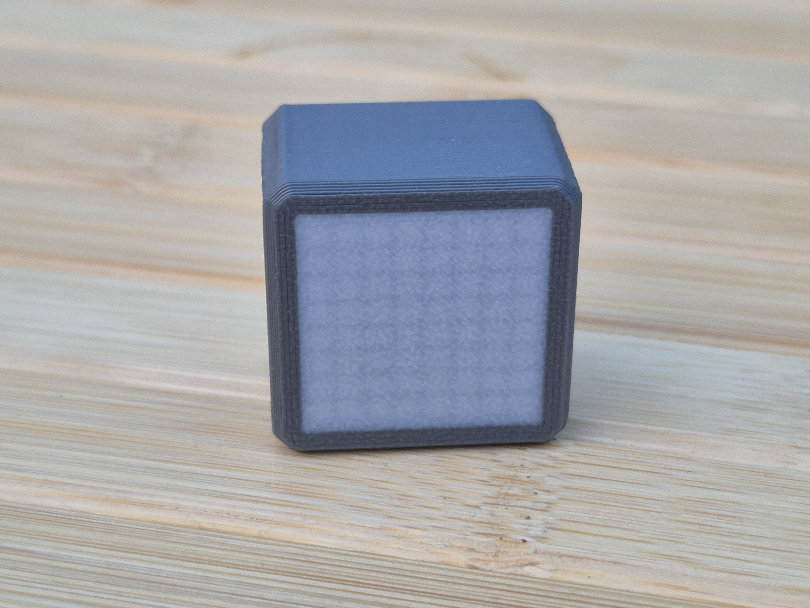
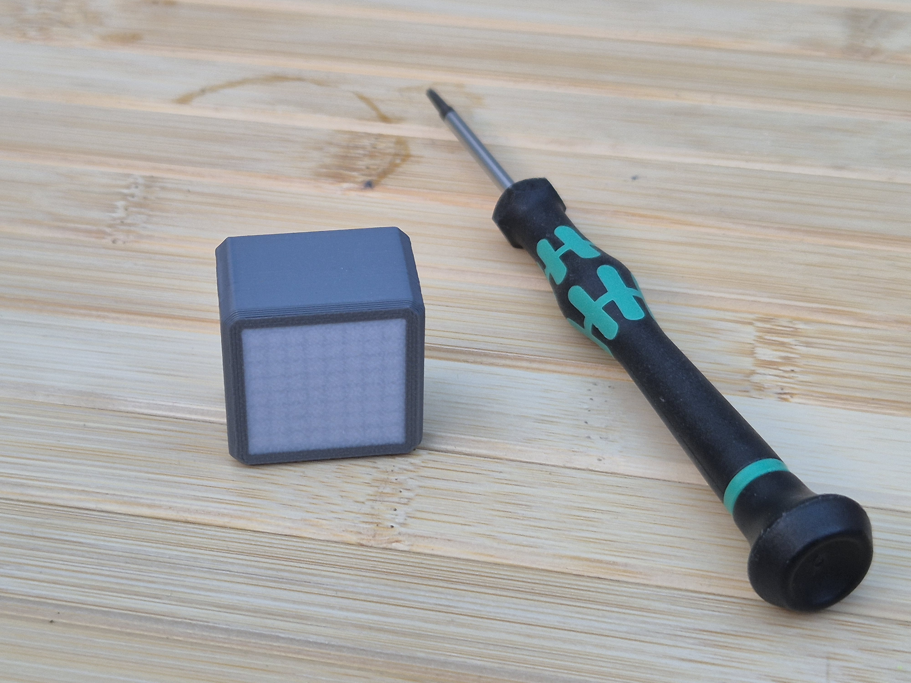
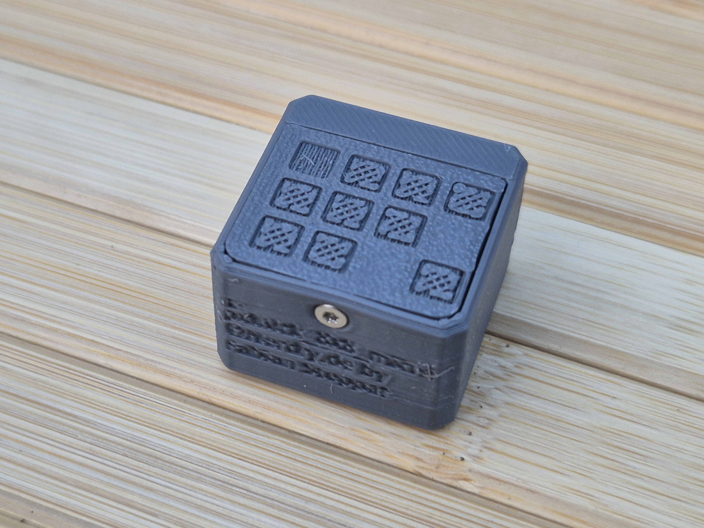
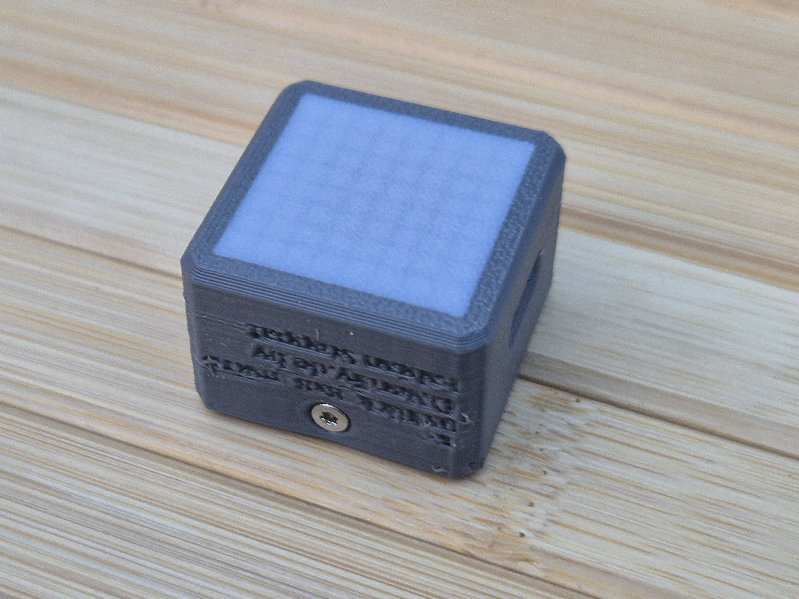
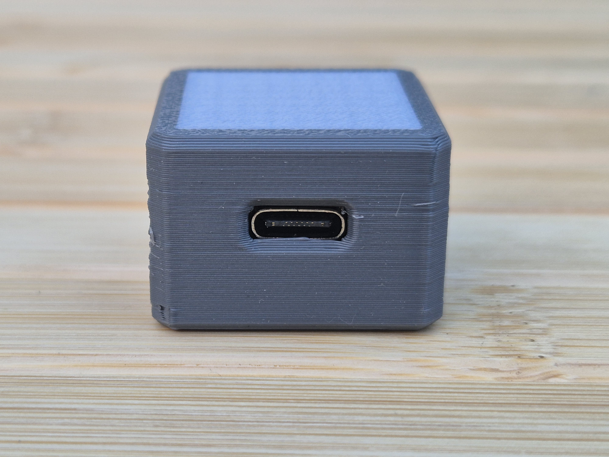
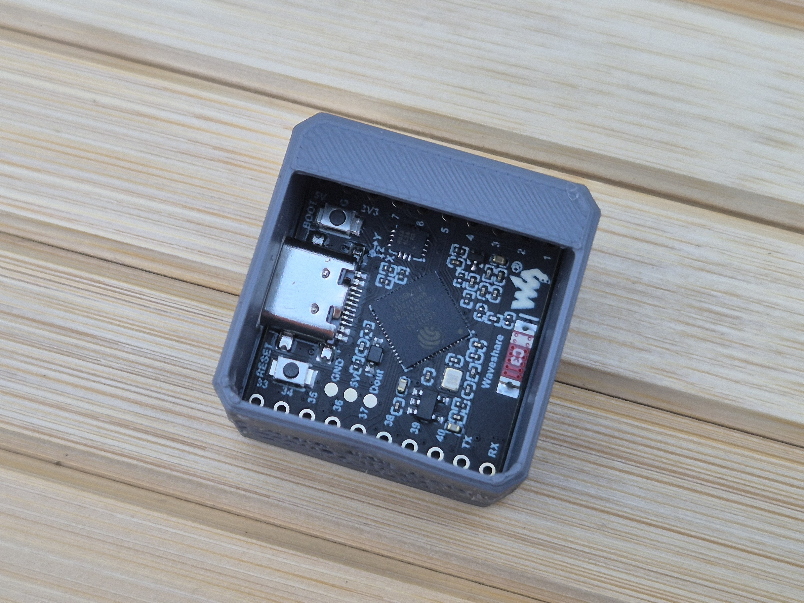
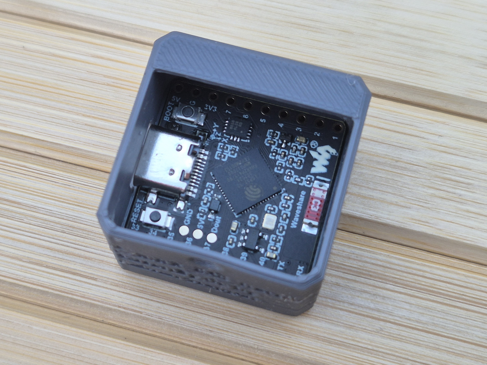

# pxlBlck 8x8 Matrix - Waveshare ESP32-S3-Matrix by Nerdiy.de

---

## Project Overview

This product page documents a pxlBlck-style build based on the Waveshare ESP32-S3-Matrix board. The board combines an ESP32-S3, an onboard 8x8 RGB LED matrix, USB-C, Wi-Fi, Bluetooth LE, and an IMU in a compact form factor.

---

## About This Product

- **Product Name**: pxlBlck 8x8 Matrix - Waveshare ESP32-S3-Matrix by Nerdiy.de
- **Base Hardware**: Waveshare ESP32-S3-Matrix
- **Board Docs**: [Waveshare ESP32-S3-Matrix](https://docs.waveshare.com/ESP32-S3-Matrix)
- **Resources**: [Waveshare ESP32-S3-Matrix Resources](https://docs.waveshare.com/ESP32-S3-Matrix/Resources-And-Documents)
- **Created**: July 2026

---

## Hardware Notes

- ESP32-S3 dual-core MCU
- Onboard 8x8 RGB LED matrix
- USB Type-C power and programming
- QMI8658 6-axis IMU on the board
- Shared I2C lines exposed by the board documentation

The Waveshare documentation warns not to run the RGB matrix at excessive brightness for long periods.

---

## Material List

The following materials are based on the shared global materials library and the additional parts needed for this build.

| Qty | Component | ASIN (DE) | Amazon (DE) | Notes |
|-----|-----------|-----------|-------------|-------|
| 1x | Waveshare ESP32-S3-Matrix Board | - | [Waveshare Docs](https://docs.waveshare.com/ESP32-S3-Matrix) | Base board for this pxlBlck build |
| 1x | M2 Thread Insert | B08DDBWKZF | [Amazon](https://www.amazon.de/dp/B08DDBWKZF?tag=nerdiyde018-21&linkCode=ogi&th=1&psc=1) | For screw reinforcement |
| 1x | M2x6 Countersunk | B0957W34XS | [Amazon](https://www.amazon.de/dp/B0957W34XS?tag=nerdiyde018-21&linkCode=ogi&th=1&psc=1) | Small fitting for the housing |
| 1x | PLA Filament White | - | - | White housing or accent parts; no dedicated global library entry available |
| 1x | PLA Filament Black (1kg) | B07T6WLFML | [Amazon](https://www.amazon.de/dp/B07T6WLFML?tag=nerdiyde018-21&linkCode=ogi&th=1&psc=1) | Black housing or inner parts |
| 1x | PETG Filament (1kg) | B07T2QZYS1 | [Amazon](https://www.amazon.de/dp/B07T2QZYS1?tag=nerdiyde018-21&linkCode=ogi&th=1&psc=1) | Any additional housing color |
| 1x | USB-C Cable | B098WVHH5L | [Amazon](https://www.amazon.de/dp/B098WVHH5L?tag=nerdiyde018-21&linkCode=ogi&th=1&psc=1) | Power and flashing |
| 1x | USB Power Supply | B00WLI5E3M | [Amazon](https://www.amazon.de/dp/B00WLI5E3M?tag=nerdiyde018-21&linkCode=ogi&th=1&psc=1) | 5V/3A recommended |

---

### 🛠️ Required Tools

| Qty | Component | ASIN (DE) | Amazon (DE) |
|-----|-----------|-----------|-------------|
| 1x | Screwdriver Set | B086SQZGLJ | [Amazon](https://www.amazon.de/dp/B086SQZGLJ?tag=nerdiyde018-21&linkCode=ogi&th=1&psc=1) |
| 1x | Soldering Iron | B0D5M727WM | [Amazon](https://www.amazon.de/dp/B0D5M727WM?tag=nerdiyde018-21&linkCode=ogi&th=1&psc=1) |

---

## Product Images

| Image 1 | Image 2 |
|---------|---------|
|  |  |
|  |  |
|  |  |
|  | |

---

## ESPHome Firmware

The matching ESPHome configuration lives in:

- [firmware/config/pxlblck-waveshare-esp32-s3-matrix.yaml](firmware/config/pxlblck-waveshare-esp32-s3-matrix.yaml)

The initial configuration is intentionally conservative:

- uses ESP32-S3 as the base target
- exposes a single addressable light for the onboard matrix
- includes Wi-Fi, API, OTA, web server, and basic diagnostics
- keeps the LED data pin as a clearly documented value to verify against the schematic if needed

---

## Next Steps

1. Confirm the matrix data pin in the Waveshare schematic.
2. Adjust the LED strip parameters if the final board uses a different color order or pixel count.
3. Extend the firmware with animations, effects, or pxlBlck-specific features.

---

**Last Updated**: July 29, 2026
**Status**: Draft - initial structure created
