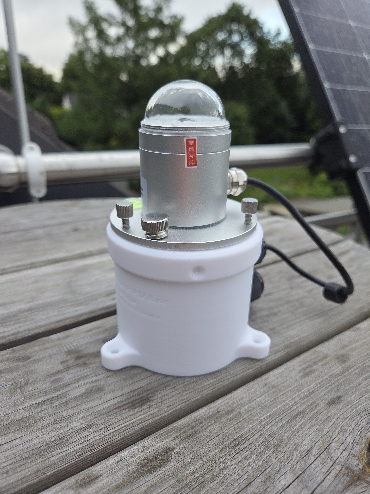
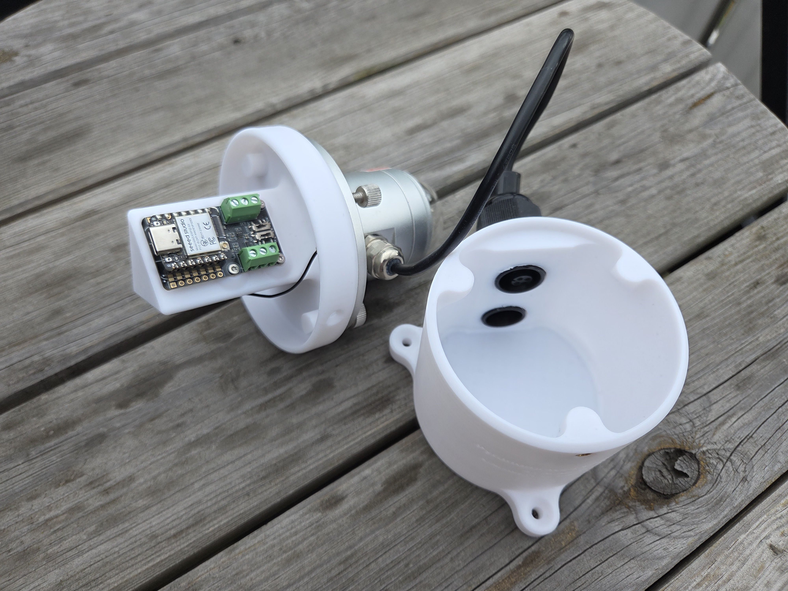
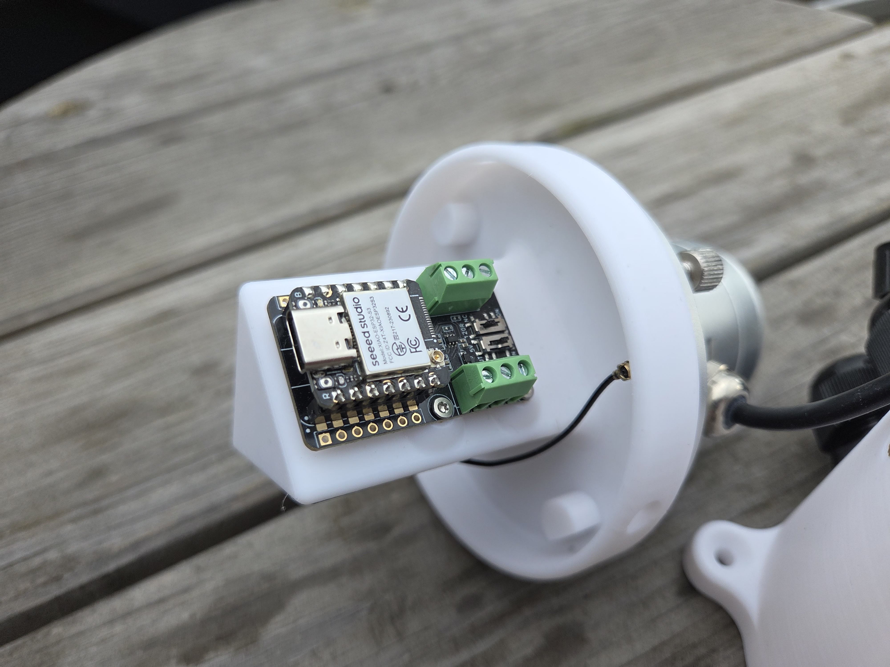
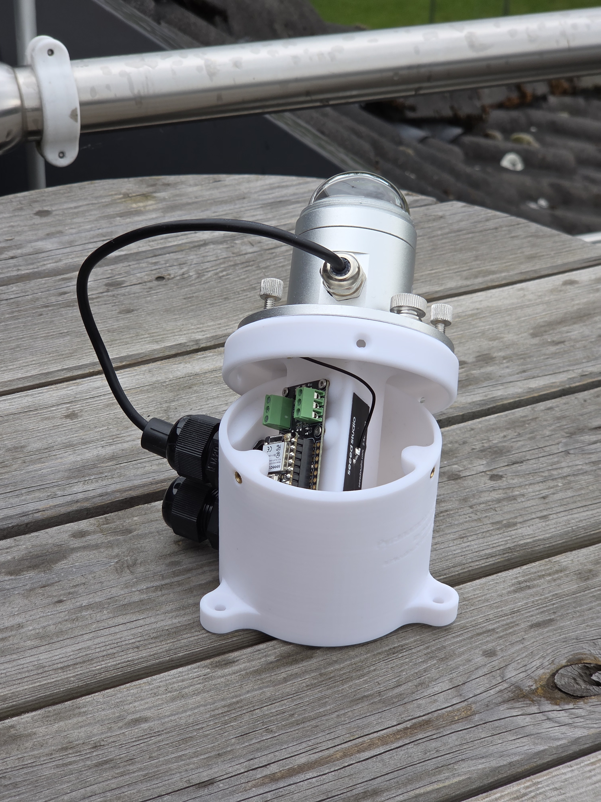
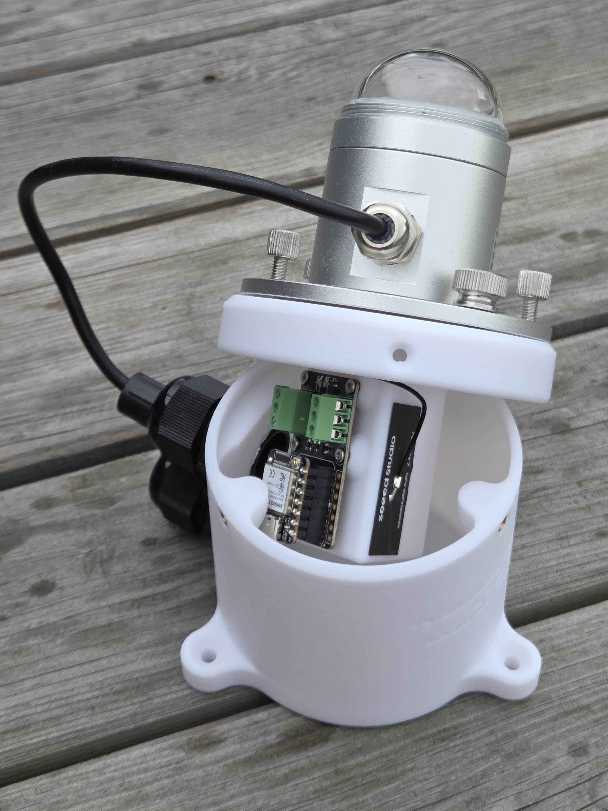

# Pyranometer Modbus Reader (XIAO ESP32-S3) by Nerdiy.de

---

## Project Overview

Read a solar radiation pyranometer sensor via Modbus RTU / RS485 using a Seeed XIAO ESP32-S3 and its RS485 expansion board, integrated into Home Assistant via ESPHome.

This product provides a compact 3D-printed adapter housing plus ESPHome firmware to connect a standard RS485 Modbus pyranometer (solar irradiance sensor, W/m²) directly to a Seeed XIAO ESP32-S3 running ESPHome. Data is exposed to Home Assistant in real time and is also accessible via the built-in web interface.

---

## About This Product

- **Product Name**: Pyranometer Modbus Reader (XIAO ESP32-S3) by Nerdiy.de
- **Nerdiy.de Shop**: [Purchase Product](https://nerdiy.de/)
- **Compatible Sensor**: RS485 Modbus solar radiation pyranometer (ASIN B0H2375KNY, e.g. [AliExpress](https://de.aliexpress.com/item/1005004228412283.html))
- **Controller**: Seeed XIAO ESP32-S3 + RS485 expansion board
- **Created**: June 2026

---

## Purchase Options

### Primary Source (Recommended)
- **[Nerdiy.de Shop](https://nerdiy.de/)** - Purchase the product here to support independent design and development

### Alternative Sources (3D Files)
- Printables: [Pyranometer ESP32 Base by Nerdiy.de](https://www.printables.com/model/1750355-pyranometer-esp32-base-by-nerdiyde)
- Cults3D: [Pyranometer ESP32 Base by Nerdiy.de](https://cults3d.com/de/modell-3d/haus/pyranometer-esp32-base-by-nerdiy-de)

---

## Bill of Materials

### Required Tools

| Qty | Tool | ASIN (DE) | Amazon (DE) |
|-----|------|-----------|-------------|
| 1x | Screwdriver Set | B086SQZGLJ | [Amazon](https://www.amazon.de/dp/B086SQZGLJ?tag=nerdiyde018-21) |
| 1x | Wire Stripper | B001NUMVHQ | [Amazon](https://www.amazon.de/dp/B001NUMVHQ?tag=nerdiyde018-21) |
| 1x | Side Cutters | B005EXOF6S | [Amazon](https://www.amazon.de/dp/B005EXOF6S?tag=nerdiyde018-21) |

### Electronics

| Qty | Component | ASIN (DE) | Amazon (DE) |
|-----|-----------|-----------|-------------|
| 1x | Seeed XIAO ESP32-S3 | B0BYSB66S5 | [Amazon](https://www.amazon.de/dp/B0BYSB66S5?tag=nerdiyde018-21&linkCode=ogi&th=1&psc=1) |
| 1x | Seeed XIAO RS485 Expansion Board | | [Seeed Studio](https://www.seeedstudio.com/) |
| 1x | RS485 Modbus Pyranometer (Solar Radiation Sensor) | B0H2375KNY | [Amazon](https://www.amazon.de/dp/B0H2375KNY?tag=nerdiyde018-21&linkCode=ogi&th=1&psc=1) |
| 1x | USB-C Cable | B0BPCBP15P | [Amazon](https://www.amazon.de/dp/B0BPCBP15P?tag=nerdiyde018-21) |

### Connection Materials

| Qty | Component | ASIN (DE) | Amazon (DE) |
|-----|-----------|-----------|-------------|
| 1x | Hookup Wire (shielded recommended for outdoor RS485) | B0C7TJG9YB | [Amazon](https://www.amazon.de/dp/B0C7TJG9YB?tag=nerdiyde018-21) |
| 1x | Ferrule Crimping Set | B07WRQN37T | [Amazon](https://www.amazon.de/dp/B07WRQN37T?tag=nerdiyde018-21) |
| 1x | M3 Screw Set | B07CHSFKXQ | [Amazon](https://www.amazon.de/dp/B07CHSFKXQ?tag=nerdiyde018-21) |

---

## Sensor Specifications

The supported sensor type is a generic RS485 Modbus RTU solar irradiance pyranometer with the following default communication settings:

| Parameter | Value |
|-----------|-------|
| Interface | RS485 (2-wire: A+, B−) |
| Protocol | Modbus RTU |
| Default Slave Address | 0x01 |
| Baud Rate | 9600 bps |
| Data Bits | 8 |
| Stop Bits | 1 |
| Parity | None |
| Measurement Range | 0 – 2000 W/m² |
| Output Register | Holding register 0x0000 (U_WORD, unit: W/m²) |
| Power Supply | 12 – 24 V DC (via sensor cable, **not** from the XIAO) |

> **Note**: Some sensor variants ship with 4800 bps baud rate. Check the sticker on your sensor and adjust `uart_baud_rate` in the firmware substitutions accordingly.

---

## Wiring

### XIAO ESP32-S3 RS485 Board + PD Trigger → Pyranometer

```
+------------------------------+
| USB-C PD Power Supply        |
| (PD source)                  |
+--------------+---------------+
       |
       | USB-C
       v
+------------------------------+
| USB-C PD Trigger Board       |
| (configured to 12V output)   |
+------+-----------------------+
   |
   | 12V rail
   +----------------------------------------> +------------------------------+
   |                                          | RS485 Pyranometer            |
   |                                          | 12-24V DC input              |
   |                                          | A+ (brown / yellow wire) <---+------+
   |                                          | B-  (blue / white wire)  <---+----+ |
   |                                          | GND (shield / black wire) <--+--+ | |
   |                                          +------------------------------+  | | |
   |                                                                            | | |
+--+---------------------------+                                                | | |
| Seeed XIAO ESP32-S3          |                                                | | |
| + RS485 Expansion Board      |                                                | | |
| UART TX: GPIO25              |                                                | | |
| UART RX: GPIO27              |                                                | | |
| RS485 A+ ----\               |                                                | | |
| RS485 B- -----+==============+================================================+-+-+
| GND ---------/               |                                            
+------------------------------+                                            
                                                                            

```

> - UART mapping used by the firmware: **GPIO25 = TX** and **GPIO27 = RX**.
> - The PD trigger board negotiates USB-C PD and provides a **12V rail** for the installation.
> - Use the 12V rail for the pyranometer supply and a proper 5V path (for example via DC-DC step-down) for the ESP board.
> - RS485 lines may need a 120 Ω termination resistor at the far end of a long cable run.
> - If communication fails, swap the A+ and B− wires.

---

## Firmware

The ESPHome firmware is located in the `firmware/` folder.

- Main configuration: `firmware/pyranometer_modbus_reader.yaml`

### Quick Start

1. Copy `firmware/pyranometer_modbus_reader.yaml` to your ESPHome configuration folder.
2. Create or update your `secrets.yaml` with:
   ```yaml
   wifi_ssid: "YourWiFiName"
   wifi_password: "YourWiFiPassword"
   ```
3. Adjust the substitutions block (slave address, baud rate, etc.) to match your sensor.
4. Compile and flash to the XIAO ESP32-S3.
5. Add the device in Home Assistant via the ESPHome integration.

---

## Home Assistant Entities

After successful integration the following entities will be available:

| Entity | Unit | Description |
|--------|------|-------------|
| Solar Irradiance | W/m² | Instantaneous solar radiation measured by the pyranometer |
| Daily Solar Energy | Wh/m² | Accumulated daily energy (calculated from irradiance) |
| ESP WiFi Signal | dBm / % | Wireless connection quality |
| ESP Uptime | s | Time since last reboot |

---

## Product Images

| | |
|---|---|
|  |  |
|  |  |
|  | |

---

## License

See the license information in the firmware header and on Nerdiy.de.

---

**Last Updated**: June 10, 2026  
**Status**: Active – Initial product setup
