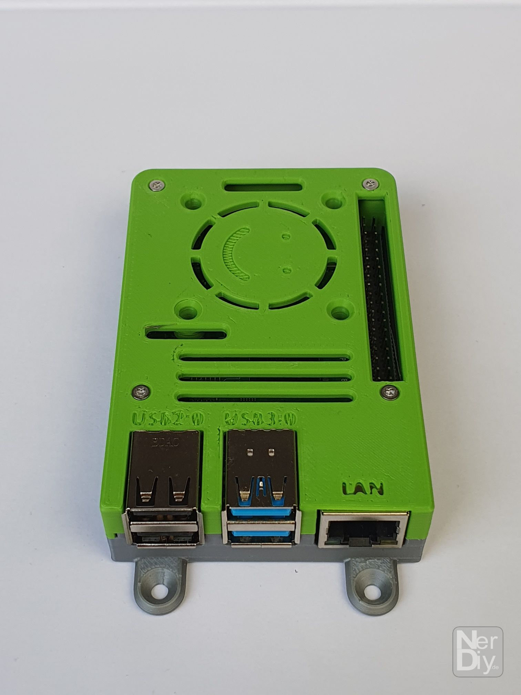
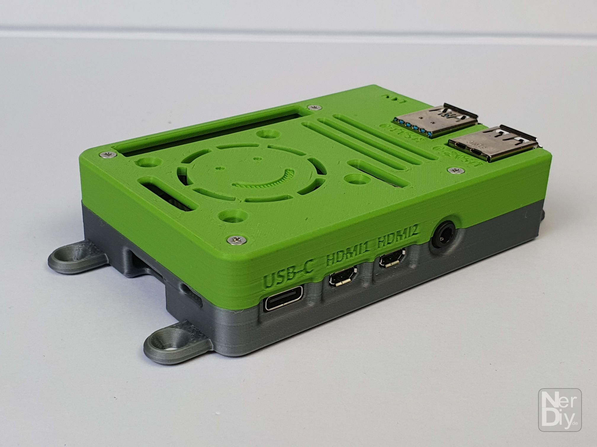
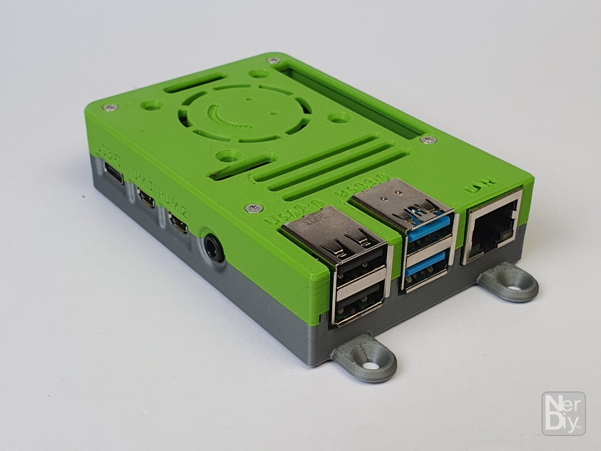
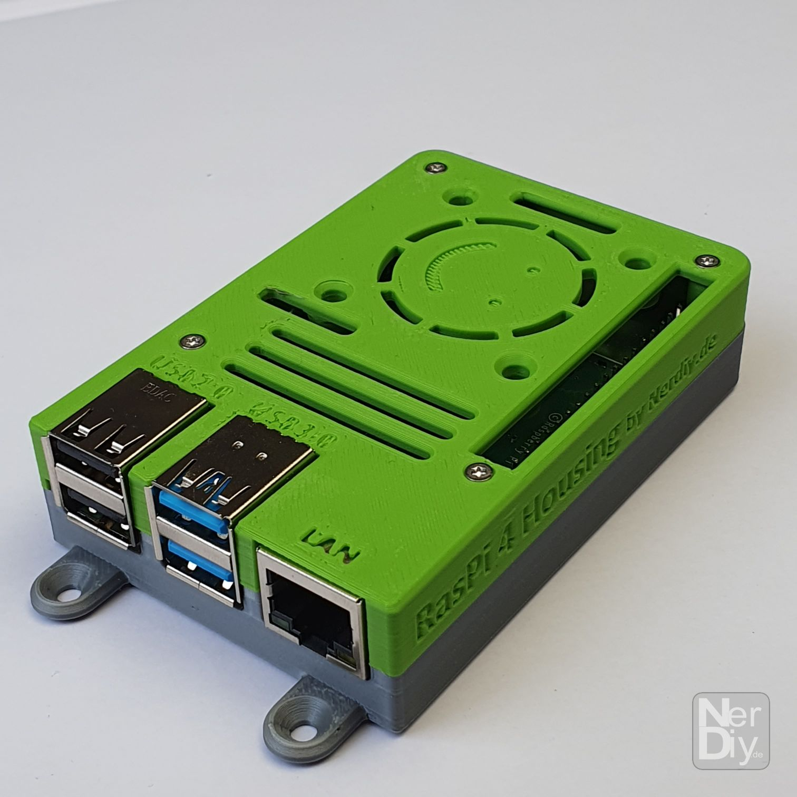
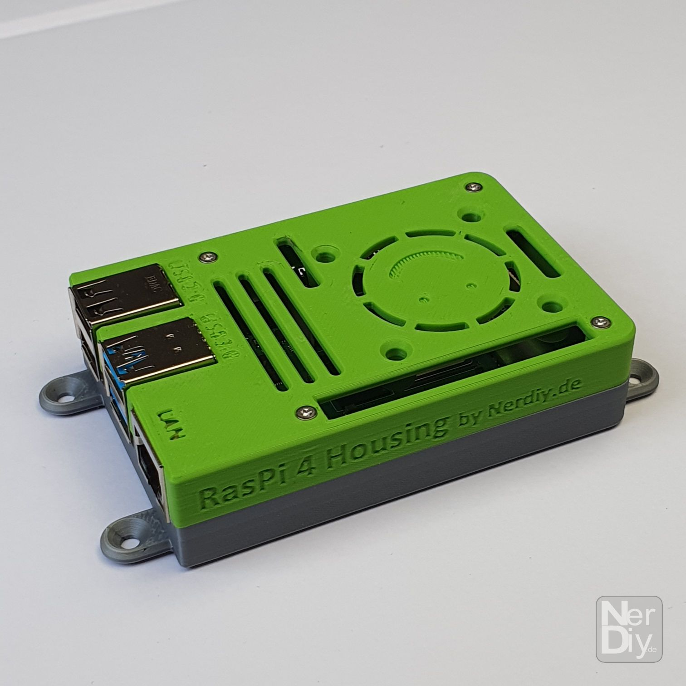
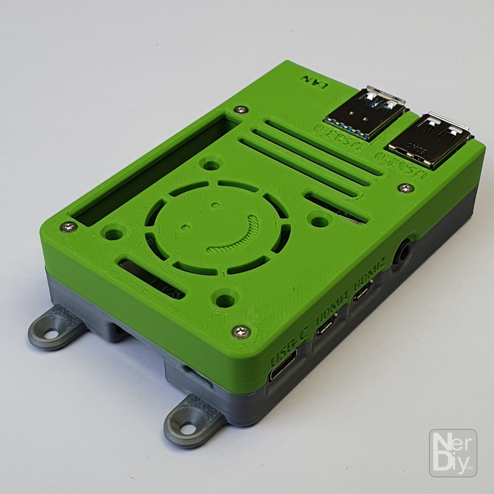

# Raspberry Pi 4 Case by Nerdiy.de

---

## 🎯 Project Overview

Build a professional protective housing for your Raspberry Pi 4 Model B.

Here we offer you the STL files for 3D-printed housing parts, which have been specifically developed to securely hold the Raspberry Pi 4 while protecting it from dust and physical damage. The housing provides proper ventilation and maintains full access to all ports and connectors.

With the provided STL files, you can easily create your own housing parts on your 3D printer and integrate them into your Raspberry Pi 4 projects.

---

## 📋 About This Product

This product provides 3D-printable protective housing and mounting parts for Raspberry Pi 4 Model B.

- **Product Name**: Raspberry Pi 4 Case by Nerdiy.de
- **Printables Store**: [🎨 View on Printables](https://www.printables.com/model/1285597-raspberry-pi-4-case-by-nerdiyde)
- **Created**: February 2026
- **Note**: The housing provides protection and proper ventilation while maintaining full access to all GPIO pins, USB ports, Ethernet, and dual micro-HDMI connections.

---

## 🛒 Purchase Options

### Primary Source (Recommended)
- **[🎨 Printables Store](https://www.printables.com/model/1285597-raspberry-pi-4-case-by-nerdiyde)** - Download the STL files here

### Alternative Sources
- **[🖨️ Cults3D](https://cults3d.com/de/modell-3d/werkzeuge/raspberrypi-4-gehaeuse-by-nerdiy-de)**
- **[🛍️ Nerdiy.de Shop](https://nerdiy.de/)** - Check for availability
- **[🧵 Etsy Shop](https://www.etsy.com/de/listing/1615634549/raspberry-pi-4-case-by-nerdiyde-stl)** - Alternative purchase option

> 💖 **Support independent makers**: By downloading from Printables and giving a like, you directly support further development and new projects!

---

## 📦 Bill of Materials

### 🛠️ Required Tools

| Qty | Component | ASIN (DE) | Amazon (DE) |
|-----|-----------|-----------|-------------|
| 1x | Screwdriver Set | B086SQZGLJ | [Amazon](https://www.amazon.de/dp/B086SQZGLJ?tag=nerdiyde018-21&linkCode=ogi&th=1&psc=1) |
| 1x | Hex Key Set | B0BZ1F6WST | [Amazon](https://www.amazon.de/dp/B0BZ1F6WST?tag=nerdiyde018-21&linkCode=ogi&th=1&psc=1) |

### 🎨 3D Print Materials

| Qty | Component | ASIN (DE) | Amazon (DE) |
|-----|-----------|-----------|-------------|
| 1x | PETG Filament 1.75mm (1kg) | B07T2QZYS1 | [Amazon](https://www.amazon.de/dp/B07T2QZYS1?tag=nerdiyde018-21&linkCode=ogi&th=1&psc=1) |

### ⚙️ Mounting Hardware

| Qty | Component | ASIN (DE) | Amazon (DE) |
|-----|-----------|-----------|-------------|
| 4x | M2 Threaded Insert | B08DDBWKZF | [Amazon](https://www.amazon.de/dp/B08DDBWKZF?tag=nerdiyde018-21&linkCode=ogi&th=1&psc=1) |
| 4x | M2x20 Countersunk Screw | B09N4WV1WP | [Amazon](https://www.amazon.de/dp/B09N4WV1WP?tag=nerdiyde018-21&linkCode=ogi&th=1&psc=1) |

### 📦 Required Components

| Qty | Component | ASIN (DE) | Amazon (DE) |
|-----|-----------|-----------|-------------|
| 1x | Raspberry Pi 4 (4GB or 8GB) | B09TTNF8BT | [Amazon](https://www.amazon.de/dp/B09TTNF8BT?tag=nerdiyde018-21&linkCode=ogi&th=1&psc=1) |
| 1x | Raspberry Pi 4 Power Supply (USB-C) | B07TZ89BT7 | [Amazon](https://www.amazon.de/dp/B07TZ89BT7?tag=nerdiyde018-21&linkCode=ogi&th=1&psc=1) |
| 1x | Micro SD Card 64GB | B07FCMBLV6 | [Amazon](https://www.amazon.de/dp/B07FCMBLV6?tag=nerdiyde018-21&linkCode=ogi&th=1&psc=1) |

---

## 🖼️ Product Images

<table>
  <tr>
    <td></td>
    <td></td>
  </tr>
  <tr>
    <td></td>
    <td></td>
  </tr>
  <tr>
    <td></td>
    <td></td>
  </tr>
</table>

---

## 🖨️ 3D Print Settings

### ⚙️ Recommended Print Settings
| Setting | Value |
|---------|-------|
| **Filament Type** | PETG (weather and UV-resistant) |
| **Layer Height** | 0.2mm |
| **Infill** | 20-25% |
| **Wall Lines** | 3-5 |
| **Support** | No support needed |

> 💡 **Print Orientation**: I highly recommend printing the parts in the already defined orientation. The defined orientation is intended to maximize the structural integrity of the part and ensure proper ventilation channels.

---

## 🎯 How to Use

### Step-by-Step Assembly Guide

1. **Gather Your Materials**
   - Purchase all components from the Bill of Materials section above
   - All Amazon links are pre-configured with affiliate tags to support Nerdiy.de development
   - For STL files, [download from Printables](https://www.printables.com/model/1285597-raspberry-pi-4-case-by-nerdiyde)

2. **Download 3D Files**
   - [🎨 Download from Printables](https://www.printables.com/model/1285597-raspberry-pi-4-case-by-nerdiyde) (free download)

3. **Prepare for 3D Printing**
   - Print the housing and mounting parts with these settings:
   - Layer Height: 0.2mm
   - Infill: 20-25%
   - Material: PETG (recommended for durability and heat resistance)
   - No supports needed
   - Slice and prepare files in your slicing software

4. **Assembly**
   - Clean all printed parts after removal from build plate
   - Install M2 threaded inserts into designated holes using soldering iron
   - Mount the Raspberry Pi 4 into the housing base
   - Secure the top cover with M2x20 countersunk screws
   - Verify all ports and GPIO pins are accessible

5. **Installation**
   - Mount the complete housing assembly in your desired location
   - Ensure proper ventilation around the unit
   - Connect power supply (USB-C power input)
   - Connect peripherals and network cables as needed
   - Boot up your Raspberry Pi 4

6. **Maintenance**
   - Periodically clean dust from ventilation areas
   - Check screw tightness after extended use
   - Monitor temperature to ensure adequate ventilation

---

## 📄 License

See the license information on the Printables product page.

---

**Last Updated**: March 5, 2026  
**Status**: Complete - Ready to build
