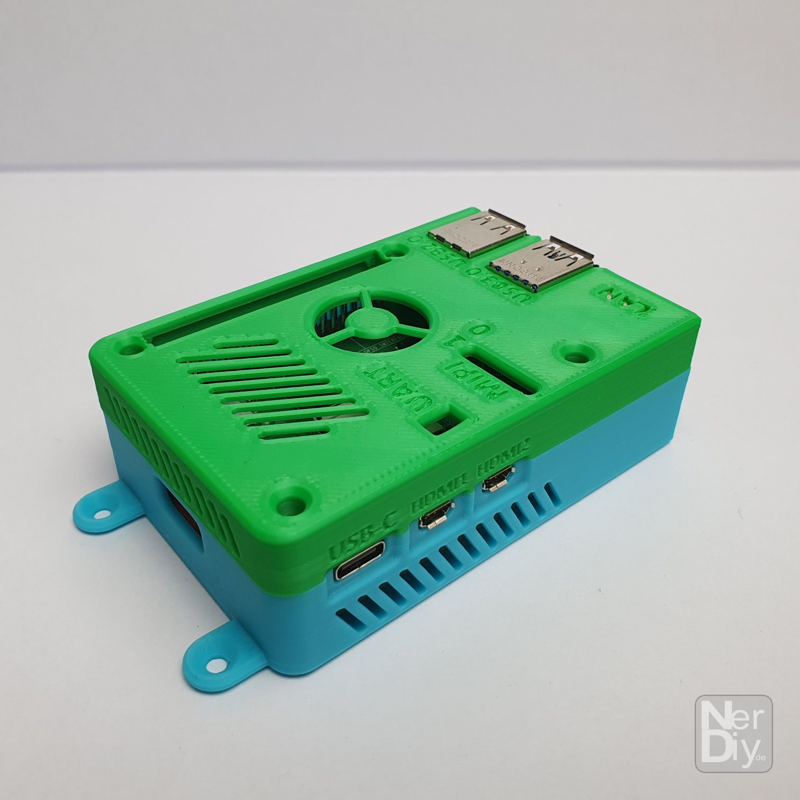
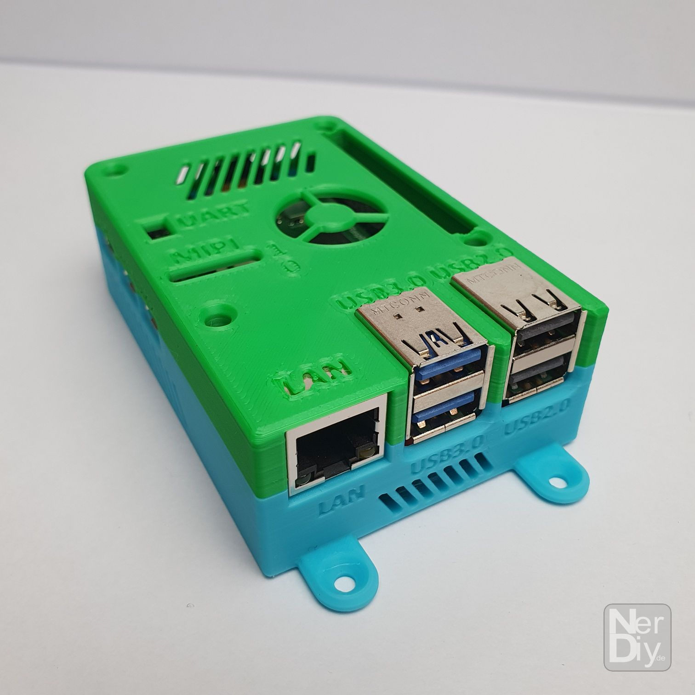
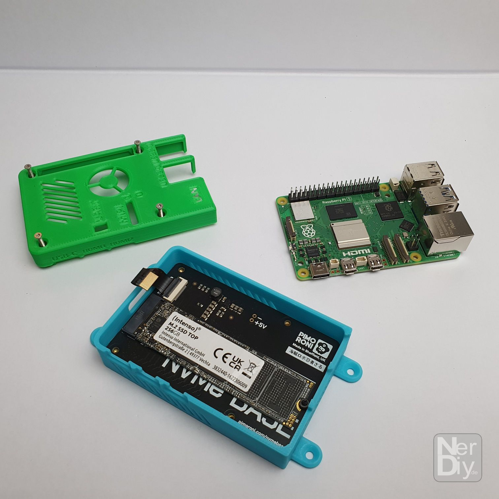
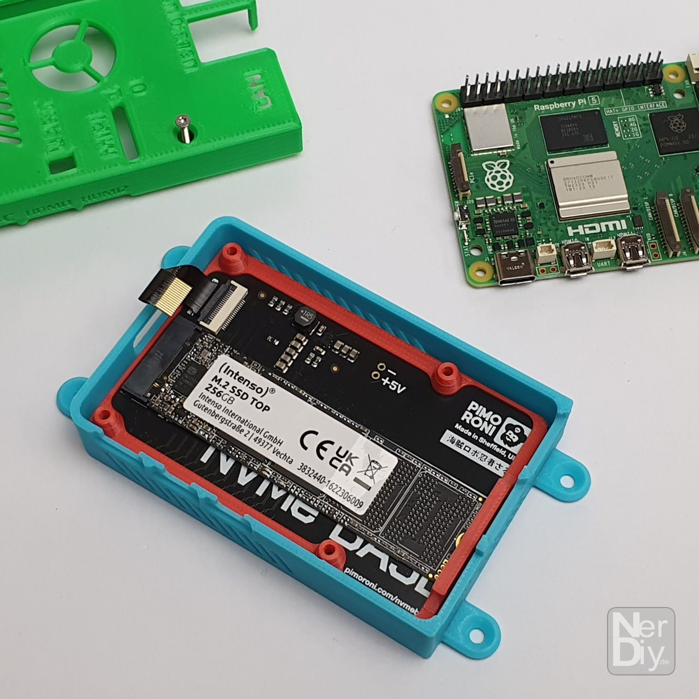
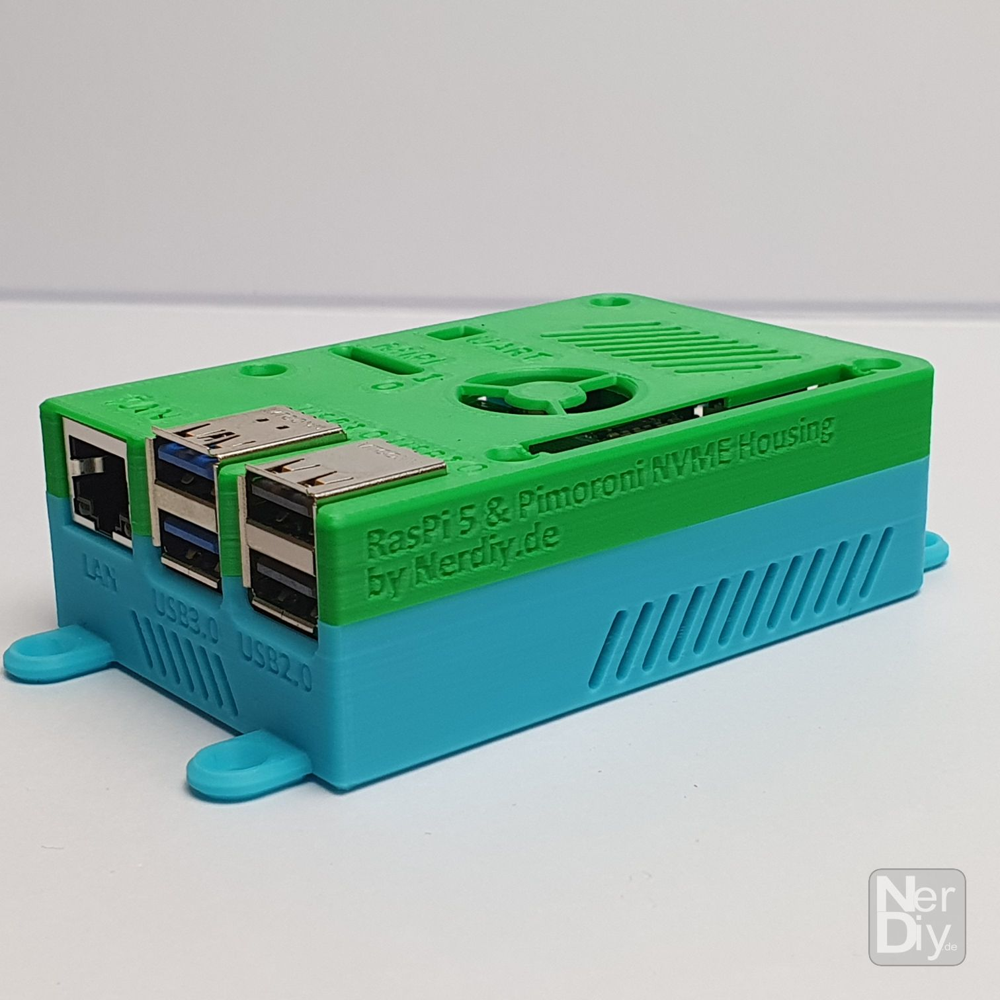
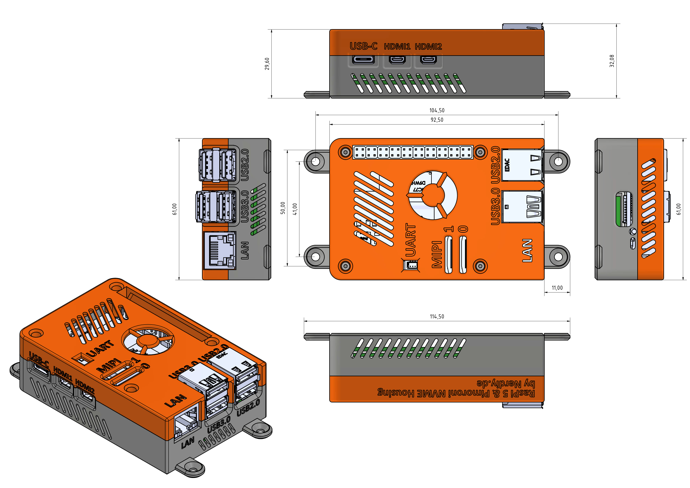

# Raspberry Pi 5 & Pimoroni NVME Base Housing by Nerdiy.de

---

## 🎯 Project Overview

Build a professional protective housing for your Raspberry Pi 5 with Pimoroni NVME Base integration.

Here we offer you the STL files for 3D-printed housing parts, which have been specifically developed to securely hold the Raspberry Pi 5 and the Pimoroni NVME Base while protecting them from dust and physical damage.

With the provided STL files, you can easily create your own housing parts on your 3D printer and integrate them into your Raspberry Pi 5 storage expansion projects.

---

## 📋 About This Product

This product provides 3D-printable protective housing and mounting parts for Raspberry Pi 5 with Pimoroni NVME Base support (including M.2 2280 SSD bay).

- **Product Name**: Raspberry Pi 5 & Pimoroni NVME Base Housing by Nerdiy.de
- **Printables Store**: [🎨 View on Printables](https://www.printables.com/model/782834-raspberry-pi-5-pimoroni-nvme-base-housing-by-nerdi)
- **Created**: February 2026
- **Note**: The housing provides protection and proper ventilation while maintaining full access to all ports, connectors, and the M.2 SSD bay.

---

## 🛒 Purchase Options

### Primary Source (Recommended)
- **[🎨 Printables Store](https://www.printables.com/model/782834-raspberry-pi-5-pimoroni-nvme-base-housing-by-nerdi)** - Download the STL files here

### Alternative Sources
- **[🖨️ Cults3D](https://cults3d.com/de/modell-3d/gadget/raspberrypi-5-pimoroni-nvme-base-gehaeuse-by-nerdiy-de)**
- **[🛍️ Nerdiy.de Shop](https://nerdiy.de/)** - Check for availability

> 💖 **Support independent makers**: By downloading from Printables and giving a like, you directly support further development and new projects!

---

## 📦 Bill of Materials

### 🛠️ Required Tools

| Qty | Component | ASIN (DE) | Amazon (DE) |
|-----|-----------|-----------|-------------|
| 1x | Screwdriver Set | B086SQZGLJ | [Amazon](https://www.amazon.de/dp/B086SQZGLJ?tag=nerdiyde018-21&linkCode=ogi&th=1&psc=1) |
| 1x | Soldering Iron | B0D5M727WM | [Amazon](https://www.amazon.de/dp/B0D5M727WM?tag=nerdiyde018-21&linkCode=ogi&th=1&psc=1) |

### 🎨 3D Print Materials

| Qty | Component | ASIN (DE) | Amazon (DE) |
|-----|-----------|-----------|-------------|
| 1x | PETG Filament 1.75mm (1kg) | B07T2QZYS1 | [Amazon](https://www.amazon.de/dp/B07T2QZYS1?tag=nerdiyde018-21&linkCode=ogi&th=1&psc=1) |

### ⚙️ Mounting Hardware

| Qty | Component | ASIN (DE) | Amazon (DE) |
|-----|-----------|-----------|-------------|
| 4x | M2 Threaded Insert | B088QJG676 | [Amazon](https://www.amazon.de/dp/B088QJG676?tag=nerdiyde018-21&linkCode=ogi&th=1&psc=1) |
| 4x | M2x20 Countersunk Screw | B09N4WV1WP | [Amazon](https://www.amazon.de/dp/B09N4WV1WP?tag=nerdiyde018-21&linkCode=ogi&th=1&psc=1) |

### 📦 Required Components

| Qty | Component | ASIN (DE) | Amazon (DE) |
|-----|-----------|-----------|-------------|
| 1x | Raspberry Pi 5 (4GB or 8GB) | B0CK3L9WD3 | [Amazon](https://www.amazon.de/dp/B0CK3L9WD3?tag=nerdiyde018-21&linkCode=ogi&th=1&psc=1) |
| 1x | Raspberry Pi 5 Active Cooler | B0CX588V5Q | [Amazon](https://www.amazon.de/dp/B0CX588V5Q?tag=nerdiyde018-21&linkCode=ogi&th=1&psc=1) |
| 1x | Pimoroni NVME Base for RPi 5 | B0CTK1RLN5 | [Amazon](https://www.amazon.de/dp/B0CTK1RLN5?tag=nerdiyde018-21&linkCode=ogi&th=1&psc=1) |
| 1x | M.2 2280 NVMe SSD (optional) | B0BMQ2D89G | [Amazon](https://www.amazon.de/dp/B0BMQ2D89G?tag=nerdiyde018-21&linkCode=ogi&th=1&psc=1) |
| 1x | Raspberry Pi 5 Power Supply | B0CM46P7MC | [Amazon](https://www.amazon.de/dp/B0CM46P7MC?tag=nerdiyde018-21&linkCode=ogi&th=1&psc=1) |
| 1x | Micro SD Card 64GB | B07FCMBLV6 | [Amazon](https://www.amazon.de/dp/B07FCMBLV6?tag=nerdiyde018-21&linkCode=ogi&th=1&psc=1) |

---

## 🖼️ Product Images

<table>
  <tr>
    <td></td>
    <td></td>
  </tr>
  <tr>
    <td></td>
    <td></td>
  </tr>
  <tr>
    <td></td>
    <td></td>
  </tr>
</table>

---

## 🖨️ 3D Print Settings

### ⚙️ Recommended Print Settings
| Setting | Value |
|---------|-------|
| **Filament Type** | PETG (weather and UV-resistant) |
| **Layer Height** | 0.2mm |
| **Infill** | 20-25% |
| **Wall Lines** | 3-5 |
| **Support** | Yes (for overhangs > 45°) |

> 💡 **Print Orientation**: I highly recommend printing the parts in the already defined orientation. The defined orientation is intended to maximize the structural integrity of the part and ensure proper ventilation channels.

---

## 🎯 How to Use

### Step-by-Step Assembly Guide

1. **Gather Your Materials**
   - Purchase all components from the Bill of Materials section above
   - All Amazon links are pre-configured with affiliate tags to support Nerdiy.de development
   - For STL files, [download from Printables](https://www.printables.com/model/782834-raspberry-pi-5-pimoroni-nvme-base-housing-by-nerdi)

2. **Download 3D Files**
   - [🎨 Download from Printables](https://www.printables.com/model/782834-raspberry-pi-5-pimoroni-nvme-base-housing-by-nerdi) (free download)
   - Alternative: [Download from Cults3D](https://cults3d.com/de/modell-3d/gadget/raspberrypi-5-pimoroni-nvme-base-gehaeuse-by-nerdiy-de)
   - Alternative: Check [Nerdiy.de Shop](https://nerdiy.de/) for availability

3. **Prepare for 3D Printing**
   - Print the housing and mounting parts with these settings:
   - Layer Height: 0.2mm
   - Infill: 20-25%
   - Supports: Yes (for overhangs > 45°)
   - Material: PETG (recommended for durability and heat resistance)
   - Slice and prepare files in your slicing software

4. **Assembly**
   - Clean all printed parts after removal from build plate
   - Install M2 threaded inserts into designated holes using soldering iron
   - Mount the Raspberry Pi 5 into the housing base
   - (Optional) Install M.2 NVMe SSD into the Pimoroni NVME Base
   - Attach the Pimoroni NVME Base to the Raspberry Pi 5
   - Secure the top cover with M2x20 screws
   - Verify all ports, connectors, and the M.2 SSD bay are accessible

5. **Installation**
   - Mount the complete housing assembly in your desired location
   - Ensure proper ventilation around the unit
   - Connect power supply (USB-C power input)
   - Boot up your Raspberry Pi 5 and configure the storage
   - Install and format the M.2 SSD if using one

6. **Maintenance**
   - Periodically clean dust from ventilation areas
   - Check screw tightness after extended use
   - Monitor temperature to ensure adequate ventilation
   - Regularly test SSD connection and performance

---

## 📄 License

This design is available under the license specified on the Printables product page. Please review the license terms when downloading the files.

---

**Last Updated**: 3. March 2026  
**Status**: Complete - All materials and assembly guide documented
