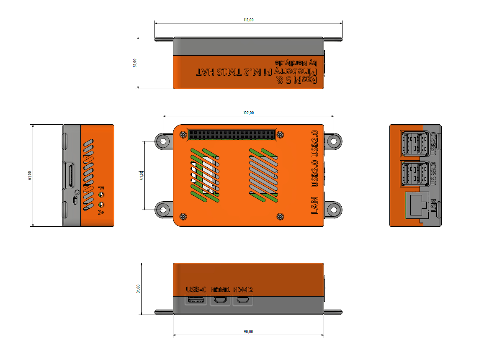
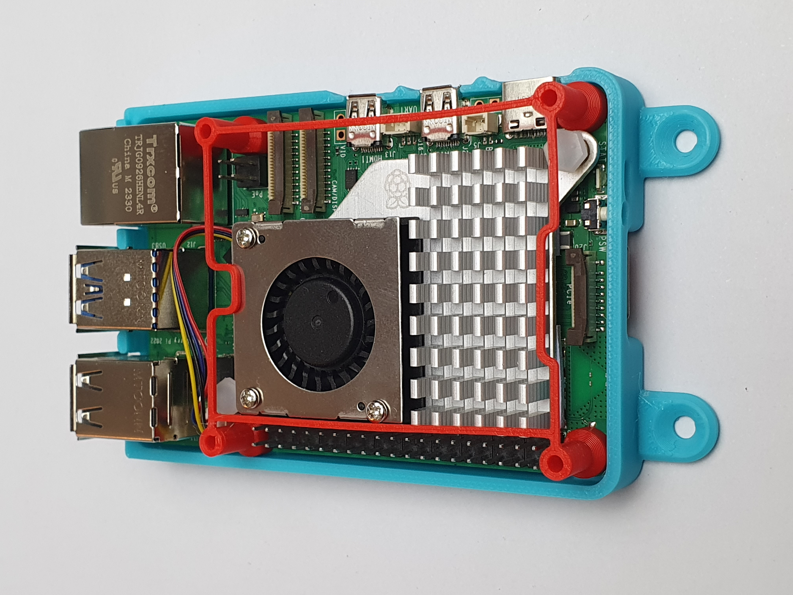
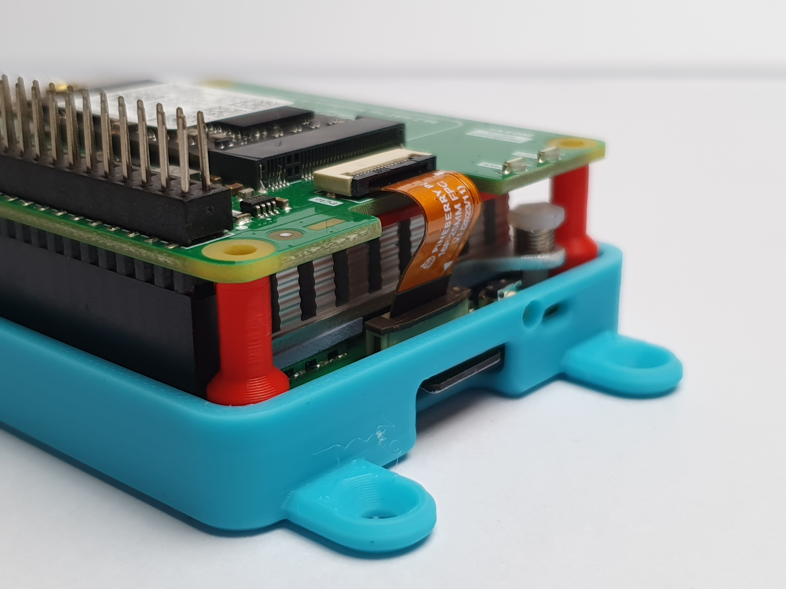
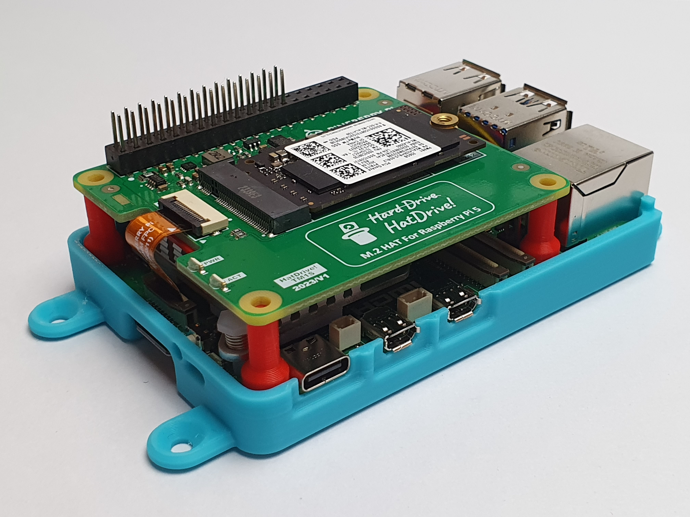

# Raspberry Pi 5 & Pineberry Pi TM1S TOP NVME Housing by Nerdiy.de

---

## 🎯 Project Overview

Build a professional protective housing for your Raspberry Pi 5 with Pineberry Pi TM1S Top NVMe HAT.

Here we offer you the STL files for 3D-printed housing parts, which have been specifically developed to securely hold the Raspberry Pi 5 together with the Pineberry Pi TM1S Top NVMe HAT while protecting it from dust and physical damage. The housing provides proper ventilation and maintains full access to all ports while accommodating the NVMe SSD mounted on top of the board.

With the provided STL files, you can easily create your own housing parts on your 3D printer and integrate them into your high-performance storage projects.

---

## 📋 About This Product

This product provides 3D-printable protective housing and mounting parts for Raspberry Pi 5 with Pineberry Pi TM1S Top NVMe HAT.

- **Product Name**: Raspberry Pi 5 & Pineberry Pi TM1S TOP NVME Housing by Nerdiy.de
- **Printables Store**: [🎨 View on Printables](https://www.printables.com/model/1285577-raspberry-pi-5-pineberry-pi-tm1s-top-nvme-housing)
- **Created**: February 2026
- **Note**: The housing is specifically designed for the Raspberry Pi 5 with the Pineberry Pi TM1S NVMe HAT mounted on the top side. It provides proper ventilation while accommodating M.2 NVMe SSDs (2230/2242/2280) and maintains full access to GPIO pins, USB ports, Ethernet, and dual micro-HDMI connections.

---

## 🛒 Purchase Options

### Primary Source (Recommended)
- **[🎨 Printables Store](https://www.printables.com/model/1285577-raspberry-pi-5-pineberry-pi-tm1s-top-nvme-housing)** - Download the STL files here

### Alternative Sources
- **[🖨️ Cults3D](https://cults3d.com/de/modell-3d/gadget/raspberrypi-5-pineberry-pi-tm1s-nvme-gehaeuse-by-nerdiy-de)**
- **[🛍️ Nerdiy.de Shop](https://nerdiy.de/)** - Check for availability

> 💖 **Support independent makers**: By downloading from Printables and giving a like, you directly support further development and new projects!

---

## 📦 Bill of Materials

### 🛠️ Required Tools

| Qty | Component | ASIN (DE) | Amazon (DE) |
|-----|-----------|-----------|-------------|
| 1x | Screwdriver Set | B086SQZGLJ | [Amazon](https://www.amazon.de/dp/B086SQZGLJ?tag=nerdiyde018-21&linkCode=ogi&th=1&psc=1) |
| 1x | Hex Key Set | B0BZ1F6WST | [Amazon](https://www.amazon.de/dp/B0BZ1F6WST?tag=nerdiyde018-21&linkCode=ogi&th=1&psc=1) |

### 🎨 3D Print Materials

| Qty | Component | ASIN (DE) | Amazon (DE) |
|-----|-----------|-----------|-------------|
| 1x | PETG Filament 1.75mm (1kg) | B07T2QZYS1 | [Amazon](https://www.amazon.de/dp/B07T2QZYS1?tag=nerdiyde018-21&linkCode=ogi&th=1&psc=1) |

### ⚙️ Mounting Hardware

| Qty | Component | ASIN (DE) | Amazon (DE) |
|-----|-----------|-----------|-------------|
| 4x | M2 Threaded Insert | B08DDBWKZF | [Amazon](https://www.amazon.de/dp/B08DDBWKZF?tag=nerdiyde018-21&linkCode=ogi&th=1&psc=1) |
| 4x | M2x20 Countersunk Screw | B09N4WV1WP | [Amazon](https://www.amazon.de/dp/B09N4WV1WP?tag=nerdiyde018-21&linkCode=ogi&th=1&psc=1) |

### 📦 Required Components

| Qty | Component | ASIN (DE) | Amazon (DE) |
|-----|-----------|-----------|-------------|
| 1x | Raspberry Pi 5 (4GB or 8GB) | B0CTQ3BQLS | [Amazon](https://www.amazon.de/dp/B0CTQ3BQLS?tag=nerdiyde018-21&linkCode=ogi&th=1&psc=1) |
| 1x | Pineberry Pi TM1S Top NVMe HAT | B0D5J5H9X8 | [Amazon](https://www.amazon.de/dp/B0D5J5H9X8?tag=nerdiyde018-21&linkCode=ogi&th=1&psc=1) |
| 1x | NVMe SSD M.2 2280 (e.g., 512GB) | B0B25LZGGW | [Amazon](https://www.amazon.de/dp/B0B25LZGGW?tag=nerdiyde018-21&linkCode=ogi&th=1&psc=1) |
| 1x | Raspberry Pi 27W USB-C Power Supply | B0CL7L48NG | [Amazon](https://www.amazon.de/dp/B0CL7L48NG?tag=nerdiyde018-21&linkCode=ogi&th=1&psc=1) |

---

## 🖨️ 3D Print Settings

### Recommended Print Settings

| Setting | Value |
|---------|-------|
| **Filament Type** | PETG (weather and UV-resistant) |
| **Layer Height** | 0.2mm |
| **Infill** | 20-25% |
| **Wall Lines** | 3-5 |
| **Support** | No support needed |

> 💡 **Print Orientation**: I highly recommend printing the parts in the already defined orientation. The defined orientation is intended to maximize the structural integrity of the part and accommodate the top-mounted NVMe HAT.

---

## 🎯 How to Use

### Step-by-Step Assembly Guide

1. **Gather Your Materials**
   - Purchase all components from the Bill of Materials section above
   - All Amazon links are pre-configured with affiliate tags to support Nerdiy.de development
   - For STL files, [download from Printables](https://www.printables.com/model/1285577-raspberry-pi-5-pineberry-pi-tm1s-top-nvme-housing)

2. **Download 3D Files**
   - [🎨 Download from Printables](https://www.printables.com/model/1285577-raspberry-pi-5-pineberry-pi-tm1s-top-nvme-housing) (free download)

3. **Prepare for 3D Printing**
   - Print the housing and mounting parts with these settings:
   - Layer Height: 0.2mm
   - Infill: 20-25%
   - Material: PETG (recommended for durability and heat resistance)
   - No supports needed
   - Slice and prepare files in your slicing software

4. **Assembly**
   - Clean all printed parts after removal from build plate
   - Install NVMe SSD into the Pineberry Pi TM1S HAT
   - Connect the HAT to the Raspberry Pi 5 PCIe connector (top side)
   - Install M2 threaded inserts into designated holes using soldering iron
   - Mount the assembled Pi+HAT+SSD into the housing base
   - Secure the top cover with M2x20 countersunk screws
   - Verify NVMe SSD has proper clearance and all ports are accessible

5. **Installation**
   - Mount the complete housing assembly in your desired location
   - Ensure proper ventilation around the unit for SSD heat dissipation
   - Connect power supply (USB-C 27W power input recommended for NVMe)
   - Connect peripherals and network cables as needed
   - Boot from NVMe SSD or SD card as configured

6. **Maintenance**
   - Periodically clean dust from ventilation areas
   - Check screw tightness after extended use
   - Monitor NVMe SSD temperature
   - Verify adequate ventilation for both Pi and SSD

---

## 📸 Product Images

.jpg)

.jpg)

---

## 📄 License

See the license information on the Printables product page.

---

**Last Updated**: March 5, 2026  
**Status**: Complete - Ready to build
