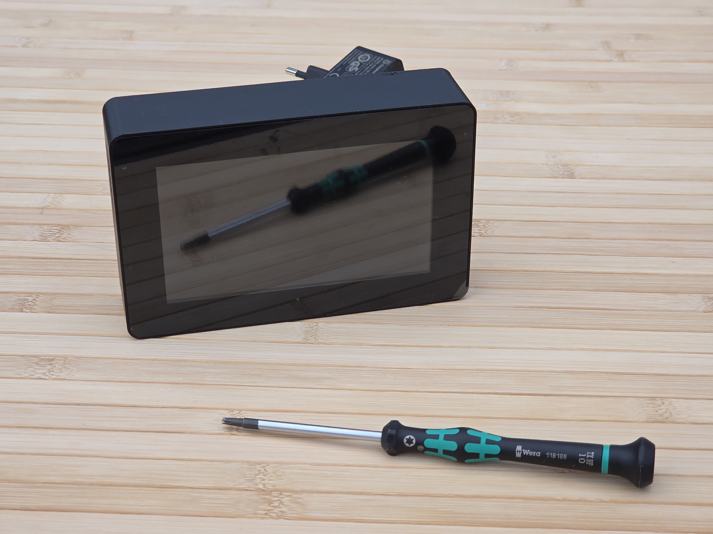
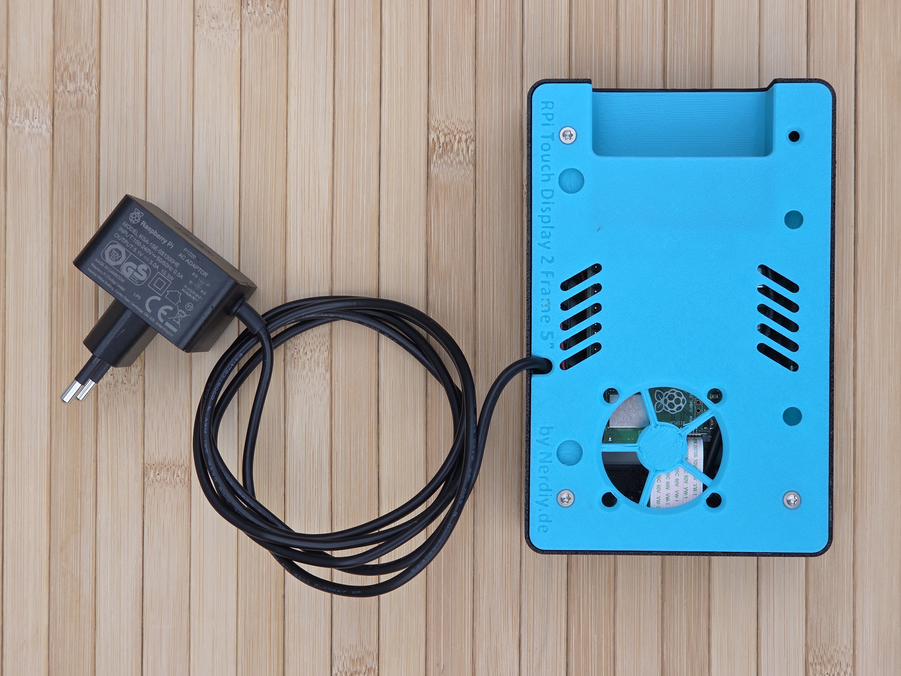
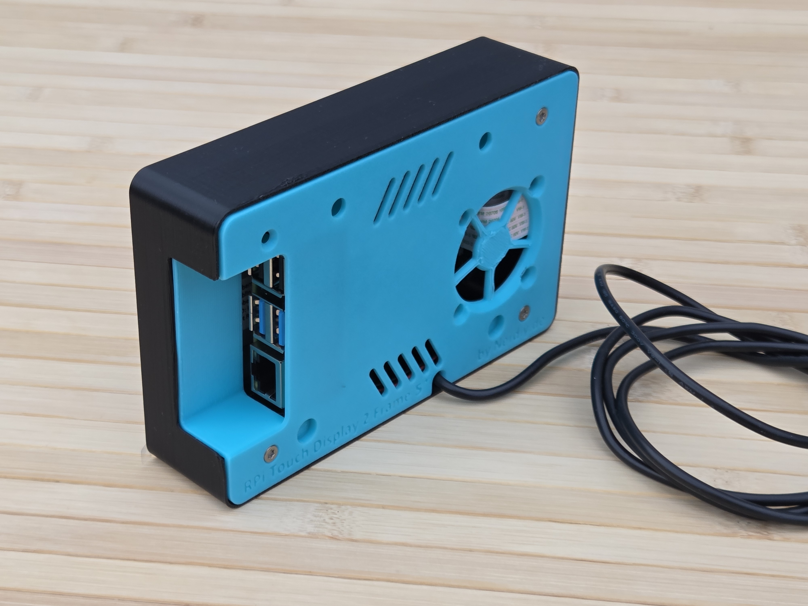
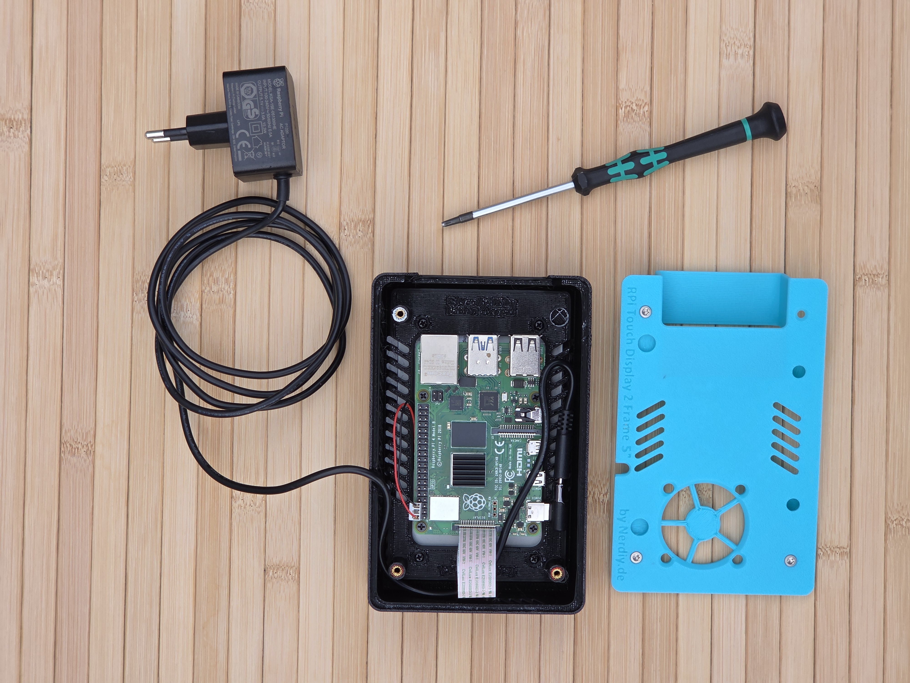
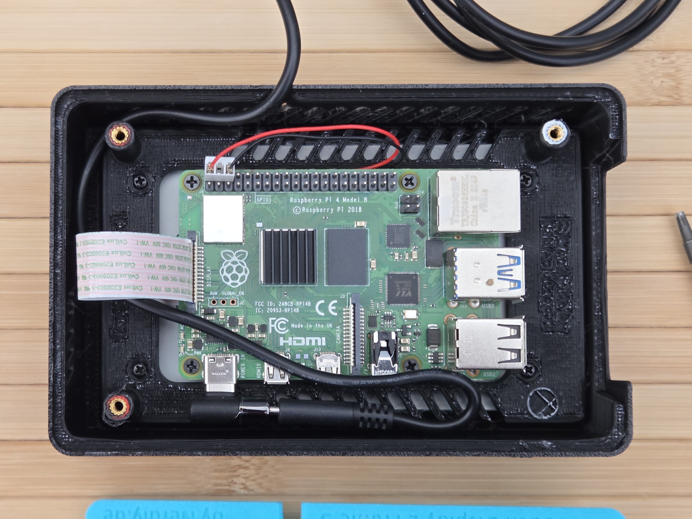
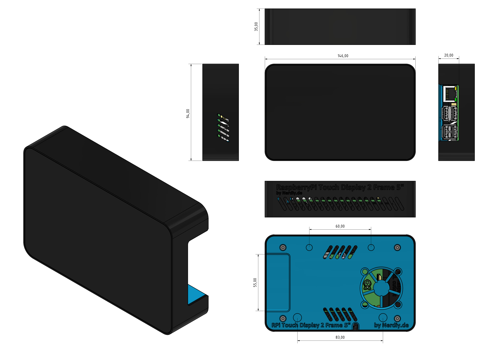

# Raspberry Pi 5" Touch Display 2 Housing for Raspberry Pi 4/5 (Incl. Active Cooler) by Nerdiy.de

**Professional 3D-Printable Display Housing**

---

## 🎯 Project Overview

Build a professional protective housing for your Raspberry Pi Touch Display 2 with integrated mounting for Raspberry Pi 4 or Raspberry Pi 5 including Active Cooler support. This horizontal mounting variant includes a top-side cutout for camera/connector access.

Here we offer you the STL files for 3D-printed housing parts, specifically developed to securely hold a Raspberry Pi 4 or Raspberry Pi 5 together with the 5" Touch Display 2 and Active Cooler while protecting the components from dust and physical damage.

---

## 📋 About This Product

This product provides 3D-printable housing parts for Raspberry Pi 4 or Raspberry Pi 5 with support for 5" Touch Display 2 and Active Cooler in horizontal orientation with integrated cutout.

- **Product Name**: Raspberry Pi Touch Display 2 Housing for Raspberry Pi 4/5 (Incl. Active Cooler)
- **Display Type**: 5" Touch Display 2
- **Raspberry Pi Version**: Raspberry Pi 4 or Raspberry Pi 5
- **Cooling**: Raspberry Pi Active Cooler supported
- **Mounting Style**: horizontal
- **Cutout Configuration**: Incl. Cutout
- **Printables URL**: https://www.printables.com
- **Created**: February 2026

---

## 🛒 Purchase Options

### Primary Source (Recommended)
- **[🎨 Printables (Raspberry Pi 4)](https://www.printables.com/model/1424341-raspberry-pi-5-touch-display-2-frame-for-raspberry)** - Download the STL files here (free)

### Alternative Sources
- **[🛍️ Nerdiy.de Shop](https://www.nerdiy.de/)** - Check for availability
- **[🧵 Etsy (Raspberry Pi 5)](https://www.etsy.com/de/listing/4477700026/raspberry-pi-5-touch-display-2-frame-for)**
- **[🧵 Etsy (Raspberry Pi 4)](https://www.etsy.com/de/listing/4386954386/raspberry-pi-5-touch-display-2-frame-for)**
- **[🗿 Cults3D (Raspberry Pi 4)](https://cults3d.com/de/modell-3d/gadget/raspberry-pi-5-touch-display-2-frame-for-raspberrypi-4-horizontal-incl-cut)**

---

## 📦 Bill of Materials

### 🛠️ Required Tools

| Qty | Component | ASIN (DE) | Amazon (DE) |
|-----|-----------|-----------|-------------|
| 1x | Screwdriver Set | B086SQZGLJ | [Amazon](https://www.amazon.de/dp/B086SQZGLJ?tag=nerdiyde018-21&linkCode=ogi&th=1&psc=1) |
| 1x | Soldering Iron | B0D5M727WM | [Amazon](https://www.amazon.de/dp/B0D5M727WM?tag=nerdiyde018-21&linkCode=ogi&th=1&psc=1) |

### 🎨 3D Print Materials

| Qty | Component | ASIN (DE) | Amazon (DE) |
|-----|-----------|-----------|-------------|
| 1x | PETG Filament 1.75mm (1kg) | B07T2QZYS1 | [Amazon](https://www.amazon.de/dp/B07T2QZYS1?tag=nerdiyde018-21&linkCode=ogi&th=1&psc=1) |

### ⚙️ Mounting Hardware

| Qty | Component | ASIN (DE) | Amazon (DE) |
|-----|-----------|-----------|-------------|
| 4x | M3 Thread Insert | B08BCRZZS3 | [Amazon](https://www.amazon.de/dp/B08BCRZZS3?tag=nerdiyde018-21&linkCode=ogi&th=1&psc=1) |
| 4x | M3x8 Countersunk Screw | B0957T69W6 | [Amazon](https://www.amazon.de/dp/B0957T69W6?tag=nerdiyde018-21&linkCode=ogi&th=1&psc=1) |
| 2x | Neodym Magnet 10x3 (cylindrical) | B0F6CQMCN3 | [Amazon](https://www.amazon.de/dp/B0F6CQMCN3?tag=nerdiyde018-21&linkCode=ogi&th=1&psc=1) |
| 1x | USB-C 90° Angle Adapter | B0F24HLGPS | [Amazon](https://www.amazon.de/dp/B0F24HLGPS?tag=nerdiyde018-21&linkCode=ogi&th=1&psc=1) |

### 📦 Required Components

| Qty | Component | ASIN (DE) | Amazon (DE) |
|-----|-----------|-----------|-------------|
| 1x | Raspberry Pi 4 or Raspberry Pi 5 | B09TTNF8BT / B0CK2FCG1K | [Raspberry Pi 4](https://www.amazon.de/dp/B09TTNF8BT?tag=nerdiyde018-21&linkCode=ogi&th=1&psc=1) / [Raspberry Pi 5](https://www.amazon.de/dp/B0CK2FCG1K?tag=nerdiyde018-21&linkCode=ogi&th=1&psc=1) |
| 1x | 5" Touch Display 2 | B0DM24QFCF | [Amazon](https://www.amazon.de/Raspberry-Display-Display-Modul-Passend-Entwickl-Schwarz/dp/B0DM24QFCF?tag=nerdiyde018-21&linkCode=ogi&th=1&psc=1) |
| 1x | Raspberry Pi Active Cooler (for Pi 5 builds) | B0CM3C2Q9K | [Amazon](https://www.amazon.de/dp/B0CM3C2Q9K?tag=nerdiyde018-21&linkCode=ogi&th=1&psc=1) |
| 1x | Raspberry Pi Power Supply (matching your Pi version) | B07TZ89BT7 / B0CHT4S6V4 | [Pi 4 PSU](https://www.amazon.de/dp/B07TZ89BT7?tag=nerdiyde018-21&linkCode=ogi&th=1&psc=1) / [Pi 5 PSU](https://www.amazon.de/dp/B0CHT4S6V4?tag=nerdiyde018-21&linkCode=ogi&th=1&psc=1) |
| 1x | Micro SD Card 64GB | B07FCMBLV6 | [Amazon](https://www.amazon.de/dp/B07FCMBLV6?tag=nerdiyde018-21&linkCode=ogi&th=1&psc=1) |

---

## 🖼️ Product Images

<table>
  <tr>
    <td></td>
    <td></td>
  </tr>
  <tr>
    <td></td>
    <td></td>
  </tr>
  <tr>
    <td></td>
    <td></td>
  </tr>
</table>

---

## 🖨️ 3D Print Settings

### ⚙️ Recommended Print Settings
| Setting | Value |
|---------|-------|
| **Filament Type** | PETG (weather and UV-resistant) |
| **Layer Height** | 0.2mm |
| **Infill** | 15-25% |
| **Wall Lines** | 3-5 |
| **Support** | Yes (for overhangs > 45°) |

> **💡 Print Orientation**: I highly recommend printing the parts in the already defined orientation. This orientation maximizes structural integrity and ensures proper display mounting stability.

---

## 🎯 How to Use

### Step-by-Step Assembly Guide

1. **Download and Prepare Files**
   - Visit the Printables product page
   - Download all STL files
   - Prepare materials according to BOM above

2. **3D Print Components**
   - Print housing parts with recommended settings
   - Use PETG filament for durability
   - Ensure proper support for overhanging sections
   - Clean parts after printing

3. **Install Hardware**
   - Install M3 thread inserts using soldering iron
   - Install M2 thread inserts in display bracket
   - Attach magnets to specified locations
   - Assemble frame structure with M3x8 screws

4. **Mount Components**
   - Position Raspberry Pi 4 or Raspberry Pi 5 in housing base
   - Install Active Cooler where applicable (Pi 5 setup)
   - Attach 5" Touch Display 2 with mounting screws
   - Secure display bracket with M2 hardware
   - Connect power and ribbon cables

5. **Installation**
   - Mount the complete assembly in desired location
   - Ensure proper ventilation around Raspberry Pi and Active Cooler airflow path
   - Connect power supply via USB-C adapter
   - Boot Raspberry Pi and configure display settings

---

## 📄 License

This design is available under the license specified on the Printables product page. Please review the license terms when downloading the files.

---

**Last Updated**: 4. March 2026
**Status**: Complete - All materials and assembly guide documented
