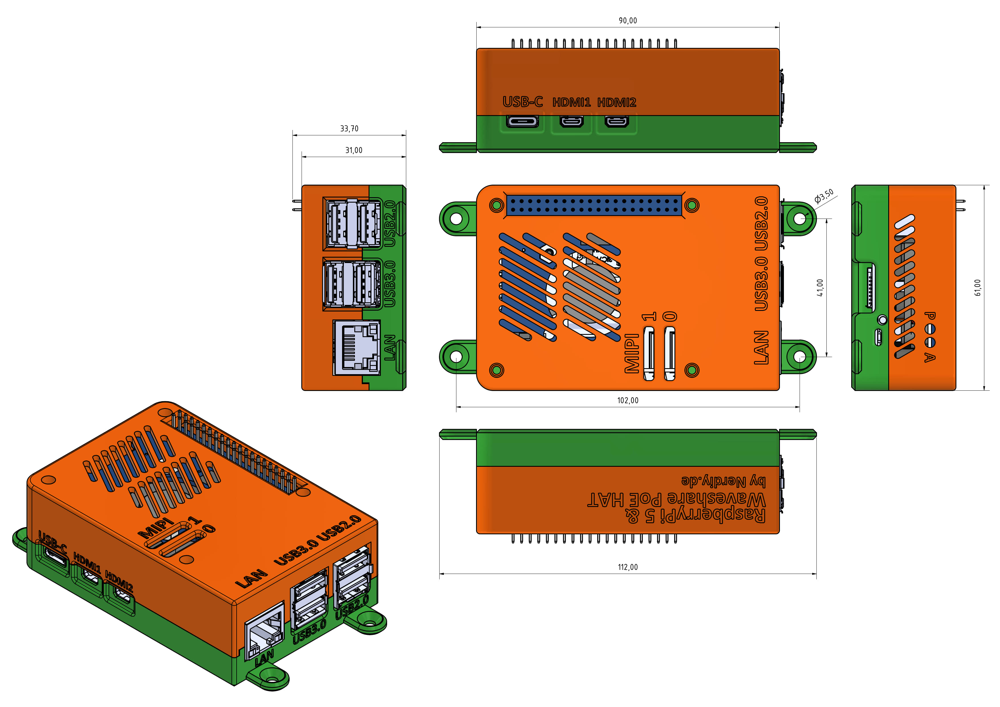

# Raspberry Pi 5 & Waveshare PoE HAT Housing by Nerdiy.de

---

## 🎯 Project Overview

Build a professional protective housing for your Raspberry Pi 5 with Waveshare PoE HAT integration.

Here we offer you the STL files for 3D-printed housing parts, which have been specifically developed to securely hold the Raspberry Pi 5 and the Waveshare PoE HAT while protecting them from dust and physical damage.

With the provided STL files, you can easily create your own housing parts on your 3D printer and integrate them into your Raspberry Pi 5 setup.

---

## 📋 About This Product

This product provides 3D-printable protective housing and mounting parts for Raspberry Pi 5 with Waveshare PoE HAT support.

- **Product Name**: Raspberry Pi 5 & Waveshare PoE HAT Housing by Nerdiy.de
- **Nerdiy.de Shop**: [🛍️ Purchase STL Files](https://nerdiy.de/en/product-2/waveshare-poe-has-housing-for-raspberry-pi-5-3d-printable-stl-files-2/)
- **Created**: February 2026
- **Note**: The housing provides protection and proper ventilation while maintaining full access to all ports and connectors.

---

## 🛒 Purchase Options

### Primary Source (Recommended)
- **[🛍️ Nerdiy.de Shop](https://nerdiy.de/en/product-2/waveshare-poe-has-housing-for-raspberry-pi-5-3d-printable-stl-files-2/)** - Purchase the STL files here to support independent design and development

### Alternative Sources
- **[🎨 Printables Store](https://www.printables.com/model/1022979-raspberry-pi-5-waveshare-poe-hat-housing-by-nerdiy)**
- **[🖨️ Cults3D](https://cults3d.com/de/kreationen/raspberrypi-5-waveshare-poe-hat-gehaeuse)**
- **[🧵 Etsy Shop](https://www.etsy.com/de/listing/4333387578/raspberry-pi-5-waveshare-poe-hat-housing)** - Alternative purchase option

> 💖 **Support independent makers**: By purchasing the STL files through [Nerdiy.de Shop](https://nerdiy.de/en/product-2/waveshare-poe-has-housing-for-raspberry-pi-5-3d-printable-stl-files-2/), you directly support further development and new projects!

---

## 📦 Bill of Materials

### 🛠️ Required Tools

| Qty | Component | ASIN (DE) | Amazon (DE) |
|-----|-----------|-----------|-------------|
| 1x | Screwdriver Set | B092LVWNX8 | [Amazon](https://www.amazon.de/dp/B092LVWNX8?tag=nerdiyde018-21&linkCode=ogi&th=1&psc=1) |
| 1x | Soldering Iron | B0CCV6T329 | [Amazon](https://www.amazon.de/dp/B0CCV6T329?tag=nerdiyde018-21&linkCode=ogi&th=1&psc=1) |

### 🎨 3D Print Materials

| Qty | Component | ASIN (DE) | Amazon (DE) |
|-----|-----------|-----------|-------------|
| 1x | PETG Filament 1.75mm (1kg) | B07T2QZYS1 | [Amazon](https://www.amazon.de/dp/B07T2QZYS1?tag=nerdiyde018-21&linkCode=ogi&th=1&psc=1) |

### ⚙️ Mounting Hardware

| Qty | Component | ASIN (DE) | Amazon (DE) |
|-----|-----------|-----------|-------------|
| 4x | M2 Threaded Insert | B088QJG676 | [Amazon](https://www.amazon.de/dp/B088QJG676?tag=nerdiyde018-21&linkCode=ogi&th=1&psc=1) |
| 4x | M2x20 Countersunk Screw | B0957RCWQB | [Amazon](https://www.amazon.de/dp/B0957RCWQB?tag=nerdiyde018-21&linkCode=ogi&th=1&psc=1) |

### 📦 Required Components

| Qty | Component | ASIN (DE) | Amazon (DE) |
|-----|-----------|-----------|-------------|
| 1x | Raspberry Pi 5 (4GB) | B0CK3L9WD3 | [Amazon](https://www.amazon.de/dp/B0CK3L9WD3?tag=nerdiyde018-21&linkCode=ogi&th=1&psc=1) |
| 1x | Waveshare PoE HAT for RPi 5 | B0CR1JGP1Z | [Amazon](https://www.amazon.de/dp/B0CR1JGP1Z?tag=nerdiyde018-21&linkCode=ogi&th=1&psc=1) |
| 1x | Raspberry Pi 5 Power Supply | B0CM46P7MC | [Amazon](https://www.amazon.de/dp/B0CM46P7MC?tag=nerdiyde018-21&linkCode=ogi&th=1&psc=1) |
| 1x | Micro SD Card 64GB | B07FCMBLV6 | [Amazon](https://www.amazon.de/dp/B07FCMBLV6?tag=nerdiyde018-21&linkCode=ogi&th=1&psc=1) |

---

## 🖼️ Product Images

<table>
  <tr>
    <td></td>
    <td></td>
  </tr>
  <tr>
    <td></td>
    <td></td>
  </tr>
  <tr>
    <td></td>
    <td></td>
  </tr>
</table>

---

## 🖨️ 3D Print Settings

### ⚙️ Recommended Print Settings
| Setting | Value |
|---------|-------|
| **Filament Type** | PETG (weather and UV-resistant) |
| **Layer Height** | 0.2mm |
| **Infill** | 20-25% |
| **Wall Lines** | 3-5 |
| **Support** | Yes (for overhangs > 45°) |

> **💡 Print Orientation**: I highly recommend printing the parts in the already defined orientation. The defined orientation is intended to maximize the structural integrity of the part and ensure proper ventilation channels.

---

## 🎯 How to Use

### Step-by-Step Guide

1. **Gather Your Materials**
   - Purchase all components from the "Bill of Materials" section above
   - All Amazon links are pre-configured with affiliate tags to support Nerdiy.de development
   - For STL files, [purchase through Nerdiy.de Shop](https://nerdiy.de/en/product-2/waveshare-poe-has-housing-for-raspberry-pi-5-3d-printable-stl-files-2/) to support independent makers

2. **Download 3D Files**
   - [🛍️ Download from Nerdiy.de Shop](https://nerdiy.de/en/product-2/waveshare-poe-has-housing-for-raspberry-pi-5-3d-printable-stl-files-2/) (recommended - supports independent makers)
   - Alternative: [Download from Printables](https://www.printables.com/model/1022979-raspberry-pi-5-waveshare-poe-hat-housing-by-nerdiy)
   - Alternative: [Download from Cults3D](https://cults3d.com/de/kreationen/raspberrypi-5-waveshare-poe-hat-gehaeuse)

3. **Prepare for 3D Printing**
   - Print the housing and mounting parts with these settings:
     - **Layer Height**: 0.2mm
     - **Infill**: 20-25%
     - **Supports**: Yes (for overhangs > 45°)
     - **Material**: PETG (recommended for durability and heat resistance)
   - Slice and prepare files in your slicing software

4. **Assembly**
   - Clean all printed parts after removal from build plate
   - Install threaded inserts (M2.5) into designated holes
   - Mount the Raspberry Pi 5 into the housing base
   - Attach the Waveshare PoE HAT to the Raspberry Pi 5
   - Secure the top cover with M2.5x12 countersunk screws
   - Verify all ports and connectors are accessible

5. **Installation**
   - Mount the complete housing assembly in your desired location
   - Ensure proper ventilation around the unit
   - Connect power and network (PoE) cables as needed
   - Boot up your Raspberry Pi 5 and verify all functions

6. **Maintenance**
   - Periodically clean dust from ventilation areas
   - Check screw tightness after extended use
   - Monitor temperature to ensure adequate ventilation

---

## 📄 License

The license for these STL files is included with your purchase. When you purchase the STL files, you receive the complete license terms along with the downloadable files.

---

**Last Updated**: 28. February 2026  
**Status**: Complete - All materials and assembly guide documented
