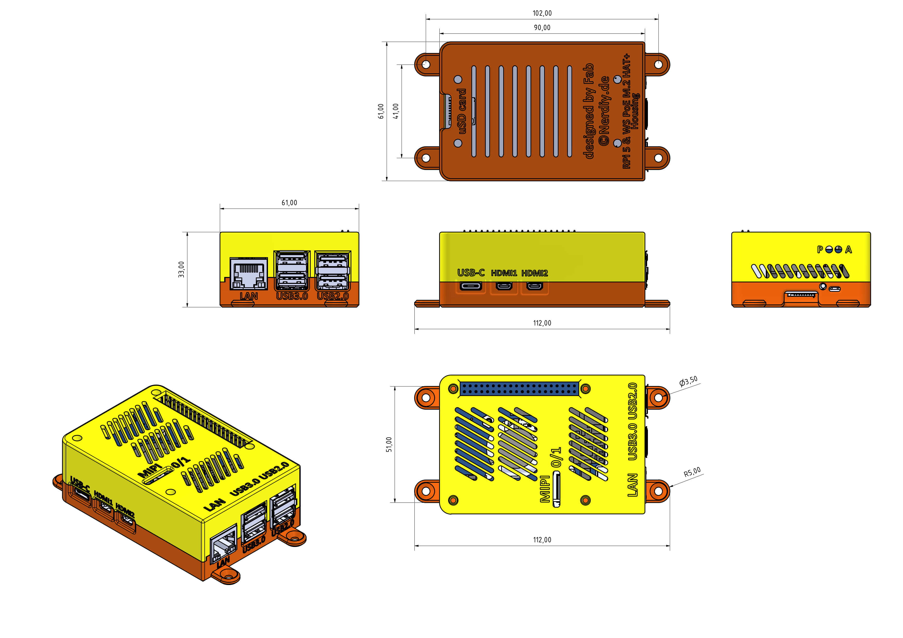
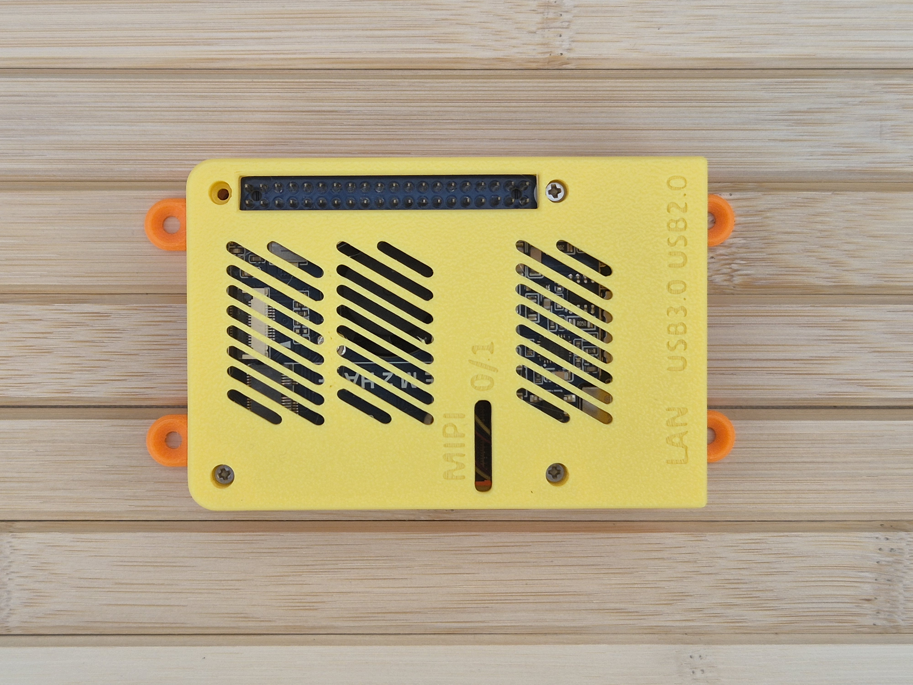
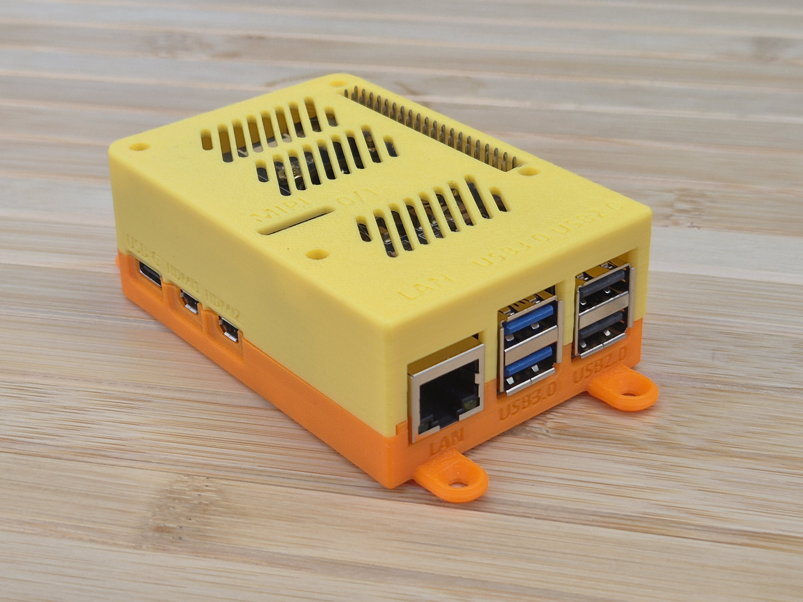
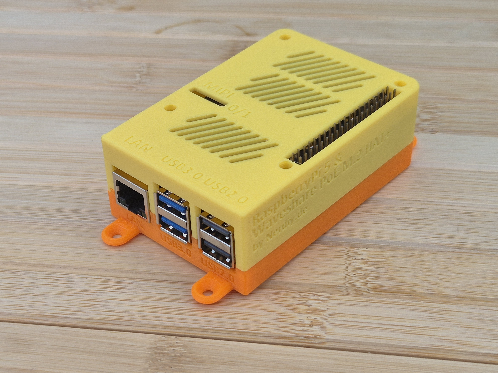
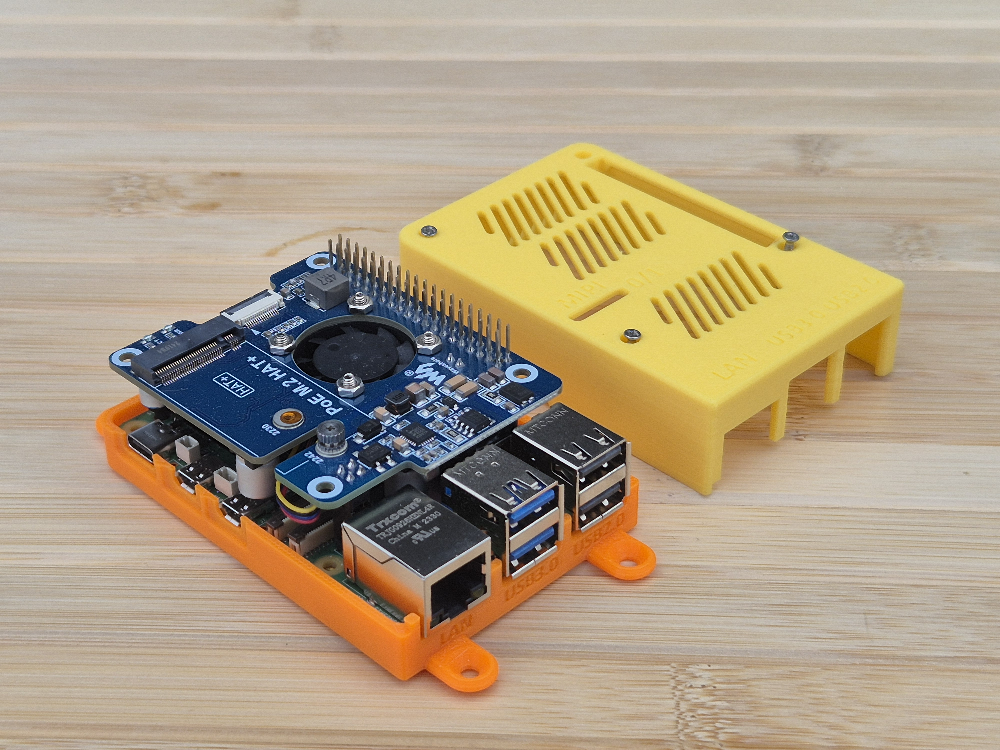
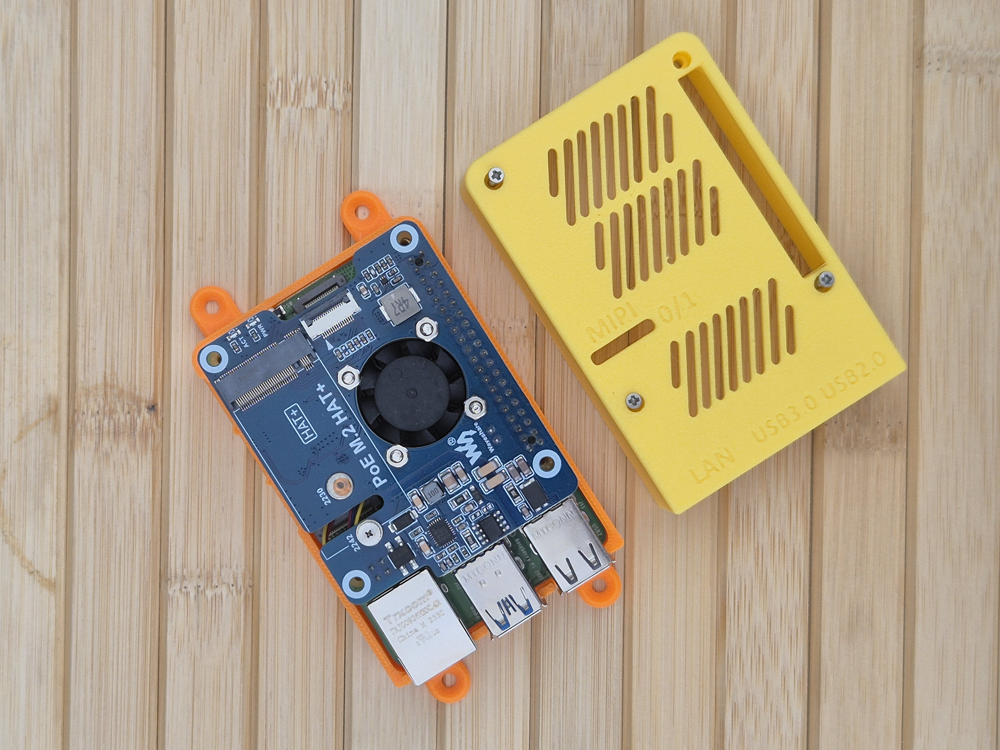

# Raspberry Pi 5 & Waveshare PoE M.2 HAT+ Housing by Nerdiy.de

---

## 🎯 Project Overview

Build a professional protective housing for your Raspberry Pi 5 with Waveshare PoE M.2 HAT+ integration.

Here we offer you the STL files for 3D-printed housing parts, which have been specifically developed to securely hold the Raspberry Pi 5 and the Waveshare PoE M.2 HAT+ (with M.2 SSD support) while protecting them from dust and physical damage.

With the provided STL files, you can easily create your own housing parts on your 3D printer and integrate them into your Raspberry Pi 5 setup with integrated M.2 NVMe storage.

---

## 📋 About This Product

This product provides 3D-printable protective housing and mounting parts for Raspberry Pi 5 with Waveshare PoE M.2 HAT+ support (including M.2 2280 SSD bay).

- **Product Name**: Raspberry Pi 5 & Waveshare PoE M.2 HAT+ Housing by Nerdiy.de
- **Printables Store**: [🎨 View on Printables](https://www.printables.com/model/1287066-raspberry-pi-5-waveshare-poe-m2-hat-housing-by-ner)
- **Created**: February 2026
- **Note**: The housing provides protection, proper ventilation, and dedicated M.2 SSD mounting while maintaining full access to all ports and connectors.

---

## 🛒 Purchase Options

### Primary Source (Recommended)
- **[🎨 Printables Store](https://www.printables.com/model/1287066-raspberry-pi-5-waveshare-poe-m2-hat-housing-by-ner)** - Download the STL files here

### Alternative Sources
- **[�️ Cults3D](https://cults3d.com/de/modell-3d/gadget/raspberry-pi-5-waveshare-poe-m-2-hat-housing-by-nerdiy-de)**
- **[�🛍️ Nerdiy.de Shop](https://nerdiy.de/)** - Check for availability

> 💖 **Support independent makers**: By downloading from Printables and giving a like, you directly support further development and new projects!

---

## 📦 Bill of Materials

### 🛠️ Required Tools

| Qty | Component | ASIN (DE) | Amazon (DE) |
|-----|-----------|-----------|-------------|
| 1x | Screwdriver Set | B086SQZGLJ | [Amazon](https://www.amazon.de/dp/B086SQZGLJ?tag=nerdiyde018-21&linkCode=ogi&th=1&psc=1) |
| 1x | Soldering Iron | B0D5M727WM | [Amazon](https://www.amazon.de/dp/B0D5M727WM?tag=nerdiyde018-21&linkCode=ogi&th=1&psc=1) |

### 🎨 3D Print Materials

| Qty | Component | ASIN (DE) | Amazon (DE) |
|-----|-----------|-----------|-------------|
| 1x | PETG Filament 1.75mm (1kg) | B07T2QZYS1 | [Amazon](https://www.amazon.de/dp/B07T2QZYS1?tag=nerdiyde018-21&linkCode=ogi&th=1&psc=1) |

### ⚙️ Mounting Hardware

| Qty | Component | ASIN (DE) | Amazon (DE) |
|-----|-----------|-----------|-------------|
| 4x | M2 Threaded Insert | B088QJG676 | [Amazon](https://www.amazon.de/dp/B088QJG676?tag=nerdiyde018-21&linkCode=ogi&th=1&psc=1) |
| 4x | M2x20 Countersunk Screw | B09N4WV1WP | [Amazon](https://www.amazon.de/dp/B09N4WV1WP?tag=nerdiyde018-21&linkCode=ogi&th=1&psc=1) |

### 📦 Required Components

| Qty | Component | ASIN (DE) | Amazon (DE) |
|-----|-----------|-----------|-------------|
| 1x | Raspberry Pi 5 (4GB or 8GB) | B0CK3L9WD3 | [Amazon](https://www.amazon.de/dp/B0CK3L9WD3?tag=nerdiyde018-21&linkCode=ogi&th=1&psc=1) |
| 1x | Waveshare PoE M.2 HAT+ for RPi 5 | B0DF712DL8 | [Amazon](https://www.amazon.de/dp/B0DF712DL8?tag=nerdiyde018-21&linkCode=ogi&th=1&psc=1) |
| 1x | M.2 NVMe SSD 2242 (optional) | B0BMQ2D89G | [Amazon](https://www.amazon.de/dp/B0BMQ2D89G?tag=nerdiyde018-21&linkCode=ogi&th=1&psc=1) |
| 1x | Raspberry Pi 5 Power Supply (if not using PoE) | B0CM46P7MC | [Amazon](https://www.amazon.de/dp/B0CM46P7MC?tag=nerdiyde018-21&linkCode=ogi&th=1&psc=1) |
| 1x | Micro SD Card 64GB | B07FCMBLV6 | [Amazon](https://www.amazon.de/dp/B07FCMBLV6?tag=nerdiyde018-21&linkCode=ogi&th=1&psc=1) |

---

## 🖨️ 3D Print Settings

### Recommended Print Settings

| Setting | Value |
|---------|-------|
| **Filament Type** | PETG (weather and UV-resistant) |
| **Layer Height** | 0.2mm |
| **Infill** | 20-25% |
| **Wall Lines** | 3-5 |
| **Support** | Yes (for overhangs > 45°) |

> **💡 Print Orientation**: I highly recommend printing the parts in the already defined orientation. The defined orientation is intended to maximize the structural integrity of the part and ensure proper ventilation channels and M.2 SSD mounting stability.

---

## 🎯 How to Use

### Step-by-Step Guide

1. **Gather Your Materials**
   - Purchase all components from the "Bill of Materials" section above
   - All Amazon links are pre-configured with affiliate tags to support Nerdiy.de development
   - For STL files, [download from Printables](https://www.printables.com/model/1287066-raspberry-pi-5-waveshare-poe-m2-hat-housing-by-ner)

2. **Download 3D Files**
   - [🎨 Download from Printables](https://www.printables.com/model/1287066-raspberry-pi-5-waveshare-poe-m2-hat-housing-by-ner) (free download)
   - Alternative: [Download from Cults3D](https://cults3d.com/de/modell-3d/gadget/raspberry-pi-5-waveshare-poe-m-2-hat-housing-by-nerdiy-de)
   - Alternative: Check [Nerdiy.de Shop](https://nerdiy.de/) for availability

3. **Prepare for 3D Printing**
   - Print the housing and mounting parts with these settings:
     - **Layer Height**: 0.2mm
     - **Infill**: 20-25%
     - **Supports**: Yes (for overhangs > 45°)
     - **Material**: PETG (recommended for durability and heat resistance)
   - Slice and prepare files in your slicing software

4. **Assembly**
   - Clean all printed parts after removal from build plate
   - Install M2 threaded inserts into designated holes using soldering iron
   - Mount the Raspberry Pi 5 into the housing base
   - (Optional) Install M.2 NVMe SSD into the Waveshare PoE M.2 HAT+
   - Attach the Waveshare PoE M.2 HAT+ to the Raspberry Pi 5
   - Secure the top cover with M2x20 countersunk screws
   - Verify all ports and connectors are accessible

5. **Installation**
   - Mount the complete housing assembly in your desired location
   - Ensure proper ventilation around the unit (especially for M.2 SSD heat dissipation)
   - Connect power via PoE (recommended) or USB-C power supply
   - Connect network cable for PoE and data connectivity
   - Boot up your Raspberry Pi 5 and verify all functions including M.2 SSD detection

6. **Maintenance**
   - Periodically clean dust from ventilation areas
   - Check screw tightness after extended use
   - Monitor temperature to ensure adequate ventilation (especially M.2 SSD temperature)
   - Check M.2 SSD connection if experiencing storage issues

---

## 📸 Product Images

---

## 📄 License

This design is available under the license specified on the Printables product page. Please review the license terms when downloading the files.

---

**Last Updated**: 28. February 2026  
**Status**: Complete - All materials and assembly guide documented
