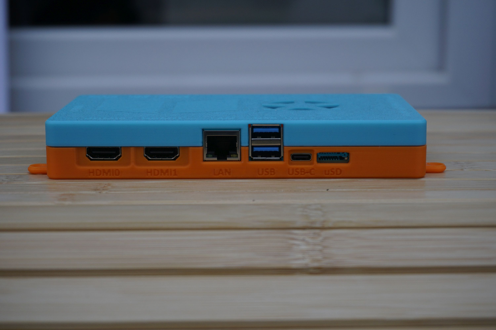
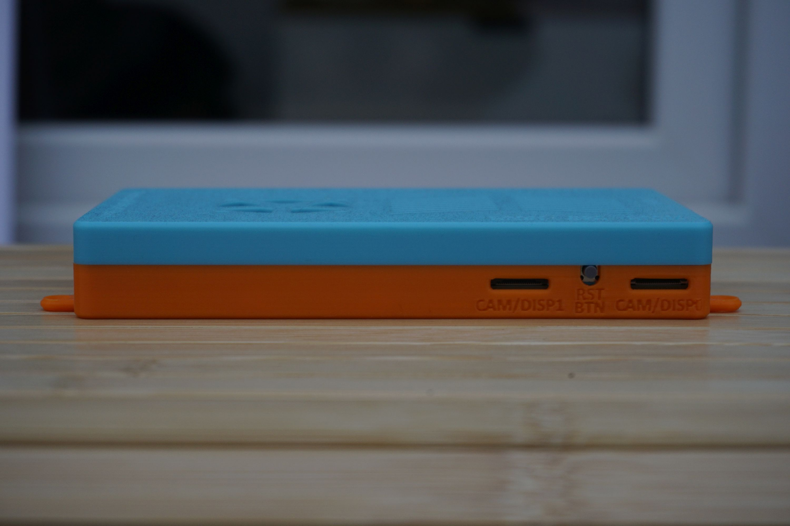
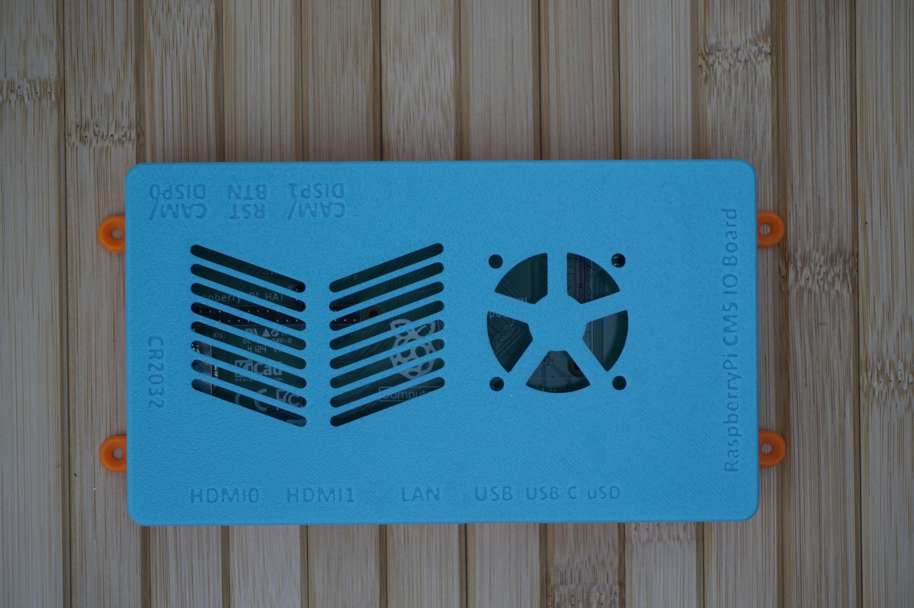
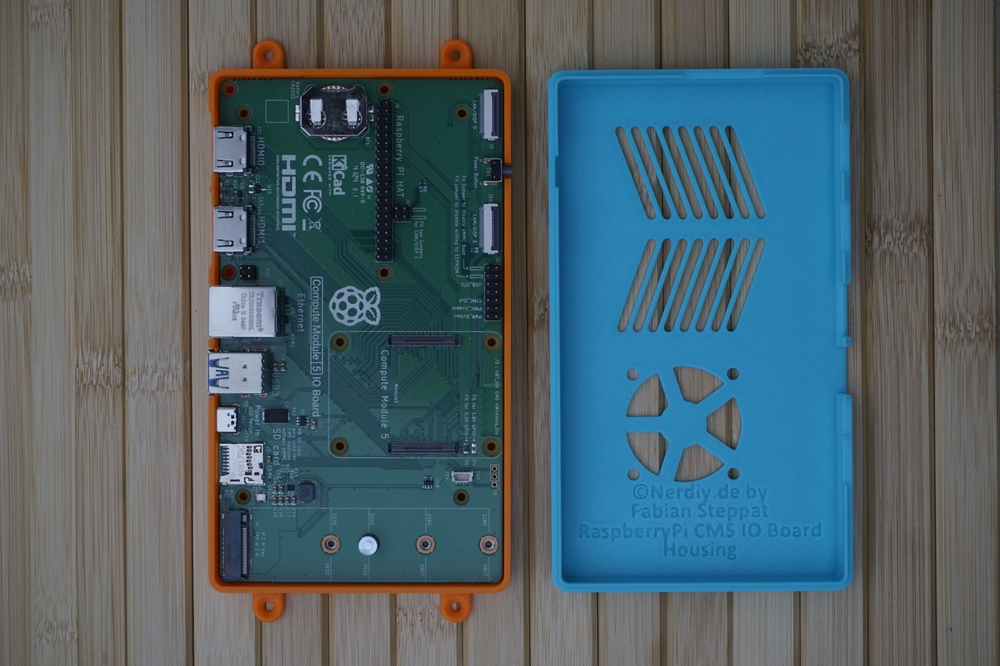
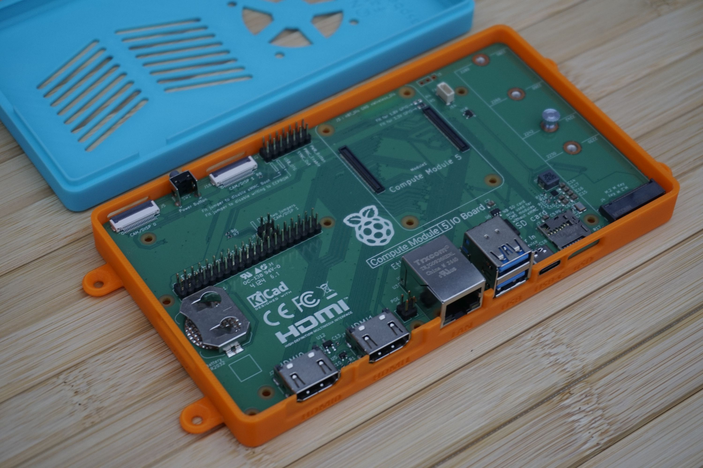
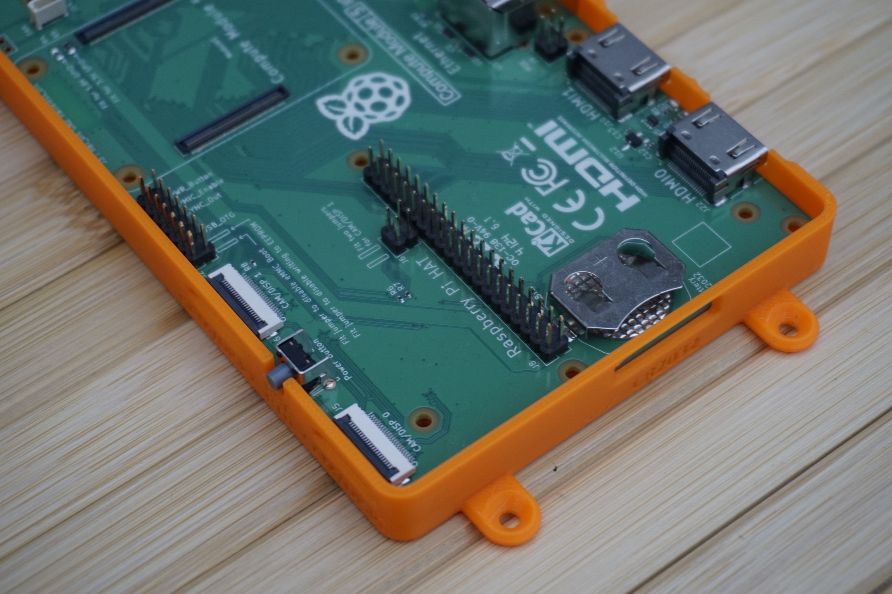

# Raspberry Pi Compute Module 5 IO Board Housing by Nerdiy.de

---

## 🎯 Project Overview

Build a professional protective housing for your Raspberry Pi Compute Module 5 IO Board.

Here we offer you the STL files for 3D-printed housing parts, which have been specifically developed to securely hold the official Raspberry Pi Compute Module 5 IO Board while protecting it from dust and physical damage. The housing provides proper ventilation and maintains full access to all connectors, GPIO headers, and expansion slots including the new PCIe connector.

With the provided STL files, you can easily create your own housing parts on your 3D printer and integrate them into your industrial and embedded projects.

---

## 📋 About This Product

This product provides 3D-printable protective housing and mounting parts for Raspberry Pi Compute Module 5 IO Board.

- **Product Name**: Raspberry Pi Compute Module 5 IO Board Housing by Nerdiy.de
- **Printables Store**: [🎨 View on Printables](https://www.printables.com/model/1280612-raspberry-pi-compute-module-5-io-board-housing-by)
- **Created**: February 2026
- **Note**: The housing is specifically designed for the official Raspberry Pi Compute Module 5 IO Board. It provides proper ventilation while protecting the board and maintains full access to all connectors, GPIO headers, PCIe slot, camera/display interfaces, USB ports, and power input.

---

## 🛒 Purchase Options

### Primary Source (Recommended)
- **[🎨 Printables Store](https://www.printables.com/model/1280612-raspberry-pi-compute-module-5-io-board-housing-by)** - Download the STL files here

### Alternative Sources
- **[🖨️ Cults3D](https://cults3d.com/de/modell-3d/gadget/raspberry-pi-compute-module-io-board-gehaeuse-by-nerdiy-de)**
- **[🛍️ Nerdiy.de Shop](https://nerdiy.de/)** - Check for availability
- **[🧵 Etsy Shop](https://www.etsy.com/de/listing/4333214776/raspberry-pi-compute-module-5-io-board)** - Alternative purchase option

> 💖 **Support independent makers**: By downloading from Printables and giving a like, you directly support further development and new projects!

---

## 📦 Bill of Materials

### 🛠️ Required Tools

| Qty | Component | ASIN (DE) | Amazon (DE) |
|-----|-----------|-----------|-------------|
| 1x | Screwdriver Set | B086SQZGLJ | [Amazon](https://www.amazon.de/dp/B086SQZGLJ?tag=nerdiyde018-21&linkCode=ogi&th=1&psc=1) |
| 1x | Hex Key Set | B0BZ1F6WST | [Amazon](https://www.amazon.de/dp/B0BZ1F6WST?tag=nerdiyde018-21&linkCode=ogi&th=1&psc=1) |

### 🎨 3D Print Materials

| Qty | Component | ASIN (DE) | Amazon (DE) |
|-----|-----------|-----------|-------------|
| 1x | PETG Filament 1.75mm (1kg) | B07T2QZYS1 | [Amazon](https://www.amazon.de/dp/B07T2QZYS1?tag=nerdiyde018-21&linkCode=ogi&th=1&psc=1) |

### ⚙️ Mounting Hardware

| Qty | Component | ASIN (DE) | Amazon (DE) |
|-----|-----------|-----------|-------------|
| 4x | M2 Threaded Insert | B08DDBWKZF | [Amazon](https://www.amazon.de/dp/B08DDBWKZF?tag=nerdiyde018-21&linkCode=ogi&th=1&psc=1) |
| 4x | M2x8 Countersunk Screw | B0957TSYBY | [Amazon](https://www.amazon.de/dp/B0957TSYBY?tag=nerdiyde018-21&linkCode=ogi&th=1&psc=1) |

### 📦 Required Components

| Qty | Component | ASIN (DE) | Amazon (DE) |
|-----|-----------|-----------|-------------|
| 1x | Raspberry Pi Compute Module 5 | B0DHJB51HC | [Amazon](https://www.amazon.de/dp/B0DHJB51HC?tag=nerdiyde018-21&linkCode=ogi&th=1&psc=1) |
| 1x | Compute Module 5 IO Board | B0DJ9Z7KN3 | [Amazon](https://www.amazon.de/dp/B0DJ9Z7KN3?tag=nerdiyde018-21&linkCode=ogi&th=1&psc=1) |
| 1x | Micro SD Card 64GB | B07FCMBLV6 | [Amazon](https://www.amazon.de/dp/B07FCMBLV6?tag=nerdiyde018-21&linkCode=ogi&th=1&psc=1) |
| 1x | 12V Power Supply (5.5mm barrel) | B08ZSBKKC6 | [Amazon](https://www.amazon.de/dp/B08ZSBKKC6?tag=nerdiyde018-21&linkCode=ogi&th=1&psc=1) |

---

## 🖼️ Product Images

<table>
  <tr>
    <td></td>
    <td></td>
  </tr>
  <tr>
    <td></td>
    <td></td>
  </tr>
  <tr>
    <td></td>
    <td></td>
  </tr>
</table>

---

## 🖨️ 3D Print Settings

### ⚙️ Recommended Print Settings
| Setting | Value |
|---------|-------|
| **Filament Type** | PETG (weather and UV-resistant) |
| **Layer Height** | 0.2mm |
| **Infill** | 20-25% |
| **Wall Lines** | 3-5 |
| **Support** | No support needed |

> 💡 **Print Orientation**: I highly recommend printing the parts in the already defined orientation. The defined orientation is intended to maximize the structural integrity of the part.

---

## 🎯 How to Use

### Step-by-Step Assembly Guide

1. **Gather Your Materials**
   - Purchase all components from the Bill of Materials section above
   - All Amazon links are pre-configured with affiliate tags to support Nerdiy.de development
   - For STL files, [download from Printables](https://www.printables.com/model/1280612-raspberry-pi-compute-module-5-io-board-housing-by)

2. **Download 3D Files**
   - [🎨 Download from Printables](https://www.printables.com/model/1280612-raspberry-pi-compute-module-5-io-board-housing-by) (free download)

3. **Prepare for 3D Printing**
   - Print the housing and mounting parts with these settings:
   - Layer Height: 0.2mm
   - Infill: 20-25%
   - Material: PETG (recommended for durability and heat resistance)
   - No supports needed
   - Slice and prepare files in your slicing software

4. **Assembly**
   - Clean all printed parts after removal from build plate
   - Insert Compute Module 5 into the IO Board socket
   - Install M2 threaded inserts into designated holes using soldering iron (8x total)
   - Mount the IO Board assembly into the housing base
   - Secure the housing parts with M2x8 countersunk screws (4x)
   - Verify all connectors, GPIO headers, PCIe slot, and expansion interfaces are accessible

5. **Installation**
   - Mount the complete housing assembly in your desired location
   - Ensure proper ventilation around the unit
   - Connect 12V power supply to the barrel connector
   - Connect peripherals, displays, cameras, PCIe devices, and network cables as needed
   - Boot up your Compute Module 5

6. **Maintenance**
   - Periodically clean dust from ventilation areas
   - Check screw tightness after extended use
   - Monitor temperature to ensure adequate ventilation (CM5 runs hotter than CM4)
   - Verify cable connections remain secure

---

## 📄 License

See the license information on the Printables product page.

---

**Last Updated**: March 5, 2026  
**Status**: Complete - Ready to build
