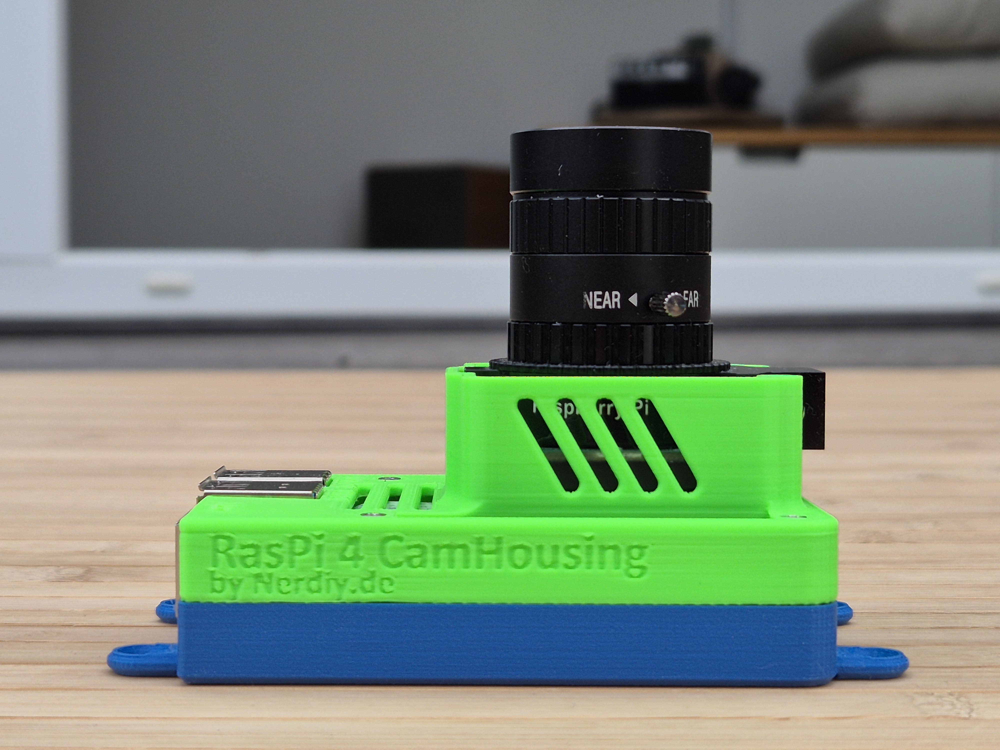
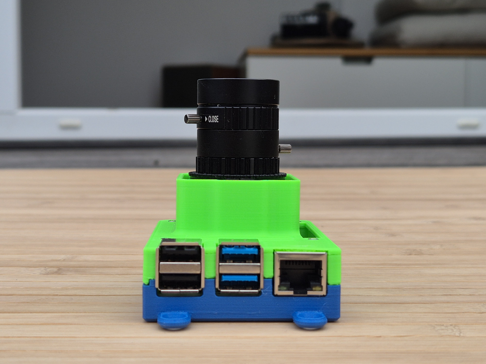
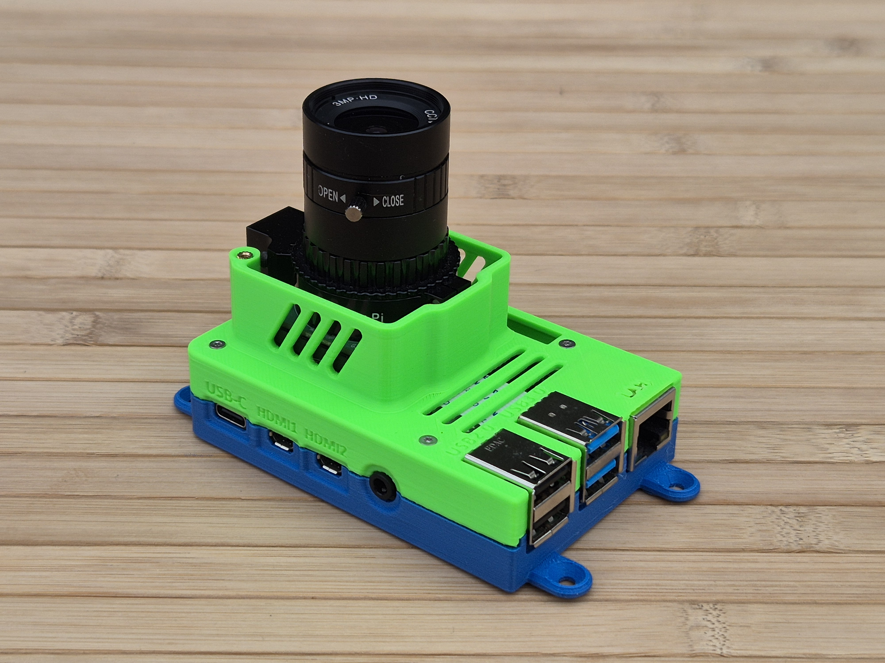
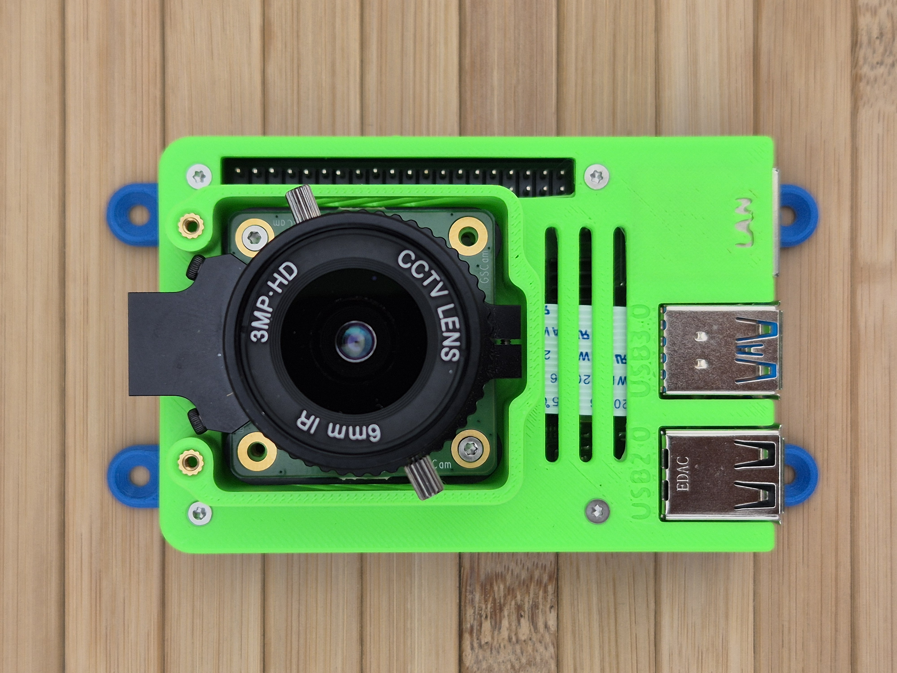
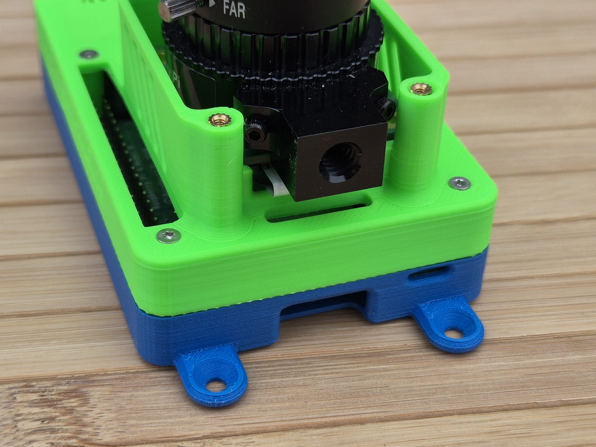
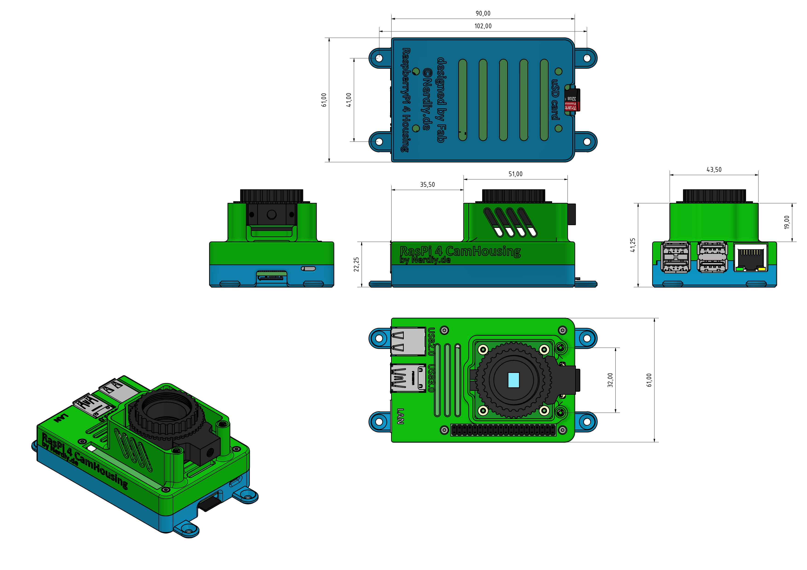

# Raspberry Pi 4 & Angled Mount for Raspberry Pi GS or HD Camera by Nerdiy.de

---

## 🎯 Project Overview

Build a professional angled camera mount for your Raspberry Pi 4 with Raspberry Pi Global Shutter (GS) or HD Camera support.

Here we offer you the STL files for 3D-printed mounting parts, which have been specifically developed to securely hold the Raspberry Pi 4 and provide an optimal angled viewing position for your camera module while protecting the components from dust and physical damage.

With the provided STL files, you can easily create your own mounting parts on your 3D printer and integrate them into your Raspberry Pi 4 camera projects, surveillance systems, or robotics applications.

---

## 📋 About This Product

This product provides 3D-printable angled camera mounting parts for Raspberry Pi 4 with support for Global Shutter (GS) and HD Camera modules.

- **Product Name**: Raspberry Pi 4 & Angled Mount for Raspberry Pi GS or HD Camera by Nerdiy.de
- **Printables Store**: [🎨 View on Printables](https://www.printables.com/model/1361750-raspberry-pi4-angled-mount-for-raspberry-pi-gs-or)
- **Created**: February 2026
- **Note**: The mount provides optimal camera positioning with adjustable angle while maintaining full access to all Pi 4 ports and connectors.

---

## 🛒 Purchase Options

### Primary Source (Recommended)
- **[🎨 Printables Store](https://www.printables.com/model/1361750-raspberry-pi4-angled-mount-for-raspberry-pi-gs-or)** - Download the STL files here

### Alternative Sources
- **[🛍️ Nerdiy.de Shop](https://nerdiy.de/)** - Check for availability
- **[🗿 Cults3D](https://cults3d.com/de/modell-3d/gadget/raspberry-pi-4-angled-mount-for-raspberry-pi-gs-or-hd-camera-by-nerdiy-de)** - Alternative purchase option

> 💖 **Support independent makers**: By downloading from Printables and giving a like, you directly support further development and new projects!

---

## 📦 Bill of Materials

### 🛠️ Required Tools

| Qty | Component | ASIN (DE) | Amazon (DE) |
|-----|-----------|-----------|-------------|
| 1x | Screwdriver Set | B086SQZGLJ | [Amazon](https://www.amazon.de/dp/B086SQZGLJ?tag=nerdiyde018-21&linkCode=ogi&th=1&psc=1) |
| 1x | Soldering Iron | B0D5M727WM | [Amazon](https://www.amazon.de/dp/B0D5M727WM?tag=nerdiyde018-21&linkCode=ogi&th=1&psc=1) |

### 🎨 3D Print Materials

| Qty | Component | ASIN (DE) | Amazon (DE) |
|-----|-----------|-----------|-------------|
| 1x | PETG Filament 1.75mm (1kg) | B07T2QZYS1 | [Amazon](https://www.amazon.de/dp/B07T2QZYS1?tag=nerdiyde018-21&linkCode=ogi&th=1&psc=1) |

### ⚙️ Mounting Hardware

| Qty | Component | ASIN (DE) | Amazon (DE) |
|-----|-----------|-----------|-------------|
| 4x | M2 Threaded Insert | B088QJG676 | [Amazon](https://www.amazon.de/dp/B088QJG676?tag=nerdiyde018-21&linkCode=ogi&th=1&psc=1) |
| 4x | M2x20 Countersunk Screw | B09N4WV1WP | [Amazon](https://www.amazon.de/dp/B09N4WV1WP?tag=nerdiyde018-21&linkCode=ogi&th=1&psc=1) |

### 📦 Required Components

| Qty | Component | ASIN (DE) | Amazon (DE) |
|-----|-----------|-----------|-------------|
| 1x | Raspberry Pi 4 (4GB or 8GB) | B09TTNF8BT | [Amazon](https://www.amazon.de/dp/B09TTNF8BT?tag=nerdiyde018-21&linkCode=ogi&th=1&psc=1) |
| 1x | Raspberry Pi Global Shutter Camera (optional) | B0C2CSTNRZ | [Amazon](https://www.amazon.de/dp/B0C2CSTNRZ?tag=nerdiyde018-21&linkCode=ogi&th=1&psc=1) |
| 1x | Raspberry Pi HQ Camera (optional) | B0BHF4D1QY | [Amazon](https://www.amazon.de/dp/B0BHF4D1QY?tag=nerdiyde018-21&linkCode=ogi&th=1&psc=1) |
| 1x | Raspberry Pi 4 Power Supply | B07TZ89BT7 | [Amazon](https://www.amazon.de/dp/B07TZ89BT7?tag=nerdiyde018-21&linkCode=ogi&th=1&psc=1) |
| 1x | Micro SD Card 64GB | B07FCMBLV6 | [Amazon](https://www.amazon.de/dp/B07FCMBLV6?tag=nerdiyde018-21&linkCode=ogi&th=1&psc=1) |

---

## 🖼️ Product Images

<table>
  <tr>
    <td></td>
    <td></td>
  </tr>
  <tr>
    <td></td>
    <td></td>
  </tr>
  <tr>
    <td></td>
    <td></td>
  </tr>
</table>

---

## 🖨️ 3D Print Settings

### ⚙️ Recommended Print Settings
| Setting | Value |
|---------|-------|
| **Filament Type** | PETG (weather and UV-resistant) |
| **Layer Height** | 0.2mm |
| **Infill** | 20-25% |
| **Wall Lines** | 3-5 |
| **Support** | Yes (for overhangs > 45°) |

> 💡 **Print Orientation**: I highly recommend printing the parts in the already defined orientation. The defined orientation is intended to maximize the structural integrity of the part and ensure proper camera mounting stability.

---

## 🎯 How to Use

### Step-by-Step Assembly Guide

1. **Gather Your Materials**
   - Purchase all components from the Bill of Materials section above
   - All Amazon links are pre-configured with affiliate tags to support Nerdiy.de development
   - For STL files, [download from Printables](https://www.printables.com/model/1361750-raspberry-pi4-angled-mount-for-raspberry-pi-gs-or)

2. **Download 3D Files**
   - [🎨 Download from Printables](https://www.printables.com/model/1361750-raspberry-pi4-angled-mount-for-raspberry-pi-gs-or) (free download)
   - Alternative: Check [Nerdiy.de Shop](https://nerdiy.de/) for availability

3. **Prepare for 3D Printing**
   - Print the mount and camera bracket parts with these settings:
   - Layer Height: 0.2mm
   - Infill: 20-25%
   - Supports: Yes (for overhangs > 45°)
   - Material: PETG (recommended for durability and outdoor use if needed)
   - Slice and prepare files in your slicing software

4. **Assembly**
   - Clean all printed parts after removal from build plate
   - Install M2 threaded inserts into designated holes using soldering iron
   - Mount the Raspberry Pi 4 onto the base mounting plate
   - Attach the camera module to the angled bracket
   - Connect the camera ribbon cable to the Raspberry Pi 4 CSI port
   - Secure all parts with M2x20 screws
   - Verify camera angle and adjust if necessary

5. **Installation**
   - Mount the complete assembly in your desired location
   - Ensure proper ventilation around the Raspberry Pi 4
   - Connect power supply (USB-C power input)
   - Boot up your Raspberry Pi 4 and test camera functionality
   - Configure camera settings in Raspberry Pi OS or your preferred software

6. **Maintenance**
   - Periodically clean camera lens and housing from dust
   - Check screw tightness after extended use
   - Verify camera ribbon cable connection remains secure
   - Test camera functionality regularly

---

## 📄 License

This design is available under the license specified on the Printables product page. Please review the license terms when downloading the files.

---

**Last Updated**: 4. March 2026  
**Status**: Complete - All materials and assembly guide documented
