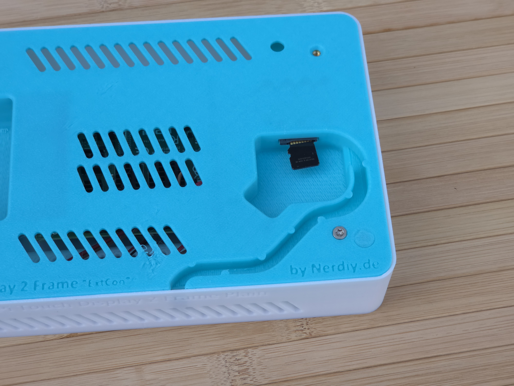
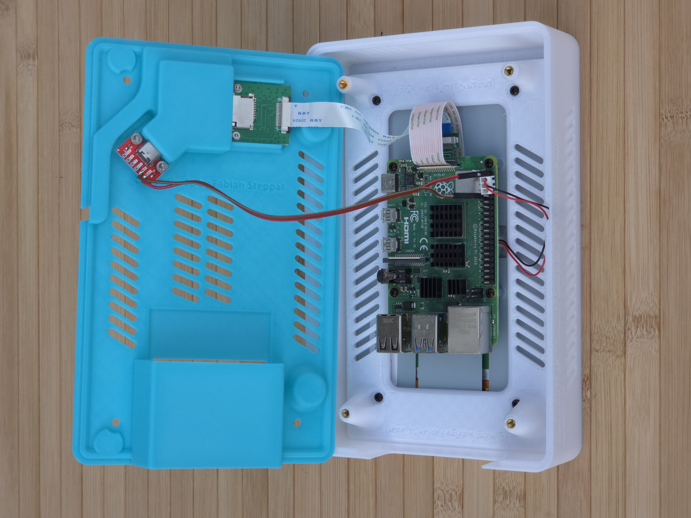
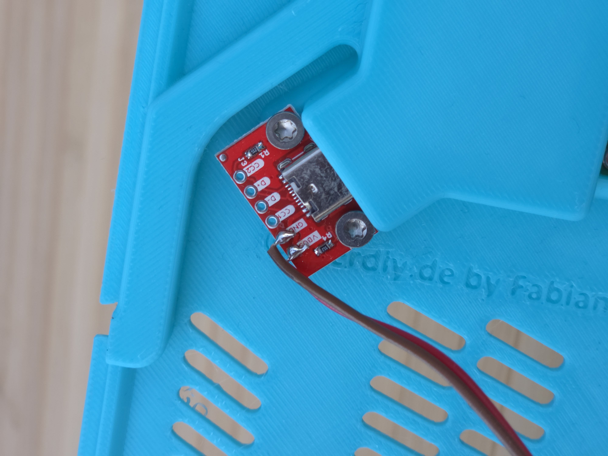

# Raspberry Pi5/4 & Addon Lid for 7" TouchDisplay 2 Housings with External Connectors

---

## 🎯 Project Overview

Build a professional alternative back panel for Raspberry Pi 5/4 housings with the official 7" Touch Display 2.

Here we offer you the STL files for a 3D-printed alternative back panel, which has been specifically developed as an addon to existing Raspberry Pi display housings. This alternative back panel provides external access to the USB-C power connector and the Micro-SD card slot through integrated cable routing channels and mounting points for breakout boards. The panel enables clean external connectivity while protecting the display and maintaining a professional appearance.

With the provided STL files, you can easily create your own alternative back panel on your 3D printer and upgrade your existing Raspberry Pi display housing for convenient external access to power and storage.

---

## 📋 About This Product

This product provides a 3D-printable alternative back panel as an addon for existing Raspberry Pi 5/4 display housings with 7" Touch Display 2.

- **Product Name**: Raspberry Pi5/4 & Addon Lid for 7" TouchDisplay 2 Housings with external connectors
- **Printables Store**: [🎨 View on Printables](https://www.printables.com/model/1491295-raspberry-pi54-addon-lid-for-7-touchdisplay-2-hous)
- **Created**: February 2026
- **Note**: This is an addon product that replaces the standard back panel of existing Raspberry Pi display housings. The alternative back panel routes the USB-C power connector and Micro-SD card slot to the outside of the housing through dedicated breakout board mounting points. This allows convenient external access to power supply and SD card without opening the housing. Compatible with existing Raspberry Pi 5/4 display housings.

---

## 🛒 Purchase Options

### Primary Source (Recommended)
- **[🎨 Printables Store](https://www.printables.com/model/1491295-raspberry-pi54-addon-lid-for-7-touchdisplay-2-hous)** - Download the STL files here

> 💖 **Support independent makers**: By downloading from Printables and giving a like, you directly support further development and new projects!

---

## 📦 Bill of Materials

### 🛠️ Required Tools

| Qty | Component | ASIN (DE) | Amazon (DE) |
|-----|-----------|-----------|-------------|
| 1x | Screwdriver Set | B086SQZGLJ | [Amazon](https://www.amazon.de/dp/B086SQZGLJ?tag=nerdiyde018-21&linkCode=ogi&th=1&psc=1) |
| 1x | Hex Key Set | B0BZ1F6WST | [Amazon](https://www.amazon.de/dp/B0BZ1F6WST?tag=nerdiyde018-21&linkCode=ogi&th=1&psc=1) |

### 🎨 3D Print Materials

| Qty | Component | ASIN (DE) | Amazon (DE) |
|-----|-----------|-----------|-------------|
| 1x | PETG Filament 1.75mm (1kg) | B07T2QZYS1 | [Amazon](https://www.amazon.de/dp/B07T2QZYS1?tag=nerdiyde018-21&linkCode=ogi&th=1&psc=1) |

### ⚙️ Mounting Hardware

| Qty | Component | ASIN (DE) | Amazon (DE) |
|-----|-----------|-----------|-------------|
| 4x | M2 Threaded Insert | B08DDBWKZF | [Amazon](https://www.amazon.de/dp/B08DDBWKZF?tag=nerdiyde018-21&linkCode=ogi&th=1&psc=1) |
| 4x | M2x6 Screw | B07YZMVGP8 | [Amazon](https://www.amazon.de/dp/B07YZMVGP8?tag=nerdiyde018-21&linkCode=ogi&th=1&psc=1) |

### 📦 Required Components

| Qty | Component | ASIN (DE) | Amazon (DE) |
|-----|-----------|-----------|-------------|
| 1x | Raspberry Pi 7" Touch Display 2 | B0D93MJXWP | [Amazon](https://www.amazon.de/dp/B0D93MJXWP?tag=nerdiyde018-21&linkCode=ogi&th=1&psc=1) |
| 1x | Existing Raspberry Pi Housing | - | (Your existing housing from our product line) |
| 1x | Raspberry Pi 27W USB-C Power Supply | B0CL7L48NG | [Amazon](https://www.amazon.de/dp/B0CL7L48NG?tag=nerdiyde018-21&linkCode=ogi&th=1&psc=1) |
| 1x | USB-C Breakout Board | B0C1YV339S | [Amazon](https://www.amazon.de/dp/B0C1YV339S?tag=nerdiyde018-21&linkCode=ogi&th=1&psc=1) |
| 1x | SD Card Extension Adapter | B09CKRDFTH | [Amazon](https://www.amazon.de/dp/B09CKRDFTH?tag=nerdiyde018-21&linkCode=ogi&th=1&psc=1) |
| 1x | Jumper Wire Set (Dupont Cables) | B01EV70C78 | [Amazon](https://www.amazon.de/dp/B01EV70C78?tag=nerdiyde018-21&linkCode=ogi&th=1&psc=1) |

---

## 🖨️ 3D Print Settings

### Recommended Print Settings

| Setting | Value |
|---------|-------|
| **Filament Type** | PETG (weather and UV-resistant) |
| **Layer Height** | 0.2mm |
| **Infill** | 20-25% |
| **Wall Lines** | 3-5 |
| **Support** | May require minimal supports depending on orientation |

> 💡 **Print Orientation**: I highly recommend printing the parts in the already defined orientation. The defined orientation is intended to maximize the structural integrity of the part and minimize support requirements.

---

## 🎯 How to Use

### Step-by-Step Assembly Guide

1. **Gather Your Materials**
   - Purchase all components from the Bill of Materials section above
   - All Amazon links are pre-configured with affiliate tags to support Nerdiy.de development
   - For STL files, [download from Printables](https://www.printables.com/model/1491295-raspberry-pi54-addon-lid-for-7-touchdisplay-2-hous)
   - Ensure you have an existing Raspberry Pi 5/4 housing with external connectors

2. **Download 3D Files**
   - [🎨 Download from Printables](https://www.printables.com/model/1491295-raspberry-pi54-addon-lid-for-7-touchdisplay-2-hous) (free download)

3. **Prepare for 3D Printing**
   - Print the addon lid and mounting parts with these settings:
   - Layer Height: 0.2mm
   - Infill: 20-25%
   - Material: PETG (recommended for durability and heat resistance)
   - Enable supports if needed for overhangs
   - Slice and prepare files in your slicing software

4. **Assembly**
   - Clean all printed parts after removal from build plate
   - Remove any support material carefully
   - Install M2 threaded inserts into designated holes using soldering iron
   - Mount the 7" Touch Display 2 to the addon lid using M2x6 screws
   - Install USB-C Breakout Board for power routing
   - Install SD Card Extension Adapter for easy SD card access
   - Use Jumper Wires to connect breakout boards as needed
   - Connect power supply through the USB-C breakout board
   - Route all cables through the designated channels in the addon lid

5. **Installation**
   - Attach the addon lid assembly to your existing Raspberry Pi housing
   - Route all external connectors (power, USB, Ethernet, etc.) through the provided openings
   - Secure the assembly with appropriate fasteners
   - Verify all cables are properly routed and not pinched
   - Test display functionality

6. **Maintenance**
   - Periodically clean dust from display surface and ventilation areas
   - Check cable connections and routing
   - Verify screw tightness after extended use
   - Monitor temperature to ensure adequate ventilation

---

## 📸 Product Images

.jpg)

.jpg)

.jpg)

---

## 📄 License

See the license information on the Printables product page.

---

**Last Updated**: March 5, 2026  
**Status**: Complete - Ready to build
