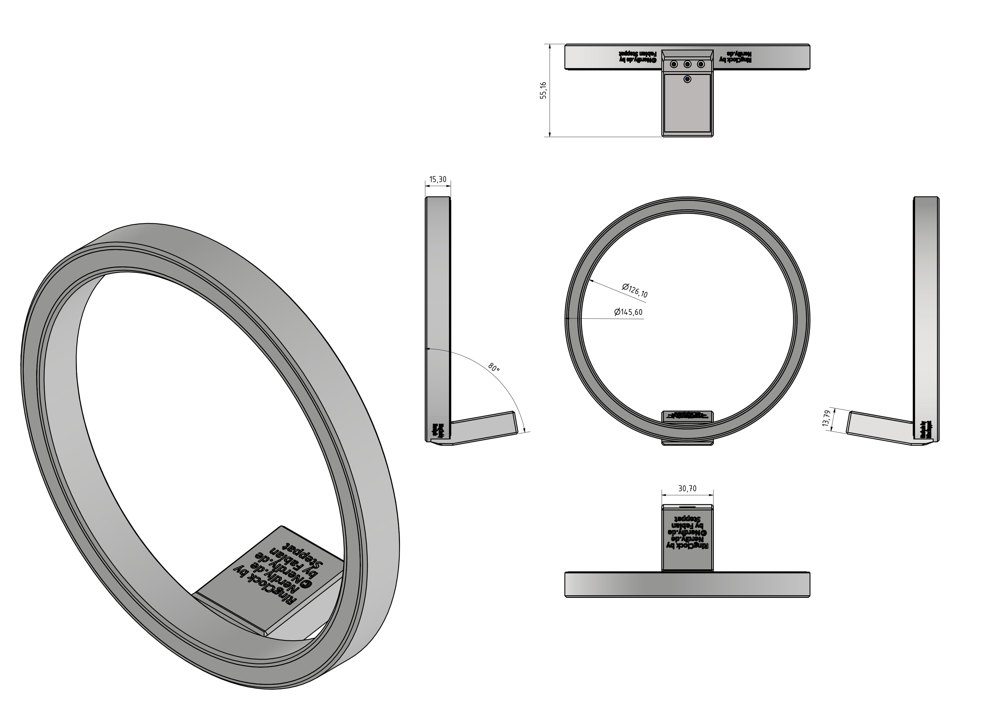

# RingClock by Nerdiy.de

---

## 🎯 Project Overview

RingClock is a printable clock project with a circular presentation and a distinctive maker-style design.

---

## 📋 About This Product

The project is intended for users who want to build a decorative clock with a printed housing and a more unusual visual layout than a standard wall clock. It fits hobby workbenches, living spaces, and electronics display projects.

---

## 🛒 Purchase Options

### Primary Source (Recommended)
- **[Nerdiy.de Shop](https://www.nerdiy.de/)** - Download the STL files here

### Alternative Sources
- **[Printables](https://www.printables.com/model/1279701-ringclock-by-nerdiyde)**
- **[Cults3D](https://cults3d.com/de/modell-3d/gadget/ringclock-by-nerdiy-de)**

> Support Nerdiy.de if you want to help fund future product updates, documentation improvements, and new maker projects.

---

## 📦 Bill of Materials

### �️ Required Tools

| Qty | Tool | Description | ASIN (DE) | Purchase |
|-----|------|-------------|-----------|----------|
| 1x | Soldering Iron | Temperature controlled, 40W+ | B0D5M727WM | [Amazon](https://www.amazon.de/dp/B0D5M727WM?tag=nerdiyde018-21&linkCode=ogi&th=1&psc=1) |
| 1x | Desoldering Wick | For solder removal and rework | B0CWR4WMRR | [Amazon](https://www.amazon.de/Entl%C3%B6tlitze-Entl%C3%B6tdraht-Entfernen-Elektrischer-Komponenten/dp/B0CWR4WMRR?tag=nerdiyde018-21&linkCode=ogi&th=1&psc=1) |
| 1x | One-Handed Clamp | Quick clamp/Helping Hand for soldering | B07ZTVY1PM | [Amazon](https://www.amazon.de/dp/B07ZTVY1PM?tag=nerdiyde018-21&linkCode=ogi&th=1&psc=1) |
| 1x | Electronic Side Cutter | For trimming wires and pins | B005EXOF6S | [Amazon](https://www.amazon.de/Electronic-Elektronik-Seitenschneider-Lichtwellenleiter-Rostschutz-125/dp/B005EXOF6S?tag=nerdiyde018-21&linkCode=ogi&th=1&psc=1) |
| 1x | Wire Stripper | Clean cable ends, automatic | B001NUMVHQ | [Amazon](https://www.amazon.de/WEICON-automatische-Abisolierzange-Abisolierer-selbsteinstellend/dp/B001NUMVHQ?tag=nerdiyde018-21&linkCode=ogi&th=1&psc=1) |
| 1x | Tweezers | Precision tweezers for small parts | B06XXXQHS8 | [Amazon](https://www.amazon.de/Pinzette-Pr%C3%A4zision-Antistatische-nicht-magnetische-Elektronik/dp/B06XXXQHS8?tag=nerdiyde018-21&linkCode=ogi&th=1&psc=1) |
| 1x | Hot Glue Gun | For assembly and fixation | B0001D1Q72 | [Amazon](https://www.amazon.de/Bosch-Klebepistole-extralange-D%C3%BCse-Volt/dp/B0001D1Q72?tag=nerdiyde018-21&linkCode=ogi&th=1&psc=1) |
| 1x | 3D Printer | FDM or Resin printer | - | [Prusa3D](https://www.prusa3d.com/de/#a_aid=Nerdiy) |

### 📦 Electronic Components

| Qty | Component | Description | ASIN (DE) | Purchase |
|-----|-----------|-------------|-----------|----------|
| 1x | Wemos D1 Mini | ESP8266 microcontroller board | - | [Amazon](https://www.amazon.de/s?k=Wemos+D1+Mini) |
| 1x | WS2812 LED Strip | 144 LEDs/m, 60 LEDs total | - | [Amazon](https://www.amazon.de/s?k=WS2812+LED+Strip+60) |
| 1x | Acrylic Glass Ring | ID: 130mm, OD: 141mm, 3mm thick | - | [Amazon](https://www.amazon.de/s?k=Acrylglasring+130mm) |
| 2x | M8x40 Cylinder Head Screw | For mounting stability weights | - | [Amazon](https://www.amazon.de/s?k=M8x40+Zylinderkopfschraube) |
| 1x | LDR (Optional) | Light-dependent resistor for auto-brightness | - | [Amazon](https://www.amazon.de/s?k=LDR+Lichtsensor) |
| 1x | 1kΩ Resistor | 1/4W, for LDR voltage divider | - | [Amazon](https://www.amazon.de/s?k=1k+Widerstand+1%2F4W) |
| 2x | Self-Tapping Screw | 2×6mm or 2×8mm | - | [Amazon](https://www.amazon.de/s?k=Blechschraube+2x6) |

### 🔧 Materials & Consumables

| Qty | Material | Description | ASIN (DE) | Purchase |
|-----|----------|-------------|-----------|----------|
| 1x | Solder Wire | 1mm diameter, lead-free recommended | B0BW8Y66JJ | [Amazon](https://www.amazon.de/dp/B0BW8Y66JJ?tag=nerdiyde018-21&linkCode=ogi&th=1&psc=1) |
| ~10cm | Hookup Wire (Litze) | 0.5mm², stranded wire | B0C7TJG9YB | [Amazon](https://www.amazon.de/dp/B0C7TJG9YB?tag=nerdiyde018-21&linkCode=ogi&th=1&psc=1) |
| ~3cm | Heat Shrink Tubing | Various diameter, assorted set | B0B4JTSYTC | [Amazon](https://www.amazon.de/dp/B0B4JTSYTC?tag=nerdiyde018-21&linkCode=ogi&th=1&psc=1) |
| 1x | Hot Glue Sticks | For hot glue gun | - | [Amazon](https://www.amazon.de/s?k=Heißkleber+Stäbe) |
| 1x | USB Power Supply | 5V/3A, minimum 2A recommended | B00WLI5E3M | [Amazon](https://www.amazon.de/dp/B00WLI5E3M?tag=nerdiyde018-21&linkCode=ogi&th=1&psc=1) |
| 1x | Micro USB Cable | Short cable 30cm for power connection | B095JZSHXQ | [Amazon](https://www.amazon.de/dp/B095JZSHXQ?tag=nerdiyde018-21&linkCode=ogi&th=1&psc=1) |

---

## 🖼️ Product Images
<table>
  <tr>
    <td></td>
    <td></td>
  </tr>
  <tr>
    <td></td>
    <td></td>
  </tr>
  <tr>
    <td></td>
    <td></td>
  </tr>
</table>

---

## 🖨️ 3D Print Settings

## 3D Print Settings

### ⚙️ Recommended Print Settings
| Parameter | Value |
| --- | --- |
| Filament Type | Weather and UV-resistant (for example PETG, ABS, or ASA) |
| Layer Height | 0.2 mm |
| Infill | 15-25% |
| Wall Lines | 3-5 |
| Supports | As needed by part geometry |

Use the orientation included in the STL package to minimize supports and achieve better surface quality on visible faces.
## 🎯 How to Use

### Step-by-Step Guide

1. Download the STL files from Nerdiy.de or the linked Printables page.
2. Print all RingClock parts with the recommended settings.
3. Prepare the matching clock electronics or mechanism from the bill of materials.
4. Assemble the printed housing, install the electronics, and test the clock before final placement.

---

## 📄 License

Refer to the original product page for the license terms that apply to this STL package.

---

**Last Updated**: March 17, 2026
**Status**: Active - Ready to build

