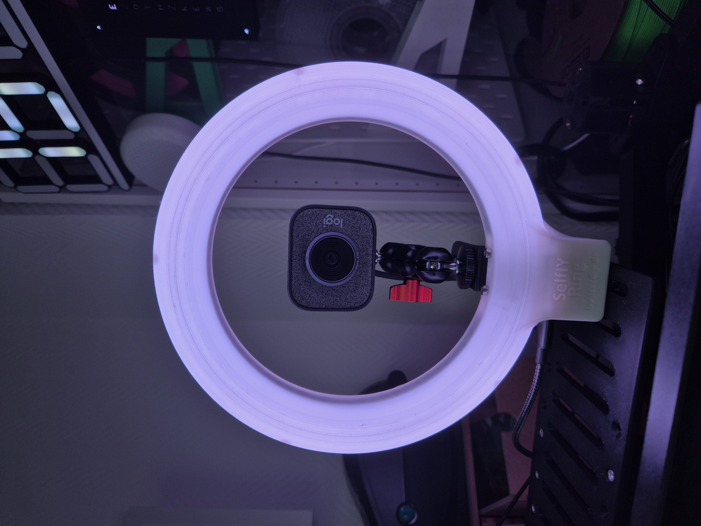
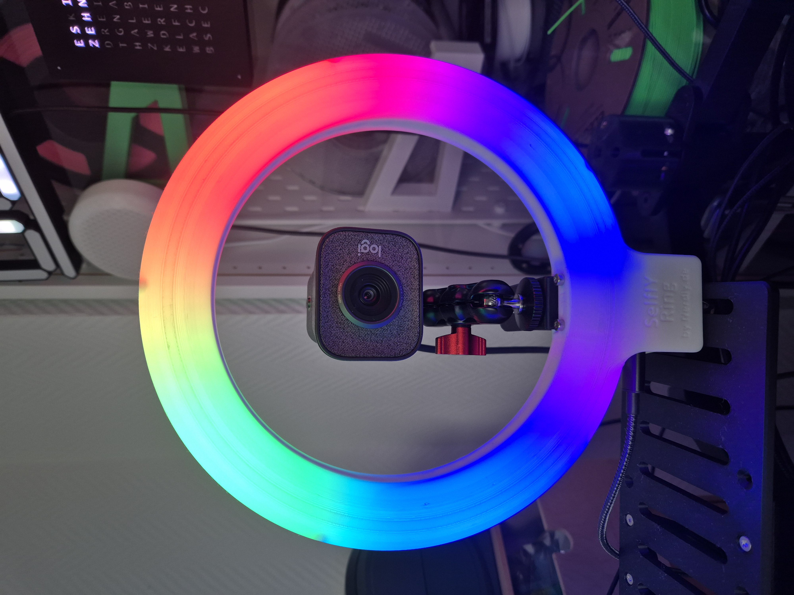
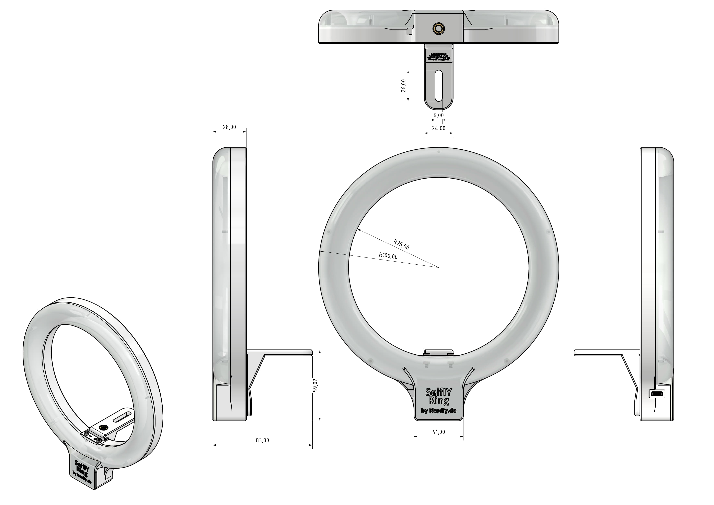

# SelfIY Ring - ESPHome based 3D printable selfie ring by Nerdiy.de

---

## 🎯 Project Overview

This product page provides a complete overview of the STL package, bill of materials, and recommended print settings.

---

## 📋 About This Product

- **Product Name**: SelfIY Ring - ESPHome based 3D printable selfie ring by Nerdiy.de
- **Nerdiy.de Shop**: [ View Product](https://www.nerdiy.de/)
- **Created**: March 2026

---

## 🛒 Purchase Options

### Primary Source (Recommended)
- **[ Nerdiy.de Shop](https://www.nerdiy.de/)** - Download the STL files here

### Alternative Sources
- **[🎨 Printables](https://www.printables.com/model/1280603-selfiy-ring-esphome-based-3d-printable-selfie-ring)**

> 💖 **Support independent makers**: By purchasing the STL files through [Nerdiy.de Shop](https://www.nerdiy.de/), you directly support further development and new projects!

---

## 📦 Bill of Materials

### 🛠️ Required Tools

| Qty | Component | ASIN (DE) | Amazon (DE) |
|-----|-----------|-----------|-------------|
| 1x | Screwdriver Set | B092LVWNX8 | [Amazon](https://www.amazon.de/dp/B086SQZGLJ?tag=nerdiyde018-21&linkCode=ogi&th=1&psc=1) |
| 1x | Soldering Iron | B0CCV6T329 | [Amazon](https://www.amazon.de/dp/B0CCV6T329?tag=nerdiyde018-21&linkCode=ogi&th=1&psc=1) |
| 1x | Side Cutters | B005EXOF6S | [Amazon](https://www.amazon.de/Electronic-Elektronik-Seitenschneider-Lichtwellenleiter-Rostschutz-125/dp/B005EXOF6S?tag=nerdiyde018-21&linkCode=ogi&th=1&psc=1) |
| 1x | 3D Printer | - | N/A |

### 📦 Required Components

| Qty | Component | ASIN (DE) | Amazon (DE) |
|-----|-----------|-----------|-------------|
| 2x (1x White, 1x e.g. Black) | PETG Filament | B0C6MMM51Y | [Amazon](https://www.amazon.de/dp/B0C6MMM51Y?tag=nerdiyde018-21&linkCode=ogi&th=1&psc=1) |
| 1x | Seeed Studio XIAO ESP32-S3 | B0BYSB66S5 | [Amazon](https://www.amazon.de/dp/B0BYSB66S5?tag=nerdiyde018-21&linkCode=ogi&th=1&psc=1) |
| 1x | Thread Insert | B088QJG676 | [Amazon](https://www.amazon.de/dp/B088QJG676?tag=nerdiyde018-21&linkCode=ogi&th=1&psc=1) |
| 1x | 1/4" Tripod Screw | B09MTS6ZZQ | [Amazon](https://www.amazon.de/dp/B09MTS6ZZQ?tag=nerdiyde018-21&linkCode=ogi&th=1&psc=1) |
| 2x | M3x6 Socket Head Cap Screw | B01GQX0JVY | [Amazon](https://www.amazon.de/dp/B01GQX0JVY?tag=nerdiyde018-21&linkCode=ogi&th=1&psc=1) |
| 2x | M3 Washer | B0CJWP92X1 | [Amazon](https://www.amazon.de/dp/B0CJWP92X1?tag=nerdiyde018-21&linkCode=ogi&th=1&psc=1) |
| 2x | M3 Nut | B07JMF3KMD | [Amazon](https://www.amazon.de/dp/B07JMF3KMD?tag=nerdiyde018-21&linkCode=ogi&th=1&psc=1) |
| 5x | Countersunk Screw | B0957RCWQB | [Amazon](https://www.amazon.de/dp/B0957RCWQB?tag=nerdiyde018-21&linkCode=ogi&th=1&psc=1) |
| 1x | M2x6 Countersunk | B0957W34XS | [Amazon](https://www.amazon.de/dp/B0957W34XS?tag=nerdiyde018-21&linkCode=ogi&th=1&psc=1) |
| 1x | USB-C Cable | B098WVHH5L | [Amazon](https://www.amazon.de/dp/B098WVHH5L?tag=nerdiyde018-21&linkCode=ogi&th=1&psc=1) |
| 1x | USB Power Supply | B00WLI5E3M | [Amazon](https://www.amazon.de/dp/B00WLI5E3M?tag=nerdiyde018-21&linkCode=ogi&th=1&psc=1) |
| 1x | Solder Wire | B0BW8Y66JJ | [Amazon](https://www.amazon.de/dp/B0BW8Y66JJ?tag=nerdiyde018-21&linkCode=ogi&th=1&psc=1) |
| 1x | Solder Wire | B01CDTEGGO | [Amazon](https://www.amazon.de/dp/B01CDTEGGO?tag=nerdiyde018-21&linkCode=ogi&th=1&psc=1) |

---

## 🖼️ Product Images

<table>
  <tr>
    <td></td>
    <td></td>
  </tr>
  <tr>
    <td></td>
    <td></td>
  </tr>
  <tr>
    <td></td>
    <td></td>
  </tr>
</table>

Show additional images

<table>
  <tr>
    <td></td>
    <td></td>
  </tr>
  <tr>
    <td></td>
    <td></td>
  </tr>
  <tr>
    <td></td>
    <td></td>
  </tr>
  <tr>
    <td></td>
    <td></td>
  </tr>
</table>

---

## 🖨️ 3D Print Settings

### ⚙️ Recommended Print Settings
| Setting | Value |
|---------|-------|
| **Filament Type** | Weather and UV-resistant (for example PETG, ABS, or ASA) |
| **Layer Height** | 0.2 mm |
| **Infill** | 15-25% |
| **Wall Lines** | 3-5 |
| **Supports** | As needed by part geometry |

> 🖨️ **Print Orientation**: Use the orientation included in the STL package to maximize part strength and fit.

---

## 🎯 How to Use

### Step-by-Step Guide

1. **Gather Your Materials** — Review the complete bill of materials and acquire all hardware (XIAO ESP32-S3, thread inserts, screws, solder wire, filament).
2. **Download & Flash Firmware** — Install [ESPHome](https://esphome.io/) and flash the configuration to the Seeed Studio XIAO ESP32-S3 before assembly.
3. **Download 3D Files** — [🛍️ Download from Nerdiy.de Shop](https://www.nerdiy.de/) (recommended) or from [Printables](https://www.printables.com/model/1280603-selfiy-ring-esphome-based-3d-printable-selfie-ring).
4. **Slice & Print** — Print ring parts using the recommended settings (PETG, 0.2 mm layers, 15–25% infill). Use white filament for the diffuser parts and dark filament for the body.
5. **Assemble** — Install M3 thread inserts, solder the LED connections, mount the XIAO ESP32-S3, and secure all parts with screws.
6. **Integrate & Test** — Add the device to Home Assistant via ESPHome and verify that all lights respond correctly before final use.

---

## 📄 License

See the license information on the product page.

---

**Last Updated**: 22. February 2026
**Status**: Active - Ready to build
